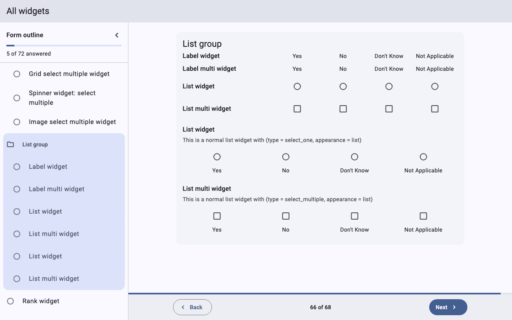
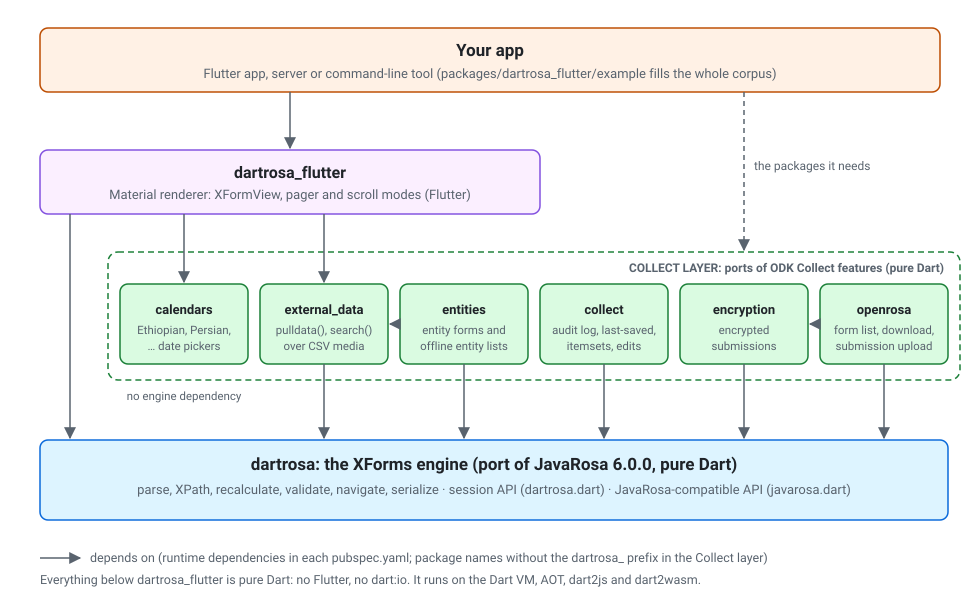
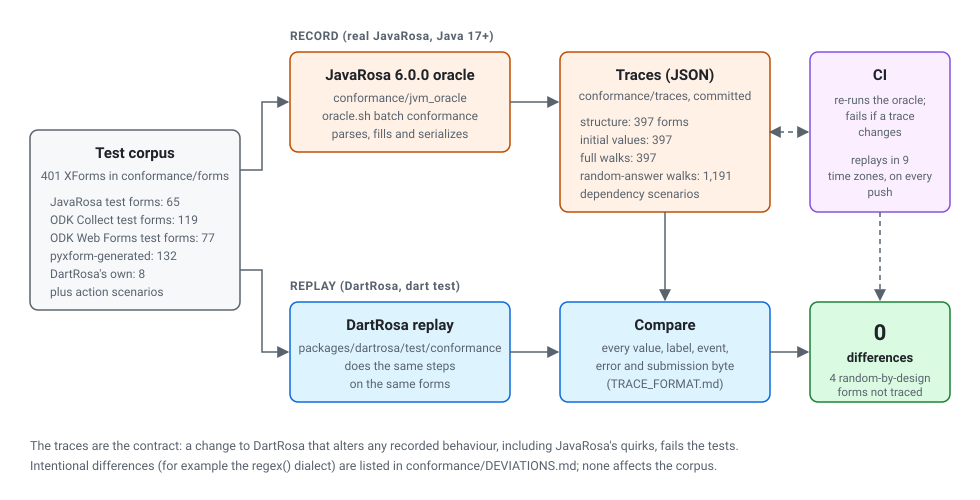

# DartRosa

[](https://github.com/sudhi001/dartrosa/actions/workflows/ci.yml)
[](LICENSE)
[](https://pub.dev/packages/dartrosa)
[](https://pub.dev/packages/dartrosa_flutter)

DartRosa fills [ODK](https://getodk.org) forms in Dart and Flutter. It is
a faithful port of [JavaRosa](https://github.com/getodk/javarosa) 6.0.0,
the form engine inside ODK Collect, plus the ODK Collect features around
it and a Flutter form renderer. Forms behave exactly as they do in ODK
Collect, on Android, iOS, the web, desktop and servers.


**Learn it:** [Quick start (5 min)](docs/QUICKSTART.md) ·
[Concepts](docs/CONCEPTS.md) ·
[Tutorial: build a data-collection app](docs/tutorials/build-a-data-collection-app.md) ·
[Cookbook](docs/cookbook/README.md) ·
[API tour](docs/API_TOUR.md) · [Widget catalog](docs/widgets/README.md) ·
[FAQ](docs/FAQ.md)

New to ODK or XForms? Read the [overview](docs/OVERVIEW.md) first.

| | | |
|---|---|---|
|  |  |  |



## Quick start

```dart
import 'package:dartrosa/dartrosa.dart';

Future<void> main() async {
  final definition = await FormDefinition.parse(xform);
  final session = definition.createSession();

  final [name, age] = session.root.visibleChildren.cast<QuestionNode>();
  session.answer(name.index, const StringValue('Ada'));
  switch (session.answer(age.index, const IntegerValue(-3))) {
    case AnswerConstraintViolated(:final message):
      print('Rejected: $message');
    case AnswerAccepted() || AnswerRequired() || AnswerRejected():
      break;
  }

  if (session.finalize() case FinalizeSuccess(:final submission)) {
    print(submission.xml); // ready to upload
  }
}
```

In Flutter, `XFormView(session: session)` shows the form with one
question per screen, as in ODK Collect. Install with `flutter pub add
dartrosa_flutter` (or `dart pub add dartrosa` without Flutter). The
[quick start](docs/QUICKSTART.md) has a complete app;
[Getting started](docs/GETTING_STARTED.md) walks through the engine's API.

## Packages



| Package | pub.dev | Purpose |
|---|---|---|
| [`dartrosa`](packages/dartrosa) | [](https://pub.dev/packages/dartrosa) | The XForms engine: parse, XPath, recalculate, validate, navigate, serialize. Session API, JavaRosa-compatible API and test DSL |
| [`dartrosa_flutter`](packages/dartrosa_flutter) | [](https://pub.dev/packages/dartrosa_flutter) | Flutter renderer (`XFormView`), with an example app that fills every test form |
| [`dartrosa_external_data`](packages/dartrosa_external_data) | [](https://pub.dev/packages/dartrosa_external_data) | `pulldata()` and `search()` over CSV media |
| [`dartrosa_entities`](packages/dartrosa_entities) | [](https://pub.dev/packages/dartrosa_entities) | ODK entities: entity forms, local entity lists, offline updates |
| [`dartrosa_collect`](packages/dartrosa_collect) | [](https://pub.dev/packages/dartrosa_collect) | Audit log, last-saved instance, fast external itemsets, edited submissions |
| [`dartrosa_encryption`](packages/dartrosa_encryption) | [](https://pub.dev/packages/dartrosa_encryption) | Encrypted submissions, decryptable by ODK Central and Briefcase |
| [`dartrosa_openrosa`](packages/dartrosa_openrosa) | [](https://pub.dev/packages/dartrosa_openrosa) | OpenRosa client: form lists, manifests, downloads, submission upload |
| [`dartrosa_calendars`](packages/dartrosa_calendars) | [](https://pub.dev/packages/dartrosa_calendars) | Ethiopian, Coptic, Islamic, Persian, Bikram Sambat, Myanmar and Buddhist dates |

Everything except `dartrosa_flutter` is pure Dart (no Flutter, no
`dart:io`) and is tested on the Dart VM, dart2js and dart2wasm.

## Documentation

Start with the [documentation index](docs/README.md), which follows a
learning path:

1. [Quick start](docs/QUICKSTART.md): a form on screen in five minutes.
2. [Concepts](docs/CONCEPTS.md): definitions, sessions, nodes, rules.
3. [Tutorial](docs/tutorials/build-a-data-collection-app.md): from an
   XLSForm to encrypted submissions on ODK Central.
4. [Cookbook](docs/cookbook/README.md): theming, custom widgets,
   translations, camera and GPS, custom functions, entities, server-side
   validation, testing.
5. Reference: [API tour](docs/API_TOUR.md),
   [widget catalog](docs/widgets/README.md),
   [compatibility](docs/COMPATIBILITY.md), API docs on
   [pub.dev](https://pub.dev/documentation/dartrosa/latest/),
   [migrating from JavaRosa](docs/MIGRATING_FROM_JAVAROSA.md).
6. [FAQ and troubleshooting](docs/FAQ.md).

The Dart code in the documentation is compiled and run by the tests in
`packages/*/test/docs/`.

## Status

The JavaRosa engine port is complete. The Collect layer and the Flutter
renderer cover the ODK Collect features listed in
[Compatibility](docs/COMPATIBILITY.md), which also lists the gaps.

* Conformance: 401 test forms from JavaRosa, ODK Collect, ODK Web Forms
  and pyxform; 397 traced by real JavaRosa 6.0.0 (structure,
  initialization, full walks, 1,191 seeded random-answer walks,
  submission XML) with 0 differences. The other 4 use unseeded random
  numbers by design. CI re-runs JavaRosa and fails if a trace changes.
* Every JavaRosa 6.0.0 unit test class is ported and passes on the Dart VM.
* The example app fills, saves, resumes, finalizes and encrypts every
  corpus form.
* Performance targets are met on a desktop
  ([Benchmarks](docs/BENCHMARKS.md)); phone measurements are still to do.



## Development

```sh
dart pub get
dart format .
dart analyze --fatal-infos
dart run tool/check_core_purity.dart
dart test packages/dartrosa
(cd packages/dartrosa && dart test -p chrome && dart test -p chrome --compiler dart2wasm)
(cd packages/dartrosa_flutter && flutter test --exclude-tags golden)
conformance/jvm_oracle/oracle.sh batch conformance   # regenerate traces (Java 17+)
```

How the conformance traces work: [conformance/TRACE_FORMAT.md](conformance/TRACE_FORMAT.md).
Publishing: [docs/development/RELEASING.md](docs/development/RELEASING.md).

## Contributing

Contributions are welcome: read [CONTRIBUTING.md](CONTRIBUTING.md) and
the [Code of Conduct](CODE_OF_CONDUCT.md). Report security problems
privately as described in [SECURITY.md](SECURITY.md).

## Licence

Apache License 2.0 ([LICENSE](LICENSE)). DartRosa is a derivative work of
JavaRosa and ports code from ODK Collect and other Apache-2.0 and MIT
projects. Attribution, third-party licences and compliance information:
[docs/legal/README.md](docs/legal/README.md).

DartRosa is an independent project. It is not affiliated with or endorsed
by Get ODK Inc. or the JavaRosa and ODK Collect projects; their names are
used only to describe where the code comes from and what it is compatible
with.
