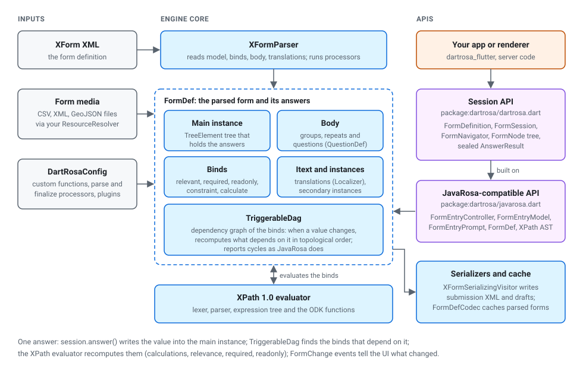

# Architecture

**Audience:** developers integrating DartRosa who want to know which
package does what, and contributors who will change it. **Type:**
concept.

DartRosa is a workspace of eight packages in three layers: the engine,
the Collect layer and the Flutter renderer. This page explains how they
fit together, what happens inside the engine, and how its behaviour is
kept identical to JavaRosa's. Terms are defined in the
[glossary](GLOSSARY.md).

## Packages

The arrows are the runtime dependencies declared in each package's
`pubspec.yaml`.

| Package | Layer | What it does | Port of |
|---|---|---|---|
| [`dartrosa`](../packages/dartrosa) | engine | Parses XForms, evaluates XPath, recalculates, validates, navigates and serializes; session API, JavaRosa-compatible API, test DSL | JavaRosa 6.0.0 |
| [`dartrosa_external_data`](../packages/dartrosa_external_data) | Collect | `pulldata()` and `search()` over CSV media | Collect's `dynamicpreload` |
| [`dartrosa_entities`](../packages/dartrosa_entities) | Collect | Entity forms, local entity lists, offline updates | Collect's entities module |
| [`dartrosa_collect`](../packages/dartrosa_collect) | Collect | Audit log, last-saved instance, fast external itemsets, edited submissions, `collectFormConfig` | Collect's form-loading services |
| [`dartrosa_encryption`](../packages/dartrosa_encryption) | Collect | Encrypted submissions | Collect's `EncryptionUtils` |
| [`dartrosa_openrosa`](../packages/dartrosa_openrosa) | Collect | OpenRosa client: form list, manifests, downloads, upload | Collect's `open-rosa` module |
| [`dartrosa_calendars`](../packages/dartrosa_calendars) | Collect | Non-Gregorian date conversions and pickers | Collect's date widgets and their libraries |
| [`dartrosa_flutter`](../packages/dartrosa_flutter) | renderer | `XFormView`: Material widgets for every control and Collect appearance | Collect's widgets (behaviour) |

Rules that keep the layers clean:

* Everything except `dartrosa_flutter` is pure Dart: no Flutter, no
  `dart:io`, no `dart:mirrors`. `tool/check_core_purity.dart` fails CI if
  a library imports one. The same code runs on the Dart VM, AOT, in the
  browser (dart2js and dart2wasm) and in Flutter.
* The engine has no global state. JavaRosa's static registries (function
  handlers, parser processors, reference roots) are fields of one
  immutable `DartRosaConfig` passed to `FormDefinition.parse`, so two
  forms can be loaded with different setups and tests run in parallel.
* The engine never reads files or the network. Media and secondary
  instances come through a `ResourceResolver` the app implements;
  device features (camera, location) go through the renderer's
  `XFormDelegates`.
* The Collect-layer packages extend the engine only through the public
  extension points described in [PLUGINS.md](PLUGINS.md).

## Inside the engine

`XFormParser` reads the XForm and builds a `FormDef`:

* the main instance, a tree of `TreeElement`s holding the answers;
* the body, the groups, repeats and questions (`QuestionDef`,
  `GroupDef`) with their labels, hints, choices and appearances;
* the binds, turned into conditions (relevant, required, read-only),
  constraints and calculations;
* the translations (`Localizer`) and secondary instances, read through
  the `ResourceResolver`;
* the `TriggerableDag`, a dependency graph of every bind expression.

The XPath evaluator (lexer, parser, expression tree and ODK's function
library in `lib/src/xpath`) computes every expression against the
instance. When an answer changes, the dependency graph finds the
expressions that read it, directly or indirectly, and recomputes them in
topological order; the session then reports what changed through
`FormSession.changes`. Number formatting, type coercion, date handling
and even the order of evaluation follow JavaRosa, because they can be
seen in the results.

## Two APIs over one engine

| Library | For |
|---|---|
| `package:dartrosa/dartrosa.dart` (session API) | New code and Flutter apps: `FormDefinition`, `FormSession`, `FormNavigator`, the sealed `FormNode` tree (`QuestionNode`, `GroupNode`, `RepeatNode`, ...), sealed `AnswerResult` and `FinalizeResult` |
| `package:dartrosa/javarosa.dart` (JavaRosa-compatible API) | Porting Java code and plugins one to one: `FormDef`, `FormEntryController`, `FormEntryModel`, `FormEntryPrompt`, `XFormParser` and its processors, the XPath AST |
| `package:dartrosa/testing.dart` | Testing forms the way JavaRosa does: `Scenario` and the XForm builder DSL |

The session API is a layer over the JavaRosa-compatible one:
`FormSession` drives a `FormEntryController`, and
`FormDefinition.formDef` exposes the underlying `FormDef`. Code can mix
them, for example a plugin written against `FormDef` used by an app
written against `FormSession`.
[MIGRATING_FROM_JAVAROSA.md](MIGRATING_FROM_JAVAROSA.md) maps every
JavaRosa class to its Dart counterpart.

## The renderer

`XFormView` listens to the session and rebuilds only the questions whose
state changed. In pager mode it uses the engine's `FormNavigator`, which
has ODK Collect's one-question-per-screen rules; in scroll mode it shows
the `FormNode` tree. Appearances are interpreted by the renderer, not the
engine; unknown ones fall back to the default widget. Platform features
are delegated to the app. See
[Show a form in a Flutter app](guides/render-a-form-in-flutter.md).

## How correctness is checked

DartRosa's contract is to behave like JavaRosa 6.0.0, quirks included.
Real JavaRosa, run on the JVM by `conformance/jvm_oracle`, records what it
does with each of the 401 corpus forms as JSON traces: the parsed
structure, the initial values, a full walk through the form, seeded
random-answer walks and dependency scenarios, ending with the submission
XML. The traces are committed. The Dart tests in
`packages/dartrosa/test/conformance` do the same steps with DartRosa and
compare. CI regenerates the traces with JavaRosa on every push and fails
if any changes, and runs the comparison in nine time zones.

On top of the traces, every JavaRosa 6.0.0 unit test class is ported to
Dart, and the example app fills, saves, resumes, finalizes and encrypts
every corpus form through the renderer. Intentional differences are
listed in [conformance/DEVIATIONS.md](../conformance/DEVIATIONS.md); the
trace format is in [conformance/TRACE_FORMAT.md](../conformance/TRACE_FORMAT.md).

## Further reading

* [STANDARDS.md](STANDARDS.md): the specifications DartRosa implements
  and where each is verified.
* [development/PORTING_PLAN.md](development/PORTING_PLAN.md): the
  original porting plan, with the design decisions (§2) and the
  compatibility traps (§9).
