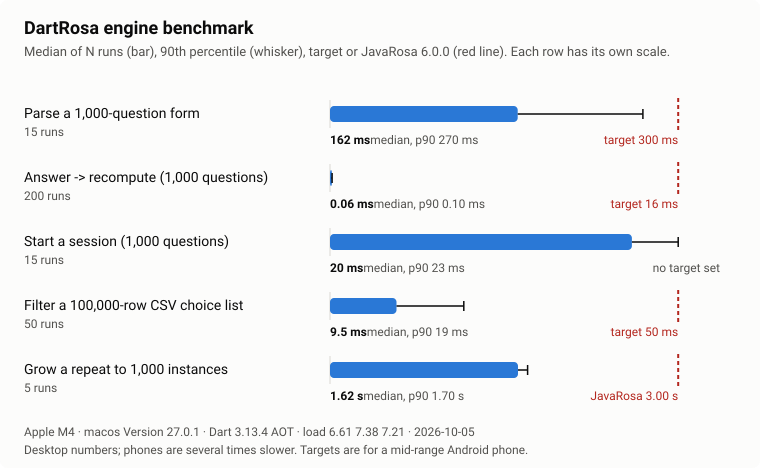

# Performance and benchmarks

**Audience:** developers deciding whether DartRosa is fast enough for
their forms and devices, and maintainers checking for regressions.
**Type:** reference.

People fill forms on inexpensive Android phones, often with large forms
(hundreds of questions, long choice lists). The port set four targets
for a mid-range phone, from the original porting plan
([§1](development/PORTING_PLAN.md#1-goals-non-goals-success-criteria)):

| Target | Why |
|---|---|
| Parse a 1,000-question form in under 300 ms | Opening a form should feel immediate |
| Answer a question and recompute everything that depends on it in under 16 ms | One screen frame at 60 Hz: typing never lags |
| Filter a 100,000-row CSV choice list in under 50 ms | Cascading selects over large lists (villages, facilities) |
| Grow a repeat to 1,000 instances no slower than JavaRosa | Large rosters (household members, plots) |



## Results

Measured with `packages/dartrosa/benchmark/engine_benchmark.dart`,
compiled ahead of time (AOT, as Flutter release builds are), on
2026-10-05. Times are the median and 90th percentile of N timed runs
after warm-up runs.

| Case | Runs | Median | p90 | Target |
|---|---:|---:|---:|---|
| Parse a 1,000-question form | 15 | 73 ms | 95 ms | < 300 ms on a phone |
| Answer → recompute dependents (1,000 questions) | 200 | 0.06 ms | 0.10 ms | < 16 ms |
| Start a session (1,000 questions, all calculations) | 15 | 12 ms | 16 ms | none |
| Filter a 100,000-row CSV choice list | 50 | 8.3 ms | 14 ms | < 50 ms |
| Grow a repeat to 1,000 instances | 5 | 1.02 s | 1.39 s | JavaRosa 6.0.0: 3.0 s |

Machine: Apple M4 (10 cores), macOS 27.0.1, Dart 3.13.4, AOT, with no
other build or test running (an Android emulator in the background; load
average 6.5 before, 5.8 after, on 10 cores; every case is
single-threaded). The raw output is in
[`packages/dartrosa/benchmark/results.json`](../packages/dartrosa/benchmark/results.json).

### Reading the results

* Every target is met on a desktop with room to spare: parsing uses a
  quarter of its budget at the median, filtering a sixth, answering
  well under one percent. A mid-range phone is several times slower
  than this desktop, so parsing is the case to watch on low-end devices.
* Growing a repeat is quadratic in both engines: on every insertion,
  JavaRosa recomputes the calculations that depend on the repeat's size
  (`position()`, `count()`) in every instance, and DartRosa reproduces
  that algorithm exactly, because the conformance traces require the
  same evaluation order. DartRosa is currently faster than JavaRosa on
  this case (1.0 s against 3.0 s). The JavaRosa figure was measured with
  JavaRosa 6.0.0 on the JVM on the same machine when the case was added;
  it is not re-measured by this benchmark.
* Starting a session evaluates every calculation once; it has no target
  but is part of opening a form, after parsing.

## What is measured

The forms are generated by the benchmark itself, so the numbers don't
depend on files outside the repository:

* parse: a form with 1,000 integer questions, where every fifth question
  has a relevance condition on the previous one, every fifth (offset by
  one) a calculation chained from the previous one, and the rest are
  required with a constraint; each question has a label and a hint;
* answer: answering the fifth question of that form, which triggers its
  dependents;
* session start: `createSession()` on that form;
* CSV filter: a select whose choices come from a 100,000-row CSV
  secondary instance filtered by `[region = /data/region]` (100 matches
  out of 1,000 regions); each run changes the region and reads the
  choices;
* repeat growth: adding 1,000 instances to a repeat with a
  `position(..)` calculation in each instance and a `count()` outside it,
  in a new session each run.

## Method

* AOT-compiled executable, one process, cases run one after another.
* Each case runs untimed warm-up runs (two, or one for the slow cases)
  before the timed runs, so the measurements exclude first-run costs.
* Each timed run is measured with a `Stopwatch`; the report gives the
  median, the 90th percentile (nearest rank) and the minimum.
* The benchmark records the operating system, CPU, core count, Dart
  version, AOT or JIT mode, and the load average before and after the
  run, so results from different machines can be compared honestly.

## Reproduce

One command compiles the benchmark, runs it, saves the JSON and redraws
the chart:

```sh
packages/dartrosa/benchmark/run.sh
```

It writes `packages/dartrosa/benchmark/results.json` and
`docs/images/benchmarks.svg`; update the table above from the printed
results. Close other programs first: the load average in the output
shows how busy the machine was. Options are passed through to the
benchmark: `--runs=3` triples the timed runs, `--quick` runs each case
three times (a smoke test). By hand:

```sh
cd packages/dartrosa
dart compile exe benchmark/engine_benchmark.dart -o /tmp/dartrosa-bench
/tmp/dartrosa-bench                        # table
/tmp/dartrosa-bench --json > results.json  # JSON
dart run benchmark/render_chart.dart results.json ../../docs/images/benchmarks.svg
```

`dart run benchmark/engine_benchmark.dart` (JIT) also works but is not
representative of release builds.

## Caveats

* Desktop, not phone. The targets are for a mid-range Android phone and
  have not yet been measured on one. To measure on a device, run the
  same cases in a Flutter release build (`flutter run --release`).
* Synthetic forms. Real forms mix question types, translations and
  secondary instances; the corpus forms are much smaller than these
  cases.
* The engine is single-threaded and synchronous after parsing, so a
  very large form blocks the thread that parses it for the time shown.
* Web builds (dart2js, dart2wasm) are not benchmarked here.
