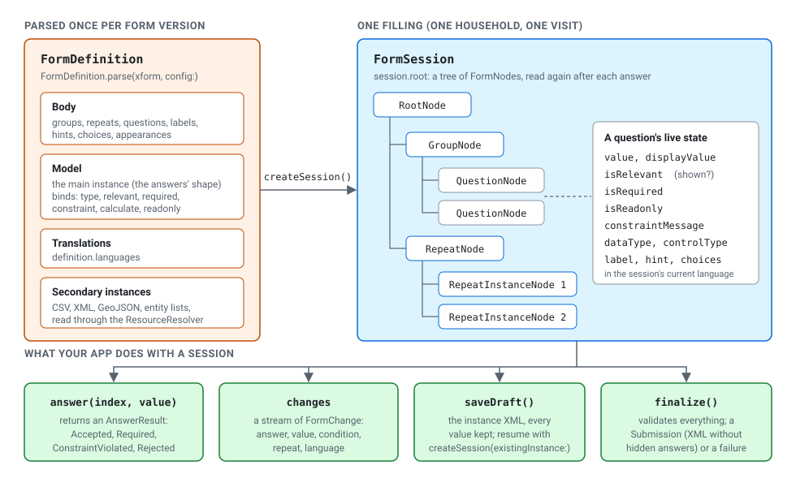

# Concepts: the form model for app developers

**Audience:** app developers who will read or drive forms from code.
**Type:** concept explanation. **Time:** about 10 minutes.

To use DartRosa you need about ten ideas. This page goes through them in
the order you meet them in code. Words in *italics* are in the
[glossary](GLOSSARY.md). If you haven't met ODK before, read the
[overview](OVERVIEW.md) first.



The Dart code on this page is run by
`packages/dartrosa/test/docs/concepts_test.dart`, against a small
"Household visit" form: a name, a number of members (required, between
1 and 29), a yes/no question about drinking water, a follow-up shown only
after "yes", and a repeat with one age per person.

## Definition and session

A form designer writes an *XLSForm*; a converter turns it into an
*XForm* (XML), which is what DartRosa reads. Parsing gives you a
`FormDefinition`: the questions, their rules and translations. It never
changes while people fill the form.

Each filling (one household, one patient visit) is a `FormSession`. It
holds the answers and everything computed from them.

```dart
// Parse once per form version: the questions, rules and translations.
final definition = await FormDefinition.parse(formXml);
// One filling of the form (one household): the answers and their state.
final session = definition.createSession(language: 'English');
```

Two rules follow from this split:

* Parse once and keep the definition for as long as the form version is
  in use. Parsing is the expensive step (about 40 ms for 1,000 questions
  on a desktop, several times that on a cheap phone); starting a session
  is cheap.
* A definition backs **one session at a time**. `createSession` closes
  the previous session. To fill two forms side by side, parse twice.

Parsing is asynchronous because a form can read files (CSV choice lists,
XML lookup tables) through the `ResourceResolver` in its
`DartRosaConfig`. Everything after parsing is synchronous.

## Nodes

`session.root` is the form as a tree, made of a sealed family of
`FormNode`s:

| Node | What it is | In XLSForm |
|---|---|---|
| `RootNode` | The form itself | the whole survey sheet |
| `GroupNode` | Questions shown together, possibly on one screen (`field-list`) | `begin_group` / `end_group` |
| `RepeatNode` | A section that can be filled several times | `begin_repeat` / `end_repeat` |
| `RepeatInstanceNode` | One filling of a repeat ("Person 2") | (one row of the repeat's data) |
| `QuestionNode` | A question, note or trigger | one row with a question type |

Nodes are *views* of the session's current state. Read the tree again
after an answer rather than keeping old `children` lists. Every node has
an `index` (a `FormIndex`), which is how you address it:
`session.answer(index, ...)`, `session.nodeAt(index)`,
`navigator.jumpTo(index)`.

`children` holds every child; `visibleChildren` only the relevant ones.
You can walk the tree yourself (a scrolling form), or let
`session.navigator` walk it the way ODK Collect does (one screen at a
time, skipping hidden questions and asking before adding repeats).

## Relevance, required and constraints

The form's rules live in its *binds*. XLSForm columns map to them like
this:

| XLSForm column | Bind attribute | What DartRosa does | Where you see it |
|---|---|---|---|
| `relevant` | `relevant` | Hides the node and everything in it; drops its answers from the submission | `node.isRelevant`, `visibleChildren` |
| `required` | `required` | Refuses an empty answer and blocks finalizing | `node.isRequired`, `AnswerRequired` |
| `constraint` | `constraint` | Refuses an answer that makes the expression false | `AnswerConstraintViolated(message)` |
| `constraint_message` | `jr:constraintMsg` | The message for that refusal, in the current language | `node.constraintMessage` |
| `calculation` | `calculate` | Recomputes the value whenever an input changes | `node.value`; a `value` change |
| `read_only` | `readonly` | The person can't edit it | `node.isReadonly` |
| `default`, `trigger`, metadata types (`start`, `deviceid`, ...) | an initial value, `setvalue`, `jr:preload` | Fills values when the form opens, on events, or from the device | `node.value` |

All of them are XPath expressions, recomputed in dependency order after
every answer, exactly as JavaRosa (the engine of ODK Collect) does.

```dart
final [_, members, water, source, _] = session.root.children;
final result = session.answer(members.index, const IntegerValue(40));
// AnswerConstraintViolated('Between 1 and 29'): nothing was saved.
session.answer(water.index, const SelectOneValue(Selection('no')));
// water_source is no longer relevant: hidden, and left out of the
// submission.
final shown = session.root.visibleChildren.contains(source); // false
```

`answer` returns a sealed `AnswerResult`, so a `switch` must handle
every outcome:

| Result | Meaning | Saved? |
|---|---|---|
| `AnswerAccepted` | The value is stored and the form recomputed | yes |
| `AnswerRequired(message)` | Empty, but the question is required | no |
| `AnswerConstraintViolated(message)` | The constraint is false for this value | no |
| `AnswerRejected(message)` | Not of the question's type, or not one of its choices | no |

Pass `validate: false` to store a value without checking `required` or
the constraint, as when a person leaves a half-filled screen;
`finalize()` checks everything again at the end. `AnswerRejected` values
are never stored.

## Answer types

Every value is an `AnswerValue`, a sealed family that mirrors the XForm
data types:

| XLSForm type | Data type | Value class |
|---|---|---|
| `text` | `string` | `StringValue` |
| `integer` | `int` | `IntegerValue` (`LongValue` for big numbers) |
| `decimal` | `decimal` | `DecimalValue` |
| `date`, `time`, `dateTime` | `date`, `time`, `dateTime` | `DateValue`, `TimeValue`, `DateTimeValue` |
| `select_one` | `select1` | `SelectOneValue(Selection('value'))` |
| `select_multiple` | `select` | `SelectMultiValue` / `MultipleItemsValue` |
| `geopoint`, `geotrace`, `geoshape` | `geopoint`, ... | `GeoPointValue`, `GeoTraceValue`, `GeoShapeValue` |
| `image`, `audio`, `file`, ... | `binary` | `PointerValue` (the file name) |

When you have text from a text field, wrap it in `UncastValue`: it is
read as the question's type, the way Collect's widgets do, and gives
`AnswerRejected` if it can't be (`'forty'` for an integer).

## Repeats

A repeat starts empty (or with `jr:count` instances). Add an instance
with `addRepeatInstance(repeat.index)`, which returns the new instance's
index; remove one with `removeRepeatInstance`. Calculations that count
or sum over the repeat update at once.

```dart
final people = session.root.children[4] as RepeatNode;
final first = session.addRepeatInstance(people.index);
final person = session.nodeAt(first) as RepeatInstanceNode;
final age = person.children.single as QuestionNode;
session.answer(age.index, const UncastValue('34')); // read as an int
```

`RepeatNode.canAddInstance` is false when the form fixes the number of
instances. The navigator stops at a `promptNewRepeat` event where Collect
asks "Add another person?".

## Languages

A form can carry several translations. `definition.languages` lists
them; `session.language` reads or changes the current one. Labels,
hints, choice labels and constraint messages follow it.

```dart
session.language = 'Kiswahili';
final label = session.root.children[1].label.text;
// 'Watu wangapi wanaishi hapa?'
```

The form's languages are separate from your app's locale: your app
translates its own buttons (in Flutter, `XFormLocalizations`), the form
translates its questions. See
[Translate the form and support right-to-left](cookbook/translate-and-rtl.md).

## Changes

Every answer can change other questions: a calculation, a relevance, a
choice list. `session.changes` is a synchronous stream of `FormChange`s
that tells you which nodes changed, so a UI can rebuild only those (the
Flutter renderer does).

```dart
final subscription = session.changes.listen((change) {
  // change.kind: answer, value (a calculation), condition (relevance,
  // required, read-only), repeat or language; change.refs: the nodes.
  log.add('${change.kind} ${change.refs.join(', ')}');
});
```

## Drafts and submissions

A form is not finished until it is *finalized*. Until then:

* `saveDraft()` returns the *instance* XML with every value, even hidden
  ones, so nothing is lost if a question becomes relevant again. Store
  it with the form's id and version.
* `definition.createSession(existingInstance: draft)` continues a draft.
* `finalize()` checks every required question and constraint. On success
  it returns a `Submission`: the XML to upload (without non-relevant
  answers), its `instanceID` and the names of attached files. On failure
  it says which question is wrong, so you can jump to it.

Encryption and upload work on that `Submission`; see
[Encrypt and submit](guides/encrypt-and-submit.md).

## Two APIs

`package:dartrosa/dartrosa.dart` is the session API described here.
`package:dartrosa/javarosa.dart` exposes the JavaRosa classes
(`FormDef`, `FormEntryController`, `TreeElement`, ...) for code ported
from Java and for plugins. Both drive the same engine: you can get the
`FormDef` of a definition with `definition.formDef`. See
[Migrating from JavaRosa](MIGRATING_FROM_JAVAROSA.md).

## Next

* [Tutorial: build a data-collection app](tutorials/build-a-data-collection-app.md)
* [Cookbook](cookbook/README.md)
* [API tour](API_TOUR.md): which class does what
