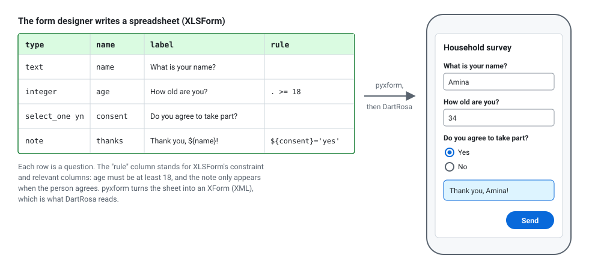
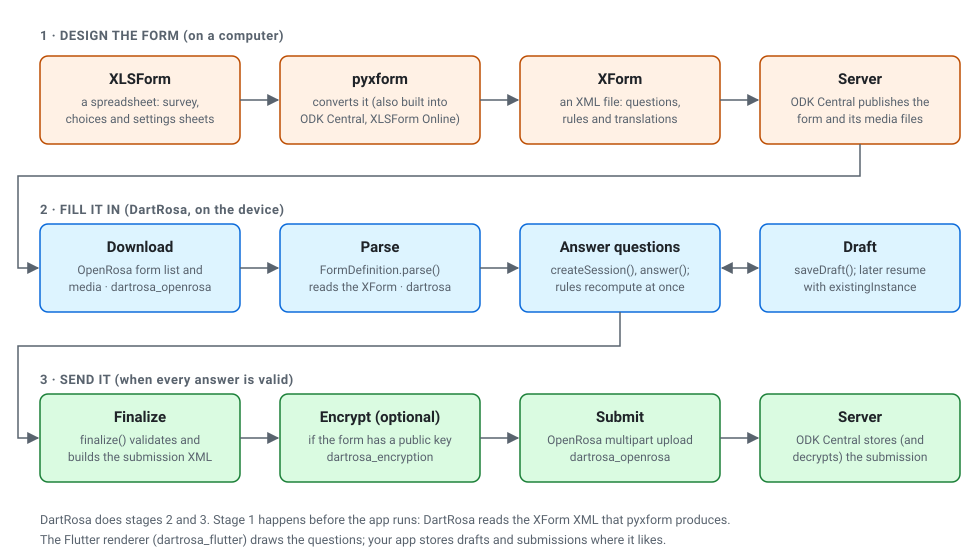
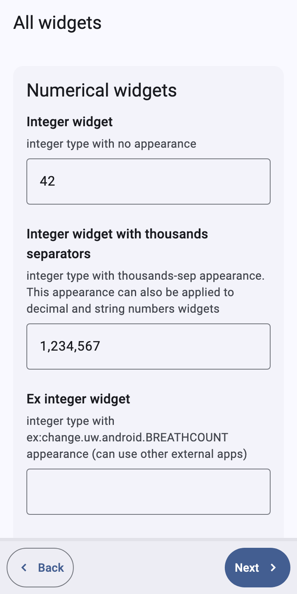
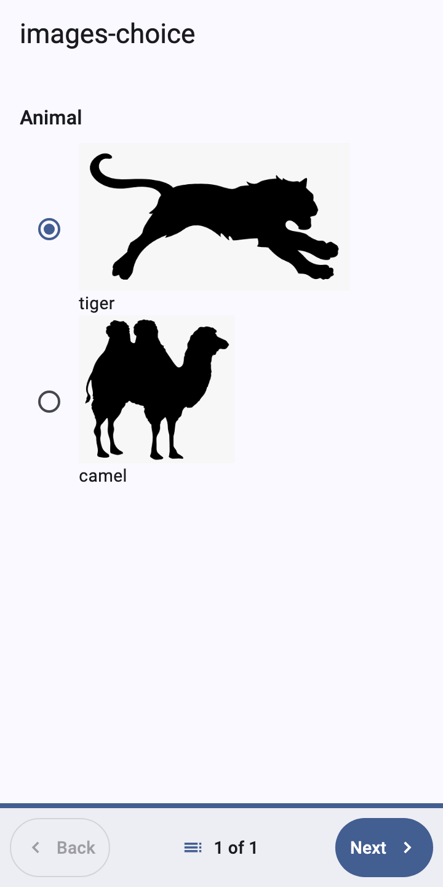
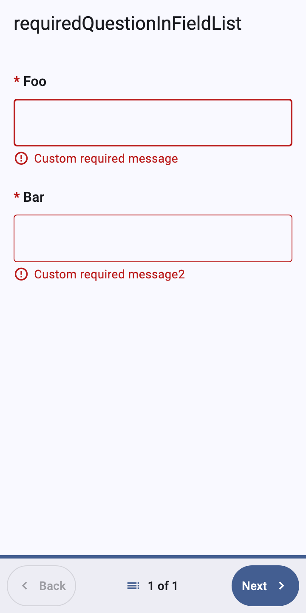
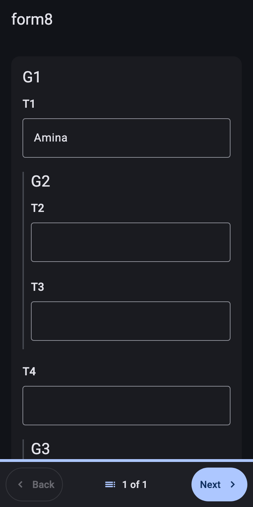
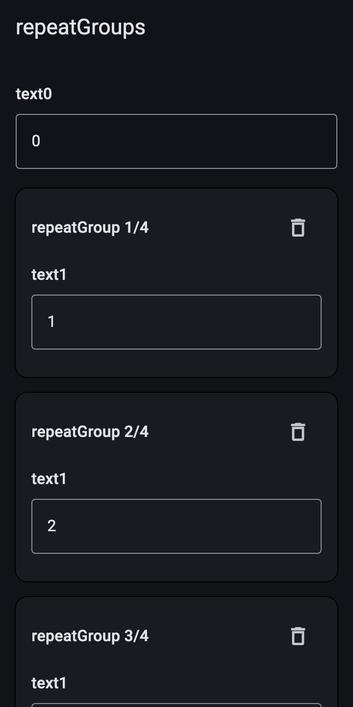
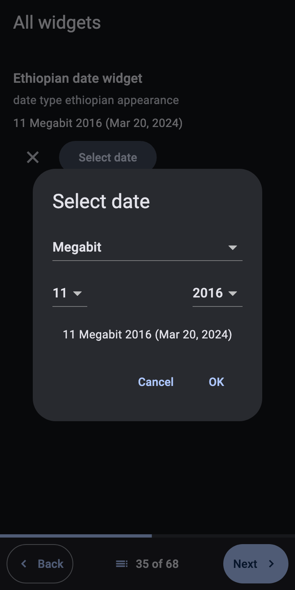

# What DartRosa is, in plain words

**Audience:** anyone curious about DartRosa: project managers, survey
and monitoring teams, funders, new contributors. No programming
knowledge needed. **Type:** concept.

## The problem

Health workers, census takers, agronomists, election observers and
researchers collect information in the field, often far from reliable
internet. For years this meant paper questionnaires typed in later, with
the errors and delays that come with it. Today most of them use a phone
or tablet: the questionnaire is a digital form that checks answers as
they are entered, skips questions that don't apply, works offline and
sends the results when a connection is available.

[ODK](https://getodk.org) (Open Data Kit) is the most widely used
open-source toolkit for this. Organisations design a form, publish it on
their ODK server, and field teams fill it in with the ODK Collect app on
Android.

## Forms are spreadsheets

An ODK form is usually written as a spreadsheet called an XLSForm. Each
row is a question; columns give its type, its wording, and rules such
as "the age must be at least 18" or "only ask this if the person agreed
to take part".

A converter called pyxform turns the spreadsheet into an XForm, an XML
file that apps can read. The XForm holds everything: the questions,
their translations into several languages, the choices, the rules and
calculations, and the structure of the data that will be sent back.

## What an engine does

Something has to read the XForm and make it work while a person fills
it in. That something is the form engine. As each answer is entered, it:

* checks the answer against the form's rules and explains what is wrong;
* recalculates values that depend on it (a body mass index from height
  and weight, a total from a list of items);
* shows or hides later questions that depend on it;
* lets the person add another household member, another plot, another
  visit, as many times as the form allows;
* switches languages at any moment;
* saves an unfinished form and reopens it later;
* when the form is complete, produces the submission: a file with all
  the answers in the format the server expects, encrypted if the form
  asks for it.

ODK Collect's engine is called JavaRosa. It is written in Java, so it
only runs where Java runs: Android phones and servers.

## What DartRosa is

DartRosa is the same engine rewritten in Dart, the language of Flutter.
Flutter apps run on Android, iPhone and iPad, the web, Windows, macOS and
Linux from one code base, so with DartRosa an organisation can build a
form-filling app (or add forms to an app it already has) for all of these
at once, and the forms behave exactly as they do in ODK Collect.

"Exactly" is the point. Survey teams test their forms in ODK Collect and
rely on every rule, calculation and skip behaving the same everywhere. A
new engine that is right 99% of the time would produce data that is
quietly wrong 1% of the time. So DartRosa was built as a faithful port
of JavaRosa 6.0.0 and checked against it: 401 test forms are run through
both engines and every value, message, screen and submitted byte is
compared. There are no differences. (Four forms that use unseeded random
numbers can't be compared this way; unit tests cover them.) See
[Standards](STANDARDS.md) for what this covers.

## The journey of a form

1. A form designer writes the XLSForm and uploads it to an ODK server
   such as ODK Central, which converts and publishes it.
2. The app downloads the form and its media files (pictures, lists of
   villages) using a protocol called OpenRosa.
3. A field worker fills the form in. DartRosa checks and recalculates as
   they go; they can save a draft and come back.
4. When the form is complete, DartRosa produces the submission, encrypts
   it if required, and the app sends it to the server when it has a
   connection.
5. The organisation sees the data on the server, decrypts it if it was
   encrypted, and analyses it.

## What it looks like

DartRosa includes a ready-made form screen for Flutter apps that follows
ODK Collect's behaviour: one question per screen, or the whole form on
one page.

| | | |
|---|---|---|
|  |  |  |
| Number questions with hints | Choices with pictures | A required answer is missing |
|  |  |  |
| Several questions on one screen (dark theme) | A repeated group, one block per entry | A date picked in the Ethiopian calendar |

## Who it is for

* Organisations that want their own branded data-collection app on
  Android and iPhone, using forms they already have.
* Developers adding a questionnaire to an existing Flutter app (a health
  record app, a farm management app) without rewriting forms.
* Teams that need forms on the web or desktop with the same behaviour as
  in the field.
* Server-side tools that need to process ODK forms in Dart.

It is not a replacement for ODK Central (the server) or for XLSForm
tools; DartRosa works with them.

## Where to go next

* Developers: [Getting started](GETTING_STARTED.md), then the
  [guides](README.md#guides-how-to).
* How it is built: [Architecture](ARCHITECTURE.md).
* What it supports and how that is verified: [Compatibility](COMPATIBILITY.md)
  and [Standards](STANDARDS.md).
* Terms: [Glossary](GLOSSARY.md).
