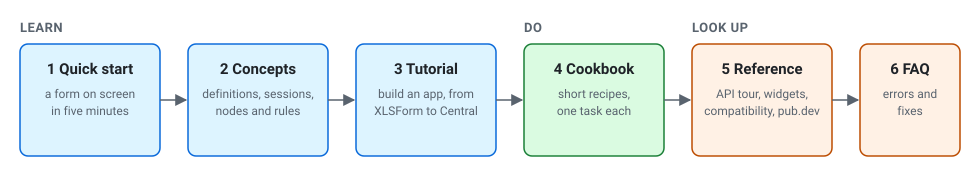

# DartRosa documentation

**Audience:** everyone; start here to find the right document.

## Learning path

Follow these in order the first time; come back to the later ones when
you need them.

| Step | Read | Time | You will |
|---|---|---|---|
| 1. Quick start | [QUICKSTART.md](QUICKSTART.md) | 5 min | Show a form in a Flutter app |
| 2. Concepts | [CONCEPTS.md](CONCEPTS.md) | 10 min | Understand definitions, sessions, nodes, rules, drafts |
| 3. Tutorial | [Build a data-collection app](tutorials/build-a-data-collection-app.md) | 1 hour | Go from an XLSForm to encrypted submissions on ODK Central |
| 4. Cookbook | [cookbook/](cookbook/README.md) | 5 min each | Do one task: theming, custom widgets, translations, camera and GPS, custom functions, entities, server-side validation, testing |
| 5. Reference | [API tour](API_TOUR.md), [widget catalog](widgets/README.md), [compatibility](COMPATIBILITY.md), [API docs on pub.dev](https://pub.dev/documentation/dartrosa/latest/) | as needed | Look up a class, a question type, a supported feature |
| 6. Troubleshooting | [FAQ.md](FAQ.md) | as needed | Fix parse errors, hidden questions, dates, web issues |

Not a programmer, or new to ODK? Read the [overview](OVERVIEW.md) first.
Terms are defined in the [glossary](GLOSSARY.md).

## Start here

| If you are... | Read |
|---|---|
| New to ODK, XForms or DartRosa, and not necessarily a programmer | [Overview](OVERVIEW.md) |
| A Flutter developer about to use DartRosa | [Quick start](QUICKSTART.md), then the [tutorial](tutorials/build-a-data-collection-app.md) |
| A Dart developer without Flutter (servers, command line) | [Getting started](GETTING_STARTED.md), [Validate submissions on the server](cookbook/validate-on-the-server.md) |
| Moving Java code from JavaRosa | [Migrating from JavaRosa](MIGRATING_FROM_JAVAROSA.md) |
| Checking whether your forms and platforms are supported | [Compatibility](COMPATIBILITY.md) |
| Stuck | [FAQ and troubleshooting](FAQ.md) |
| Reviewing quality, standards or licensing | [Standards](STANDARDS.md), [Benchmarks](BENCHMARKS.md), [Legal](legal/README.md) |
| Contributing to DartRosa | [Architecture](ARCHITECTURE.md), the [conformance docs](#conformance) and [development](#development) |

## All documents

The documents are grouped by what they are for, following
ISO/IEC/IEEE 26514: tutorials teach, concepts explain, how-to guides and
recipes walk through a task, and reference material is for looking
things up. Each document states its audience at the top.

### Tutorials

| Document | Audience | Contents |
|---|---|---|
| [QUICKSTART.md](QUICKSTART.md) | Flutter developers | A form on screen in five minutes |
| [tutorials/build-a-data-collection-app.md](tutorials/build-a-data-collection-app.md) | Flutter developers | XLSForm, ODK Central, download, fill, drafts, finalize, encrypt, submit, test |
| [GETTING_STARTED.md](GETTING_STARTED.md) | Dart and Flutter developers | The session API step by step: parse, read the tree, navigate, answer, repeats, languages, drafts, finalize |

### Concepts

| Document | Audience | Contents |
|---|---|---|
| [OVERVIEW.md](OVERVIEW.md) | Anyone | What ODK, XForms and DartRosa are, the journey of a form, screenshots |
| [CONCEPTS.md](CONCEPTS.md) | App developers | The form model: definition and session, nodes, rules, answer types, repeats, languages, changes, drafts |
| [ARCHITECTURE.md](ARCHITECTURE.md) | Integrators, contributors | The packages and their dependencies, the engine's internals, the two APIs, how correctness is checked |

### How-to guides and recipes

| Document | Audience | Task |
|---|---|---|
| [cookbook/](cookbook/README.md) | Developers | Nine short recipes, one task each |
| [guides/render-a-form-in-flutter.md](guides/render-a-form-in-flutter.md) | Flutter developers | Show a downloaded form with its media, connect device features, theme and translate the interface |
| [guides/save-and-resume-drafts.md](guides/save-and-resume-drafts.md) | Developers | Save drafts, autosave, resume, finalize, edit finalized submissions |
| [guides/encrypt-and-submit.md](guides/encrypt-and-submit.md) | Developers | Download forms from ODK Central, encrypt and upload submissions over OpenRosa |
| [guides/external-data-and-entities.md](guides/external-data-and-entities.md) | Developers | CSV choice lists, `pulldata()`, `search()`, entities |
| [guides/non-gregorian-calendars.md](guides/non-gregorian-calendars.md) | Form designers, developers | Ethiopian, Persian, Nepali and other calendars |
| [PLUGINS.md](PLUGINS.md) | Developers extending the engine | Custom XPath functions, processors, secondary instances, how the Collect packages plug in |

### Reference

| Document | Audience | Contents |
|---|---|---|
| [API_TOUR.md](API_TOUR.md) | Developers | Which class does what, by task, linked to the API documentation |
| [widgets/README.md](widgets/README.md) | Flutter developers, form designers | Every question type and appearance as the renderer draws it |
| API documentation | Developers | On pub.dev: [dartrosa](https://pub.dev/documentation/dartrosa/latest/), [dartrosa_flutter](https://pub.dev/documentation/dartrosa_flutter/latest/), [dartrosa_openrosa](https://pub.dev/documentation/dartrosa_openrosa/latest/), [dartrosa_encryption](https://pub.dev/documentation/dartrosa_encryption/latest/), [dartrosa_entities](https://pub.dev/documentation/dartrosa_entities/latest/), [dartrosa_external_data](https://pub.dev/documentation/dartrosa_external_data/latest/), [dartrosa_collect](https://pub.dev/documentation/dartrosa_collect/latest/), [dartrosa_calendars](https://pub.dev/documentation/dartrosa_calendars/latest/) |
| [COMPATIBILITY.md](COMPATIBILITY.md) | Developers, form designers | Every supported XForms feature, XPath function, appearance and platform, with the conformance evidence |
| [FAQ.md](FAQ.md) | Developers | Questions, error messages and fixes |
| [MIGRATING_FROM_JAVAROSA.md](MIGRATING_FROM_JAVAROSA.md) | Java developers | JavaRosa class to Dart class map, behavioural differences, what is not ported |
| [STANDARDS.md](STANDARDS.md) | Technical leads, reviewers | Specifications implemented (ODK XForms, XPath, Entities, OpenRosa, ISO 8601) and quality standards (ISO/IEC 25010, ISO/IEC/IEEE 26514, WCAG 2.1) |
| [BENCHMARKS.md](BENCHMARKS.md) | Developers, maintainers | Performance targets, results, method, how to reproduce |
| [GLOSSARY.md](GLOSSARY.md) | Everyone | Terms used in the documentation |
| Package READMEs | Developers | Install and a short example for each package: [dartrosa](../packages/dartrosa/README.md), [dartrosa_flutter](../packages/dartrosa_flutter/README.md), [dartrosa_collect](../packages/dartrosa_collect/README.md), [dartrosa_external_data](../packages/dartrosa_external_data/README.md), [dartrosa_entities](../packages/dartrosa_entities/README.md), [dartrosa_encryption](../packages/dartrosa_encryption/README.md), [dartrosa_openrosa](../packages/dartrosa_openrosa/README.md), [dartrosa_calendars](../packages/dartrosa_calendars/README.md) |
| [legal/README.md](legal/README.md) | Legal and compliance reviewers | Licences, notices, SPDX and OpenChain |

### Conformance

| Document | Audience | Contents |
|---|---|---|
| [conformance/TRACE_FORMAT.md](../conformance/TRACE_FORMAT.md) | Contributors | The JSON traces recorded from JavaRosa and how they are compared |
| [conformance/DEVIATIONS.md](../conformance/DEVIATIONS.md) | Developers, contributors | Every intentional difference from JavaRosa and why |

### Development

| Document | Audience | Contents |
|---|---|---|
| [development/COMPETITIVE_ANALYSIS.md](development/COMPETITIVE_ANALYSIS.md) | Maintainers | How comparable libraries and platforms work and document themselves; what this documentation took from them and what is left |
| [development/RELEASING.md](development/RELEASING.md) | Maintainers | Publishing the packages |
| [development/PORTING_PLAN.md](development/PORTING_PLAN.md) | Maintainers | The original porting plan: design decisions, the JavaRosa inventory, compatibility traps. Historical; not kept in step with the code |

## Keeping the documentation correct

Every Dart code block in `docs/*.md`, `docs/guides/*.md`,
`docs/tutorials/*.md` and `docs/cookbook/*.md` must appear in a test
under `packages/*/test/docs/`, which compiles and runs it;
`packages/dartrosa/test/docs/all_docs_test.dart` fails otherwise.
`python3 tool/check_docs.py` checks every relative link and anchor and
that every SVG parses. The diagrams in `images/` are hand-written SVG
(light and dark through `prefers-color-scheme`), except `benchmarks.svg`
(drawn by `packages/dartrosa/benchmark/render_chart.dart`). The renderer
screenshots in `images/screenshots/` are produced by
`packages/dartrosa_flutter/test/screenshots/screenshots_test.dart`.
