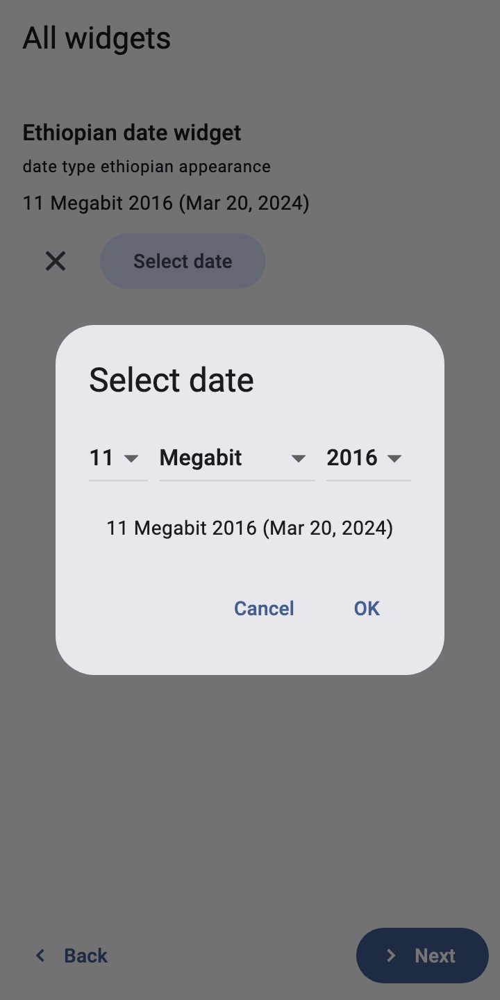

# Use non-Gregorian calendars

**Audience:** form designers and developers serving people who date
events in the Ethiopian, Coptic, Islamic (Hijri), Persian (Solar Hijri),
Bikram Sambat (Nepal), Myanmar or Buddhist calendar. **Type:** how-to
guide.

In Ethiopia, 20 March 2024 is 11 Megabit 2016; in Iran it is 1 Farvardin
1403. Asking people to translate dates in their head causes errors, so
ODK Collect lets a date question show and pick dates in the local
calendar while storing the internationally comparable Gregorian date.
DartRosa does the same: the conversions in `dartrosa_calendars` match
Collect's (and the libraries it uses) day for day from 1880 to 2120.



Every Dart snippet below is run by
`packages/dartrosa_flutter/test/docs/calendars_guide_test.dart`.

## In the form

Give the date question one of the calendar appearances: `ethiopian`,
`coptic`, `islamic`, `bikram-sambat`, `myanmar`, `persian` or `buddhist`.
In XLSForm, put it in the `appearance` column of a `date` row. Add
`month-year` or `year` to ask for less (`persian month-year`). The XForm
gets:

```xml
<input ref="/data/visit_date" appearance="ethiopian">
  <label>Visit date</label>
</input>
```

## In a Flutter app

Nothing to do: `XFormView` reads the appearance, shows the answer as
Collect does (`11 Megabit 2016 (Mar 20, 2024)`) and opens that
calendar's day, month and year spinners.

## What is stored

The answer is always the Gregorian date, so submissions from different
calendars can be compared and analysed together:

```dart
final definition = await FormDefinition.parse(formXml);
final session = definition.createSession();
final date = session.root.children.first as QuestionNode;
session.answer(date.index, DateValue(DateTime(2024, 3, 20)));
// The instance holds <visit_date>2024-03-20</visit_date>.
final draft = session.saveDraft();
```

Calculations such as `today()`, `format-date()` and date arithmetic also
work on Gregorian dates. Date values in XForms follow ISO 8601
(`yyyy-mm-dd`); see [STANDARDS.md](../STANDARDS.md#iso-8601-dates-and-times).

## Conversions without Flutter

`dartrosa_calendars` is pure Dart, so servers and other UIs can show the
same dates. `DatePickerDetails` reads an appearance; `CustomCalendar`
converts:

```dart
final details = DatePickerDetails.fromAppearance('ethiopian');
final calendar = CustomCalendar.of(details.type);
final day = DateTime(2024, 3, 20);
final ethiopian = calendar.fromGregorian(day); // 11 Megabit 2016
final label = dateTimeLabel(day, details); // 11 Megabit 2016 (Mar 20, 2024)
final years = (calendar.minYear, calendar.maxYear); // (1893, 2093)
```

```dart
final details = DatePickerDetails.fromAppearance('persian month-year');
final type = details.type; // DatePickerType.persian
final monthYear = details.isMonthYearMode; // true: no day spinner
```

The year range is what Collect's spinners offer (1900 to 2100 in the
Gregorian calendar; Bikram Sambat 1913 to 2033).

## Your own date picker

To build a different picker with Collect's behaviour (days per month,
leap years, clamping the day when the month changes), drive a
`CustomDatePickerModel`:

```dart
final picker = CustomDatePickerModel(
  DatePickerDetails.fromAppearance('persian'),
  DateTime(2024, 3, 20),
);
final shown = (picker.day, picker.year); // (1, 1403): 1 Farvardin 1403
picker.setYear(picker.year + 1); // the user turns the year spinner
final chosen = picker.gregorianDate; // 2025-03-21, the date to store
final text = picker.label(); // 1 Farvardin 1404 (Mar 21, 2025)
```

Or reuse the renderer's dialog anywhere in a Flutter app:

```dart
// Collect's spinner dialog, outside a form: pops the Gregorian date, or
// null when cancelled.
Future<DateTime?> pickDate(BuildContext context) => showDialog<DateTime>(
  context: context,
  builder: (context) => CustomCalendarDatePickerDialog(
    details: DatePickerDetails.fromAppearance('ethiopian'),
    initialDate: DateTime(2024, 3, 20),
  ),
);
```

## Related

* [dartrosa_calendars README](../../packages/dartrosa_calendars/README.md)
* [COMPATIBILITY.md](../COMPATIBILITY.md#collect-appearances-flutter-renderer):
  date appearances
* [ODK documentation on date widgets](https://docs.getodk.org/form-question-types/)
