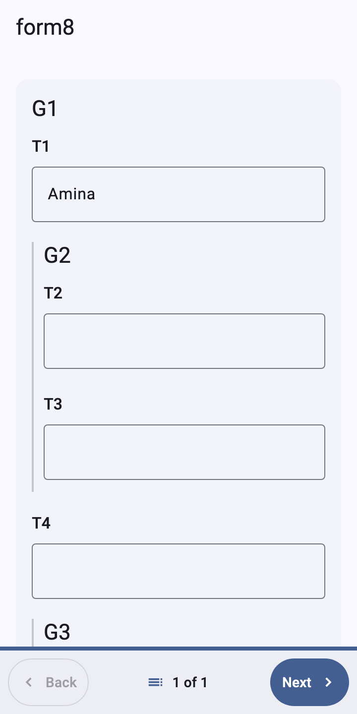

# Show a form in a Flutter app

**Audience:** Flutter developers adding form filling to an app.
**Type:** how-to guide. **Time:** about 20 minutes.

This guide shows a downloaded XForm with its media files in a Flutter
screen, using the `XFormView` widget of `dartrosa_flutter`. At the end
the person filling the form sees one question per screen, as in ODK
Collect, and your app receives the finished submission.



Every Dart snippet below is run by
`packages/dartrosa_flutter/test/docs/render_guide_test.dart`.

## Before you start

* A Flutter app (Flutter 3.38 or later).
* An XForm XML file and its media files (images, CSV files) in a folder
  on the device. [Encrypt and submit](encrypt-and-submit.md) shows how
  to download them from ODK Central.
* Terms used here are explained in the [glossary](../GLOSSARY.md).

## 1. Add the dependency

The packages are not on pub.dev yet. Depend on them from Git, and point
the DartRosa packages that `dartrosa_flutter` uses at the same source:

```yaml
dependencies:
  dartrosa_flutter:
    git:
      url: https://github.com/sudhi001/dartrosa
      path: packages/dartrosa_flutter
  flutter_localizations:
    sdk: flutter

dependency_overrides:
  dartrosa:
    git: {url: https://github.com/sudhi001/dartrosa, path: packages/dartrosa}
  dartrosa_calendars:
    git: {url: https://github.com/sudhi001/dartrosa, path: packages/dartrosa_calendars}
  dartrosa_external_data:
    git: {url: https://github.com/sudhi001/dartrosa, path: packages/dartrosa_external_data}
```

`dartrosa_flutter` re-exports the engine (`package:dartrosa/dartrosa.dart`),
so one import is enough: `import 'package:dartrosa_flutter/dartrosa_flutter.dart';`.

## 2. Tell the engine where the media files are

A form can read files: a CSV list of choices
(`jr://file-csv/towns.csv`), an XML lookup table, a GeoJSON file. The
engine never opens files itself (that keeps it working on the web). It
asks a `ResourceResolver` you provide. This one reads the folder the
form's media files were saved to:

```dart
// Serves jr://file/..., jr://file-csv/... and jr://images/... from the
// folder the form's media files were downloaded to.
class MediaFolderResolver implements ResourceResolver {
  MediaFolderResolver(this.folder);

  final Directory folder;

  @override
  Future<Uint8List> read(String uri) async {
    final file = File('${folder.path}/${Uri.parse(uri).pathSegments.last}');
    if (!file.existsSync()) throw ResourceNotFoundException(uri);
    return file.readAsBytes();
  }
}
```

Parse the form with that resolver and start a session. A session is one
filling of the form (one household, one patient visit):

```dart
Future<FormSession> openForm(String formXml, Directory media) async {
  final definition = await FormDefinition.parse(
    formXml,
    config: DartRosaConfig(resolver: MediaFolderResolver(media)),
  );
  return definition.createSession();
}
```

Parsing is asynchronous because it reads those files; everything after it
is synchronous. A malformed form throws `XFormParseException`.

## 3. Connect the device features

The renderer draws every question type, but it can't take photos, read
GPS or scan barcodes by itself. It calls an `XFormDelegates` object for
those, so you can use the plugins your app already has (image_picker,
geolocator, a barcode scanner, a map). Every method has a default; without
a delegate, capture questions let the person type the value.

```dart
// Images in labels come from the media folder. Capture questions would
// open the camera, a file picker, a location service and so on.
class MyDelegates extends XFormDelegates {
  const MyDelegates(this.media);

  final Directory media;

  File _file(String uri) =>
      File('${media.path}/${Uri.parse(uri).pathSegments.last}');

  @override
  ImageProvider? image(String uri) {
    final file = _file(uri);
    return file.existsSync() ? FileImage(file) : null;
  }

  @override
  Future<Uint8List?> mediaBytes(String uri) async {
    final file = _file(uri);
    return file.existsSync() ? file.readAsBytes() : null;
  }

  @override
  Future<String?> captureMedia(
    BuildContext context, {
    required String mediaType,
    String? appearance,
  }) async {
    // Take a photo or pick a file (mediaType is image/*, audio/*, ...),
    // save it next to the instance and return its file name; null if
    // the user cancels.
    return null;
  }
}
```

The other methods are `currentLocation`, `scanBarcode`, `openLink`,
`selectFromMap`, `geoFromMap` (with `canShowMaps`), `launchExternalApp`,
`print` and `compassBearing`; see their API documentation.

## 4. Show the form

`XFormView` takes the session and the delegates. When the person
finalizes the form on the last screen, `onFinalized` receives the
`Submission` (its XML, its `instanceID` and the names of the files it
refers to):

```dart
class FormPage extends StatelessWidget {
  const FormPage({required this.session, required this.media, super.key});

  final FormSession session;
  final Directory media;

  @override
  Widget build(BuildContext context) => Scaffold(
    appBar: AppBar(title: Text(session.definition.title ?? '')),
    body: XFormView(
      session: session,
      delegates: MyDelegates(media),
      onFinalized: (submission) {
        // Store submission.xml and its attachments, then leave the form.
        Navigator.of(context).pop(submission);
      },
    ),
  );
}
```

The default `XFormMode.pager` shows one question (or one `field-list`
group) per screen, checks the screen before moving on, asks before
adding a repeat and ends with a finalize screen. `XFormMode.scroll`
shows every question on one page instead.

To keep what the person entered when they leave before finishing, save a
draft: see [Save and resume drafts](save-and-resume-drafts.md).

## 5. Match your app's look and language

Add an `XFormTheme` to your theme to change spacing, the card style and
the error color, and to cap the width of the form on large screens
(`maxContentWidth`; by default the form fills the width); everything
else follows your `ThemeData`. The button
labels and default messages come from `XFormLocalizations`, in English
by default. To translate them, subclass it and register a delegate:

```dart
// French button labels; every string has an English default.
class FrenchXFormLocalizations extends XFormLocalizations {
  const FrenchXFormLocalizations();

  @override
  String get next => 'Suivant';

  @override
  String get back => 'Retour';
}

class FrenchXFormLocalizationsDelegate
    extends LocalizationsDelegate<XFormLocalizations> {
  const FrenchXFormLocalizationsDelegate();

  @override
  bool isSupported(Locale locale) => locale.languageCode == 'fr';

  @override
  Future<XFormLocalizations> load(Locale locale) =>
      SynchronousFuture(const FrenchXFormLocalizations());

  @override
  bool shouldReload(FrenchXFormLocalizationsDelegate old) => false;
}

Widget buildApp(FormSession session, Directory media) => MaterialApp(
  theme: ThemeData(
    colorSchemeSeed: Colors.indigo,
    extensions: const [
      // On tablets and desktops, questions at most 840dp wide, centered.
      XFormTheme(pagePadding: EdgeInsets.all(24), maxContentWidth: 840),
    ],
  ),
  locale: const Locale('fr'),
  supportedLocales: const [Locale('en'), Locale('fr')],
  localizationsDelegates: const [
    FrenchXFormLocalizationsDelegate(),
    // From flutter_localizations, for Flutter's own widgets.
    GlobalMaterialLocalizations.delegate,
    GlobalWidgetsLocalizations.delegate,
    GlobalCupertinoLocalizations.delegate,
  ],
  home: FormPage(session: session, media: media),
);
```

The form's own text (labels, hints, choices) comes from the form's
translations, not from your app: set `session.language` to one of
`session.definition.languages`. Forms in right-to-left languages (Arabic,
Persian, Hebrew, Urdu and others) are laid out right to left
automatically.

## 6. Replace a question widget (optional)

Any question widget can be swapped for your own, by control type and
appearance. The key is the control type (`selectOne`, `input`,
`range`, ...), optionally followed by `:` and an appearance:

```dart
XFormView(
  session: session,
  mode: XFormMode.scroll, // every question on one page
  widgetOverrides: {
    // Your widget for every select_one with appearance "likert".
    'selectOne:likert': (context, node) =>
        StarRating(node: node as QuestionNode),
  },
);
```

Your widget answers through `XFormScope.of(context).controller.answer(...)`
so that the renderer shows validation errors for it.

## Result

The app shows the form, recalculates and validates while the person
answers, and hands you the submission. Next steps:

* [Save and resume drafts](save-and-resume-drafts.md)
* [Encrypt and submit to ODK Central](encrypt-and-submit.md)
* The supported controls and appearances:
  [COMPATIBILITY.md](../COMPATIBILITY.md#collect-appearances-flutter-renderer)
  and the [dartrosa_flutter README](../../packages/dartrosa_flutter/README.md)
* A complete app that fills every test form:
  [`packages/dartrosa_flutter/example`](../../packages/dartrosa_flutter/example)
