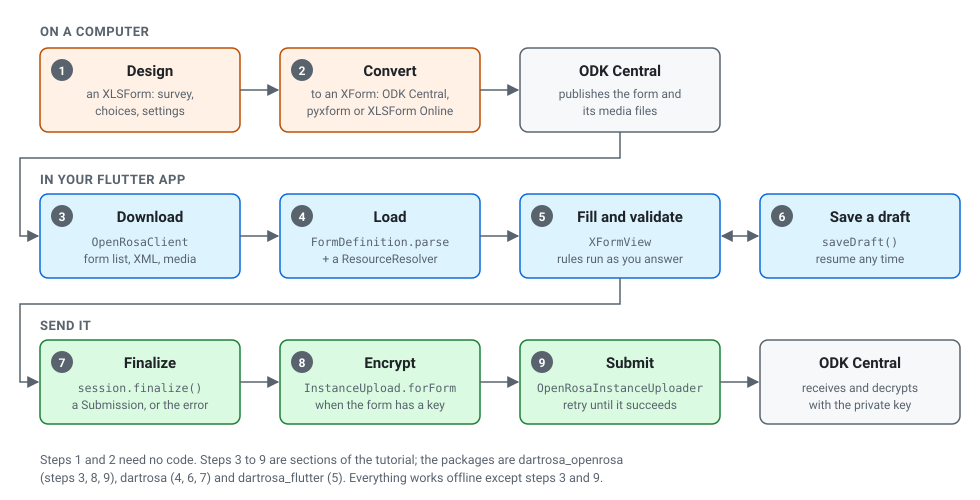

# Tutorial: build a data-collection app

**Audience:** Flutter developers building a field app for ODK forms.
**Type:** tutorial. **Time:** about an hour.

In this tutorial you build a small household-survey app, the kind that
health workers and enumerators use offline in the field. You design the
form as a spreadsheet, publish it on ODK Central, and write an app that
downloads it, lets people fill it in (with drafts), finalizes and
encrypts each visit and sends it to the server when there is a
connection.



The code is run by `packages/dartrosa_flutter/test/docs/tutorial_test.dart`
(the screens) and `packages/dartrosa_openrosa/test/docs/tutorial_test.dart`
(download and upload, against a fake ODK Central), so it compiles and
works as shown.

**You need:** Flutter 3.35 or later; an ODK Central server (a
[free trial](https://getodk.org/) or your own), or Python with pyxform if
you only want to convert the form locally. If you have not yet seen the
[quick start](../QUICKSTART.md) and the [concepts](../CONCEPTS.md), read
them first; they take 15 minutes together.

## 1. Design the form

Create a spreadsheet `household_visit.xlsx` with three sheets.

**survey**

| type | name | label | required | constraint | constraint_message | relevant |
|---|---|---|---|---|---|---|
| select_one_from_file villages.csv | village | Village | yes | | | |
| text | head_name | Name of the household head | yes | | | |
| integer | members | How many people live here? | yes | . > 0 and . < 30 | Between 1 and 29 | |
| select_one yes_no | has_water | Is there drinking water? | yes | | | |
| text | water_source | Where does it come from? | | | | ${has_water} = 'yes' |
| image | photo | Photo of the house | | | | |
| geopoint | location | Location | | | | |

**choices**

| list_name | name | label |
|---|---|---|
| yes_no | yes | Yes |
| yes_no | no | No |

**settings**

| form_title | form_id | version |
|---|---|---|
| Household visit | household_visit | 2026100501 |

And a media file `villages.csv`:

```text
name,label
kib,Kibera
mat,Mathare
```

Each row of the survey sheet is a question. `required`, `constraint` and
`relevant` are rules the engine enforces while people type; the
[concepts page](../CONCEPTS.md#relevance-required-and-constraints) maps
each column to what you see in code. The full language is documented at
[xlsform.org](https://xlsform.org) and in the
[ODK form design docs](https://docs.getodk.org/form-design-intro/).

## 2. Convert and publish it

DartRosa reads XForms (XML), not spreadsheets. Pick one way to convert:

* **ODK Central** (recommended): create a project, then a form from
  `household_visit.xlsx`; upload `villages.csv` when Central asks for it,
  and publish. Central converts the spreadsheet with pyxform for you. To
  encrypt submissions, turn on encryption in the project settings first:
  Central then adds a public key to every form.
* **pyxform**, on your computer:

  ```sh
  pip install pyxform
  xls2xform household_visit.xlsx household_visit.xml
  ```

* **[XLSForm Online](https://getodk.org/xlsform/)**, in a browser.

The result starts like this (pyxform's output, trimmed):

```xml
<h:html xmlns="http://www.w3.org/2002/xforms" ...>
  <h:head>
    <h:title>Household visit</h:title>
    <model>
      <instance>
        <data id="household_visit" version="2026100501">
          <village/><head_name/><members/><has_water/><water_source/>
          ...
      <instance id="villages" src="jr://file-csv/villages.csv"/>
      <bind nodeset="/data/members" type="int" required="true()"
          constraint=". &gt; 0 and . &lt; 30"
          jr:constraintMsg="Between 1 and 29"/>
      ...
```

In Central, create an **App User** for the project and open its QR code:
the URL inside, shaped like
`https://central.example.org/v1/key/<token>/projects/1`, is all the app
needs to download forms and send submissions.

## 3. Create the app

```sh
flutter create visit_app
cd visit_app
flutter pub add dartrosa_flutter dartrosa_openrosa http
```

`dartrosa_flutter` shows forms, `dartrosa_openrosa` talks to ODK Central
(and brings `dartrosa_encryption`), `http` is the HTTP client it uses.

The app keeps forms, drafts, files and finished submissions somewhere.
To keep the tutorial short this store lives in memory; a real app writes
files (with `path_provider`) or uses a database, behind the same
methods:

```dart
/// What the app keeps: forms with their media, drafts, files and the
/// outbox. This one lives in memory; a real app writes files under
/// getApplicationDocumentsDirectory() or uses a database.
class FormStore {
  /// Form id -> its XML and media files (file name -> bytes).
  final forms = <String, ({String xml, Map<String, Uint8List> media})>{};

  /// Draft id -> the instance XML from saveDraft().
  final drafts = <String, String>{};

  /// Photos, signatures and recordings, by file name.
  final files = <String, Uint8List>{};

  /// instanceID -> a finalized submission waiting to be sent.
  final outbox = <String, ({String formId, Submission submission})>{};
}
```

## 4. Download the form

Connect to the App User URL once, when the app starts. The connection
sends ODK Collect's headers, so Central treats the app like Collect:

```dart
final connection = HttpClientConnection(
  client: httpClient, // an http.Client
  fileToContentTypeMapper: CollectThenSystemContentTypeMapper(),
  userAgent: 'visit-app/1.0',
);
final credentials = WebCredentialsUtils(
  // The App User's URL from ODK Central carries its token.
  InMemoryServerCredentialsSettings(serverUrl: serverUrl),
);
final client = OpenRosaClient(
  serverUrl,
  connection,
  credentials,
  deviceId: 'visit-app:device-1',
);
final uploader = OpenRosaInstanceUploader(connection, credentials);
```

Then download every form of the project with its media files:

```dart
/// Downloads the project's forms and their media files into [store].
Future<void> downloadForms(OpenRosaClient client, FormStore store) async {
  for (final form in await client.fetchFormList()) {
    final xml = await utf8.decodeStream(
      await client.fetchForm(form.downloadUrl),
    );
    final media = <String, Uint8List>{};
    final manifest = await client.fetchManifest(form.manifestUrl);
    for (final file in manifest?.mediaFiles ?? const <MediaFile>[]) {
      final chunks = await client.fetchMediaFile(file.downloadUrl);
      media[file.filename] = Uint8List.fromList(
        await chunks.expand((chunk) => chunk).toList(),
      );
    }
    store.forms[form.formId] = (xml: xml, media: media);
  }
}
```

Run it when the person taps "Get forms". `form.version` and `form.hash`
tell you whether a form changed since the last download, so a real app
skips unchanged forms and media files. Everything from here on works
offline.

## 5. Load the form

The form reads `villages.csv` through `jr://file-csv/villages.csv`. The
engine never opens files itself (that keeps it working on the web); it
asks a `ResourceResolver`. This one serves the stored media:

```dart
/// Serves a form's media files (jr://file-csv/villages.csv, ...) from
/// memory.
class StoredMediaResolver implements ResourceResolver {
  StoredMediaResolver(this.media);

  final Map<String, Uint8List> media;

  @override
  Future<Uint8List> read(String uri) async =>
      media[Uri.parse(uri).pathSegments.last] ??
      (throw ResourceNotFoundException(uri));
}

/// Parses the stored form [formId].
Future<FormDefinition> loadForm(FormStore store, String formId) {
  final form = store.forms[formId]!;
  return FormDefinition.parse(
    form.xml,
    config: DartRosaConfig(resolver: StoredMediaResolver(form.media)),
  );
}
```

A visit is a session of that form, new or continued from a draft:

```dart
/// Opens a new visit, or continues the draft [draftId].
Future<FormSession> openVisit(
  FormStore store,
  String formId, {
  String? draftId,
}) async {
  final definition = await loadForm(store, formId);
  return definition.createSession(
    existingInstance: draftId == null ? null : store.drafts[draftId],
  );
}
```

Parsing takes tens of milliseconds for a typical form. If your app
opens the same form many times, keep the `FormDefinition` and call
`createSession` again; one definition backs one session at a time.

## 6. Fill it in and validate

`XFormView` shows the session one question per screen. It validates as
the person goes: **Next** is blocked while the screen has a missing
required answer or a broken constraint (with the form's message, such as
"Between 1 and 29"), `water_source` appears only after "Yes", and
**Finalize** checks the whole form and jumps to the first problem.

The page below adds what a field app needs around it: it saves a draft
when the person leaves or the app goes to the background, and moves the
visit to the outbox when it is finalized.

```dart
class VisitPage extends StatefulWidget {
  const VisitPage({
    required this.store,
    required this.formId,
    required this.draftId,
    required this.session,
    super.key,
  });

  final FormStore store;
  final String formId;
  final String draftId;
  final FormSession session;

  @override
  State<VisitPage> createState() => _VisitPageState();
}

class _VisitPageState extends State<VisitPage> with WidgetsBindingObserver {
  var _finalized = false;

  @override
  void initState() {
    super.initState();
    WidgetsBinding.instance.addObserver(this);
  }

  @override
  void dispose() {
    WidgetsBinding.instance.removeObserver(this);
    super.dispose();
  }

  // The system may stop a paused app: save first.
  @override
  void didChangeAppLifecycleState(AppLifecycleState state) {
    if (state == AppLifecycleState.paused) _saveDraft();
  }

  void _saveDraft() {
    if (_finalized) return;
    widget.store.drafts[widget.draftId] = widget.session.saveDraft();
  }

  void _finalize(Submission submission) {
    _finalized = true;
    widget.store.drafts.remove(widget.draftId);
    widget.store.outbox[submission.instanceId!] = (
      formId: widget.formId,
      submission: submission,
    );
    Navigator.of(context).pop(submission);
  }

  @override
  Widget build(BuildContext context) => PopScope(
    // Leaving with the back button keeps what was entered.
    onPopInvokedWithResult: (didPop, result) => _saveDraft(),
    child: Scaffold(
      appBar: AppBar(title: Text(widget.session.definition.title ?? '')),
      body: XFormView(
        session: widget.session,
        // Camera, GPS, barcodes: see the cookbook's device recipe.
        delegates: const NoDelegates(),
        onFinalized: _finalize,
      ),
    ),
  );
}
```

Open it with `Navigator.push`, after `openVisit`. Give each new visit a
draft id of your own (a counter or a UUID) and list `store.drafts` on
your home screen so people can continue them.

Without delegates, the photo and location questions let the person type
a value. To use the camera and GPS, pass an `XFormDelegates` subclass:
[Connect the camera, location and barcode scanner](../cookbook/device-features.md).
Save each captured file in `store.files` under the name your delegate
returns.

## 7. Save drafts and resume

You already did: `saveDraft()` returns the instance XML with every value,
even answers to questions that are hidden now, so nothing is lost if the
person changes an earlier answer back. `openVisit(store, formId,
draftId: id)` continues it. A draft can be finalized only with the form
version it was started with, so keep the form's id and version with each
draft and keep old form versions until their drafts are done.

More on drafts, autosave and editing finalized submissions:
[Save and resume drafts](../guides/save-and-resume-drafts.md).

## 8. Finalize and encrypt

When the person taps **Finalize**, `XFormView` calls `session.finalize()`.
On success, `onFinalized` receives a `Submission`: the XML to upload,
without hidden answers, and its `instanceID`. `_finalize` above puts it
in the outbox.

`InstanceUpload.forForm` prepares the upload. If the form has a public
key (Central's project encryption, or the `public_key` setting in
XLSForm), it encrypts the XML and every file first, exactly as ODK
Collect does; only the holder of the project's private key can read
them, and Central decrypts them when you export.

```dart
/// The upload of a finalized submission: encrypted when the form has a
/// public key (ODK Central's encryption setting), plain otherwise.
Future<InstanceUpload> prepareUpload(
  FormStore store,
  String formId,
  Submission submission,
) async {
  final definition = await loadForm(store, formId);
  return InstanceUpload.forForm(
    definition.formDef,
    submission,
    attachments: {
      // The files your delegates saved that this submission names.
      for (final MapEntry(key: name, value: bytes) in store.files.entries)
        if (submission.xml.contains('>$name<')) name: bytes,
    },
  );
}
```

## 9. Submit to ODK Central

Send the outbox when there is a connection: when the person taps "Send",
or from a periodic background task. Keep a submission until its upload
succeeds; phones are often offline in the field.

```dart
/// Sends every submission in the outbox. Failed ones stay there; returns
/// why they failed.
Future<List<String>> sendOutbox(
  FormStore store,
  OpenRosaInstanceUploader uploader,
  String serverUrl,
) async {
  final problems = <String>[];
  for (final MapEntry(key: id, value: (:formId, :submission))
      in store.outbox.entries.toList()) {
    try {
      final upload = await prepareUpload(store, formId, submission);
      await uploader.uploadOneSubmission(
        upload,
        serverUrl: serverUrl,
        deviceId: 'visit-app:device-1',
      );
      store.outbox.remove(id);
    } on FormUploadException catch (e) {
      // Offline, or refused by the server: keep it and try again later.
      problems.add(e.message);
    }
  }
  return problems;
}
```

Open the form's **Submissions** tab in ODK Central: the visit is there.
Encrypted visits are decrypted when you export them with the project's
passphrase.

## 10. Test it

Because the engine is pure Dart and the store is yours, the whole flow
runs in widget tests, with no device or server. This test (from
`tutorial_test.dart`) checks that leaving a visit keeps a draft that
opens again:

```dart
testWidgets('a visit is kept as a draft when the person leaves', (
  tester,
) async {
  final store = storeWithVisitForm();
  final session = (await tester.runAsync(
    () => openVisit(store, 'household_visit'),
  ))!;
```

The rest of the test pushes `VisitPage`, taps "Kibera", goes back and
checks `store.drafts`. For the form's own rules, test the engine
directly: [Test your forms](../cookbook/test-your-forms.md).

## What you built

* Forms designed as spreadsheets, published and versioned by ODK Central.
* An app that downloads them and fills them offline, with the same
  rules, calculations and messages as ODK Collect.
* Drafts that survive the back button and the app being killed.
* Encrypted submissions that Central accepts and decrypts.

## Next

* [Cookbook](../cookbook/README.md): theming, custom widgets, translations,
  CSV lists and entities, layouts.
* [Use CSV data and entities](../guides/external-data-and-entities.md)
  for registrations and follow-ups.
* [FAQ and troubleshooting](../FAQ.md).
* [API tour](../API_TOUR.md): every class used here, with links to its
  API documentation.
