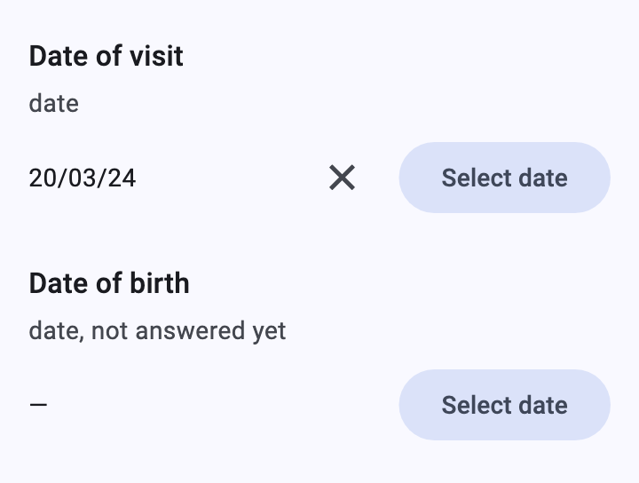
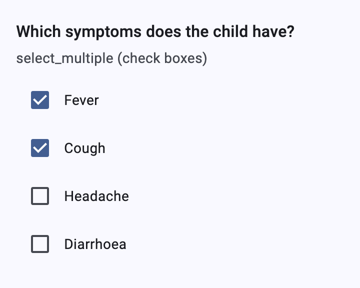
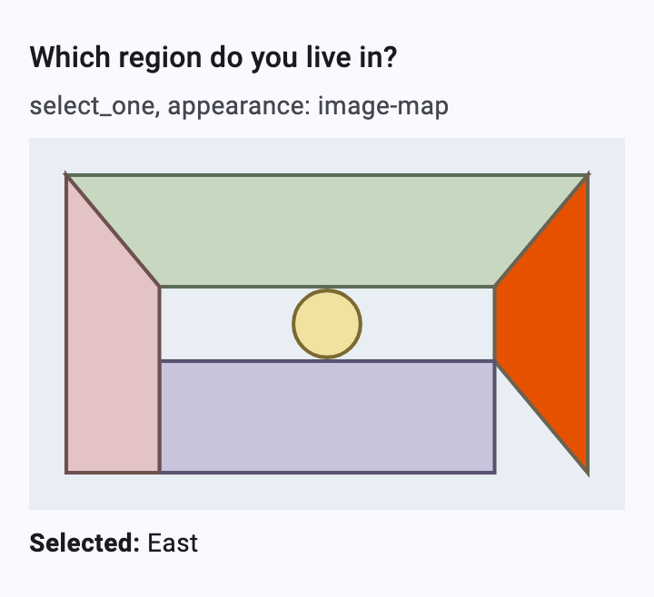
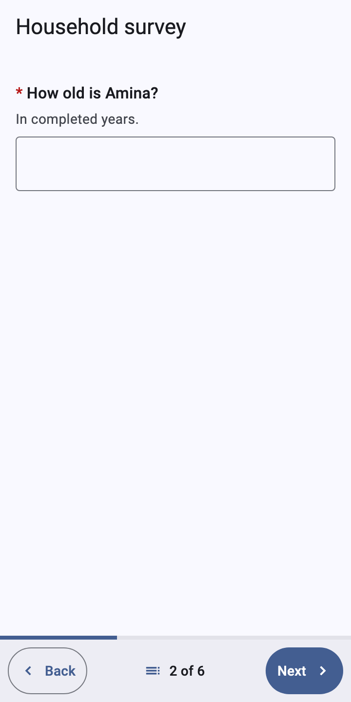
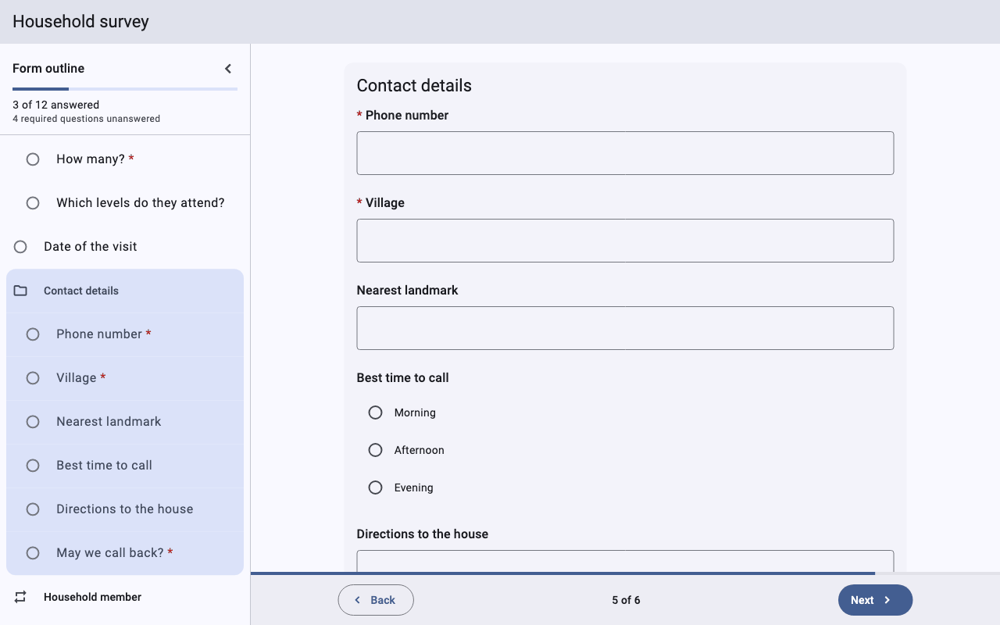
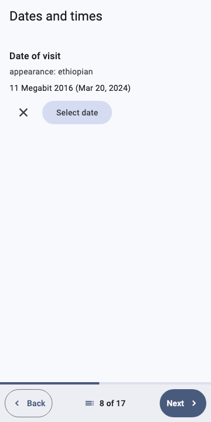
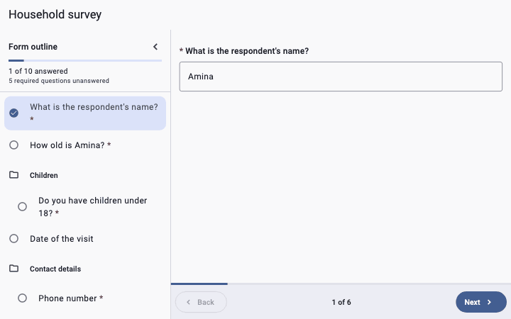
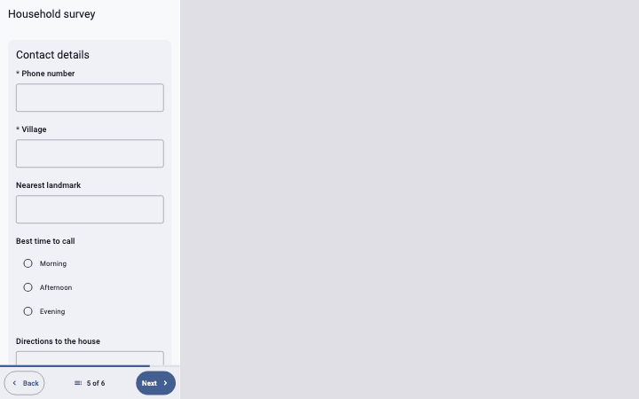

# Widget catalog

What every ODK control and appearance looks like in
[`dartrosa_flutter`](../../packages/dartrosa_flutter/README.md), how to
write it in XLSForm and XForm, which states it has, what the app must
supply for it, and how to theme it.


Every image here is rendered by a widget test from a small form in
[`packages/dartrosa_flutter/test/screenshots/forms/`](../../packages/dartrosa_flutter/test/screenshots/forms/),
with Roboto, Material 3 (seed color `#1A73E8`) and a 360dp-wide phone at
2x unless the caption says otherwise. See
[Regenerating the images](#regenerating-the-images).

## Controls

<table>
<tr>
<td align="center" valign="top"><a href="text-and-numbers.md"><br><b>Text and numbers</b></a><br>text, multiline, numbers, masked, integer, decimal, thousands-sep</td>
<td align="center" valign="top"><a href="date-and-time.md"><br><b>Dates and times</b></a><br>date, time, dateTime, no-calendar, month-year, year, 7 calendars</td>
<td align="center" valign="top"><a href="select-one.md"><br><b>Select one</b></a><br>minimal, quick, autocomplete, columns, no-buttons, likert, list, label</td>
</tr>
<tr>
<td align="center" valign="top"><a href="select-multiple.md"><br><b>Select multiple</b></a><br>check boxes, minimal, autocomplete, columns, no-buttons, list</td>
<td align="center" valign="top"><a href="image-maps-maps-and-csv.md"><br><b>Image maps, maps, CSV choices</b></a><br>image-map, map, search()</td>
<td align="center" valign="top"><a href="range-and-rank.md"><br><b>Range and rank</b></a><br>slider, vertical, picker, rating, no-ticks, rank</td>
</tr>
<tr>
<td align="center" valign="top"><a href="location.md"><br><b>Location</b></a><br>geopoint, maps, placement-map, geotrace, geoshape, hidden-answer</td>
<td align="center" valign="top"><a href="media-and-barcodes.md"><br><b>Media and barcodes</b></a><br>image, audio, video, file, signature, draw, annotate, barcode</td>
<td align="center" valign="top"><a href="special-inputs.md"><br><b>Counters, links, apps, printing</b></a><br>counter, bearing, url, ex:, printer, intent groups</td>
</tr>
<tr>
<td align="center" valign="top"><a href="notes-labels-and-triggers.md"><br><b>Notes, labels, triggers</b></a><br>notes, markdown, hints, guidance, label images, acknowledge</td>
<td align="center" valign="top"><a href="groups.md"><br><b>Groups</b></a><br>cards, nested sections, field-list, table-list</td>
<td align="center" valign="top"><a href="repeats.md"><br><b>Repeats</b></a><br>add / remove, the pager's prompt, jr:count, noAddRemove</td>
</tr>
</table>

## The form around the questions

<table>
<tr>
<td align="center" valign="top"><a href="navigation-and-layout.md"><br><b>Pager, outline, adaptive layout</b></a><br>bottom bar, progress, outline sheet and panel, keyboard, phone to desktop</td>
<td align="center" valign="top"><a href="validation.md"><br><b>Validation</b></a><br>required, constraints and their messages, rejected answers, focus on the first error, finalize</td>
</tr>
</table>



## Animations

| | |
|---|---|
| [Pager navigation](navigation-and-layout.md#the-pager) | [Relevance](select-one.md#relevance-a-choice-that-shows-questions) |
|  |  |
| [Constraint error, then fixed](validation.md#constraints) | [Focus on the first error](validation.md#next-and-the-first-error) |
|  |  |
| [Adding a repeat instance](repeats.md#in-the-pager) | [Ethiopian date picker](date-and-time.md#non-gregorian-calendars) |
|  |  |
| [Outline panel jump (desktop)](navigation-and-layout.md#the-form-outline) | [Phone to desktop](navigation-and-layout.md#adaptive-layout) |
|  |  |

## What every question has

Each question is a label (ODK markdown, `*` for required), its hint and
guidance hint, the input for its control type and appearance, and, when
its last answer was rejected, an error line with an icon. The same
states apply to every control:

| State | What you see | Where it comes from |
|---|---|---|
| Empty | the input without a value (`—` for captured values) | no answer yet |
| Answered | the value | the instance, an answer, a calculation |
| Read-only | the value, inputs disabled | `readonly` (a read-only *text* question is a note: label only) |
| Required, missing | red `*` before the label; after Next or Finalize, the error | `required`, message from `jr:requiredMsg` |
| Constraint failed | the typed value stays, the error appears as you type | `constraint`, message from `jr:constraintMsg` |
| Not relevant | not shown | `relevant` |

The error text is `XFormTheme.errorColor` (the color scheme's error by
default); text fields in error also get a red outline. The default
messages come from `XFormLocalizations` (`requiredDefault`,
`constraintDefault`). See [Validation](validation.md).

## What the app supplies

Questions that need the device go through one object, `XFormDelegates`,
passed to `XFormView(delegates: ...)`. Each feature has a `can...` getter;
without it the question falls back to its default widget (usually a text
field to type the value), so every form can still be filled.

| Feature | Override | Used by |
|---|---|---|
| Media files | `captureMedia` + `canCaptureMedia` | [image, audio, video, file, signature, draw, annotate](media-and-barcodes.md) |
| Location | `currentLocation` + `canLocate` | [geopoint](location.md) |
| Maps | `geoFromMap`, `selectFromMap` + `canShowMaps` | [maps, placement-map, geotrace, geoshape](location.md), [select `map`](image-maps-maps-and-csv.md#map) |
| Barcodes | `scanBarcode` + `canScanBarcode` | [barcode](media-and-barcodes.md#barcode) |
| Compass | `compassBearing` + `canReadBearing` | [bearing](special-inputs.md#bearing) |
| External apps | `launchExternalApp` + `canLaunchExternalApps` | [ex:, intent groups](special-inputs.md#external-apps-ex) |
| Printing | `print` + `canPrint` | [printer](special-inputs.md#printer) |
| Links | `openLink` | [url](special-inputs.md#url), links in labels |
| Form media | `image`, `mediaBytes` | label and choice images, [image-map SVGs](image-maps-maps-and-csv.md#image-map) |

```dart
class AppDelegates extends XFormDelegates {
  @override
  bool get canLocate => true;

  @override
  Future<String?> currentLocation(BuildContext context) async {
    final p = await Geolocator.getCurrentPosition();
    return '${p.latitude} ${p.longitude} ${p.altitude} ${p.accuracy}';
  }
}
```

## Theming and overrides

- `XFormTheme` (a `ThemeExtension`): `pagePadding`, `questionSpacing`,
  `errorColor`, `cardColor` / `cardElevation` / `cardShape` /
  `cardMargin` / `cardPadding`, `maxContentWidth`,
  `adaptiveChoiceColumns`, `outlinePanelWidth`.
- The app's `ThemeData` does the rest: the color scheme, text theme,
  `InputDecorationTheme` (text fields), `FilledButtonTheme` (capture
  buttons), `RadioTheme` / `CheckboxTheme`, `SliderTheme`, `CardTheme`,
  `DialogTheme`.
- `widgetOverrides` replaces the widget of a control type, optionally per
  appearance: `{'selectOne:likert': (context, node) => MyLikert(node)}`.
- `XFormLocalizations` holds every string the renderer adds (buttons,
  default messages).

## Regenerating the images

From `packages/dartrosa_flutter`, on macOS (text rasterization differs
between platforms):

```sh
DARTROSA_SCREENSHOTS=1 flutter test test/screenshots/catalog_test.dart
python3 test/screenshots/optimize_pngs.py ../../docs/images/screenshots/widgets
DARTROSA_SCREENSHOTS=1 flutter test test/screenshots/gifs_test.dart
python3 test/screenshots/make_gifs.py build/gif_frames ../../docs/images/gifs
```

Without `DARTROSA_SCREENSHOTS` the tests are skipped, so a plain
`flutter test` writes nothing. The forms are in
`test/screenshots/forms/`; each catalog image is named after the crop
or screen in `catalog_test.dart`.
