# Dates and times

[Catalog](README.md) › Dates and times

`date`, `time` and `dateTime` questions show the answer and a button that
opens a picker (`DateTimeInput`); the ✕ button clears the answer. The
pickers are Flutter's Material date and time pickers, a month / year
dialog, and, for non-Gregorian calendars, ODK Collect's spinner dialog.

Form: [`forms/date_time.xml`](../../packages/dartrosa_flutter/test/screenshots/forms/date_time.xml)

- [date](#date)
- [time and dateTime](#time-and-datetime)
- [no-calendar](#no-calendar)
- [month-year and year](#month-year-and-year)
- [Non-Gregorian calendars](#non-gregorian-calendars)
- [States](#states)
- [Keyboard, accessibility, theming](#keyboard-accessibility-theming)

## date

 

| type | name | label |
|---|---|---|
| date | visit | Date of visit |

```xml
<bind nodeset="/data/visit" type="date"/>
...
<input ref="/data/visit">
  <label>Date of visit</label>
</input>
```

**Select date** opens the Material calendar, from 1900 to 2100, on the
answer (or today):

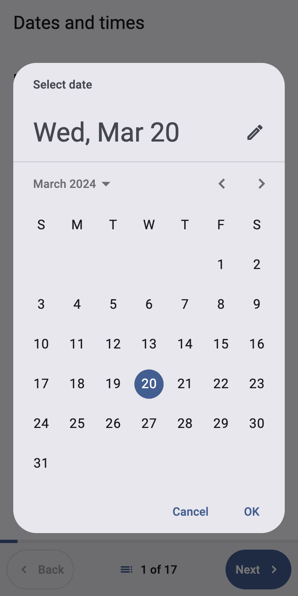 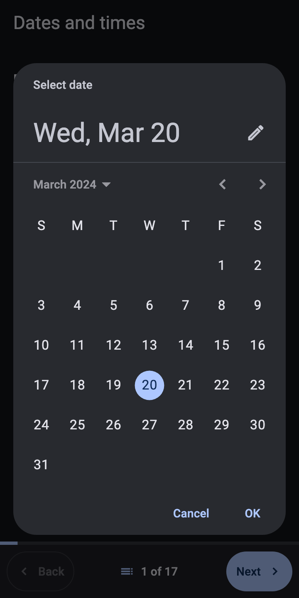

The answer is formatted by the engine (`displayValue`, as JavaRosa does);
the stored value is `2024-03-20`.

## time and dateTime

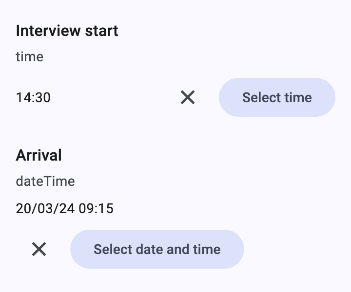

| type | name | label |
|---|---|---|
| time | start | Interview start |
| dateTime | arrived | Arrival |

`time` opens the Material time picker; `dateTime` the date picker, then
the time picker. On desktops and the web the time picker opens in input
mode (typing is quicker than the dial).

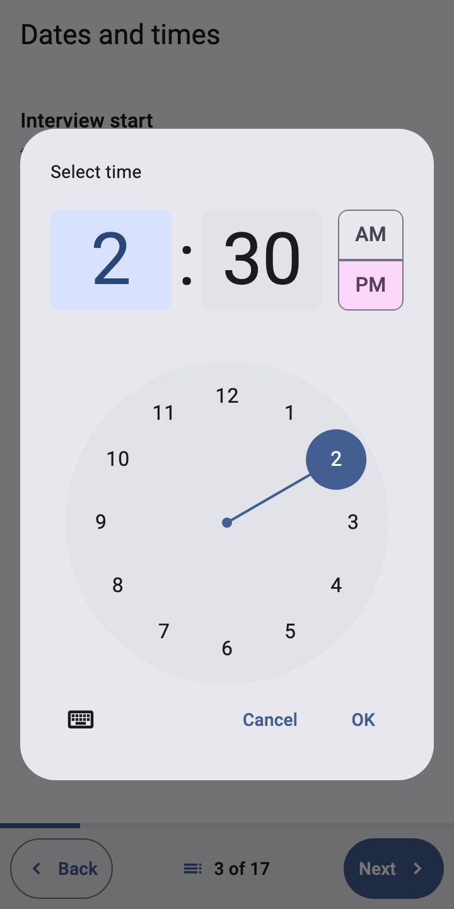

## no-calendar

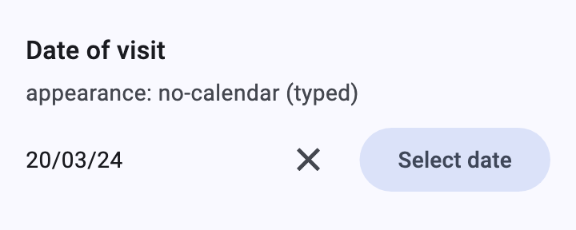

| type | name | label | appearance |
|---|---|---|---|
| date | typed | Date of visit | no-calendar |

The picker opens as a text field for typing the date:

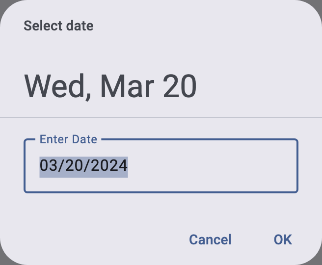

## month-year and year

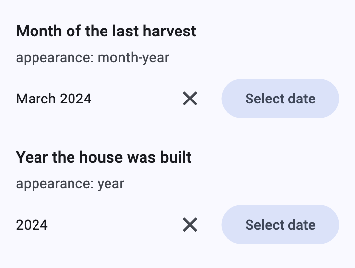

| type | name | label | appearance |
|---|---|---|---|
| date | harvest | Month of the last harvest | month-year |
| date | built | Year the house was built | year |

A small dialog with a month and a year (or only a year) drop-down. The
date is saved as the first of the month (`2024-03-01`) or of the year
(`2024-01-01`) and shown as "March 2024" or "2024".

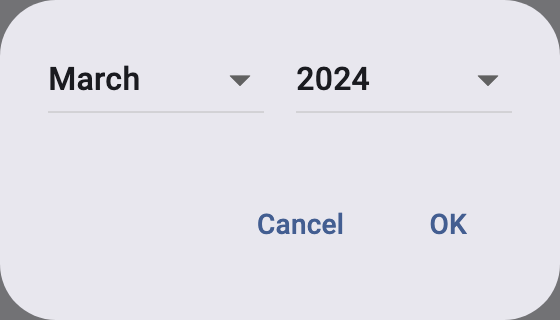 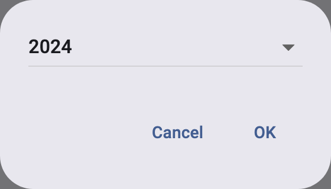

## Non-Gregorian calendars

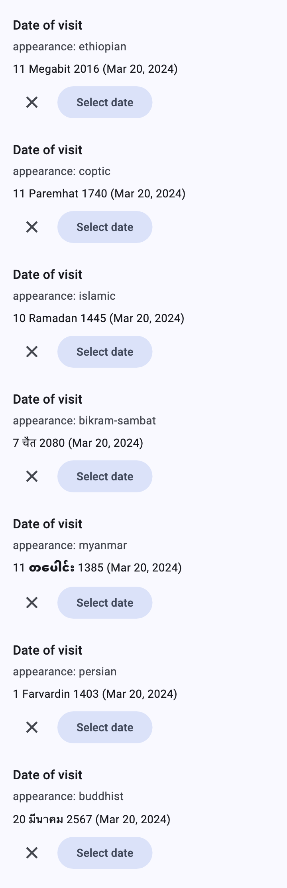 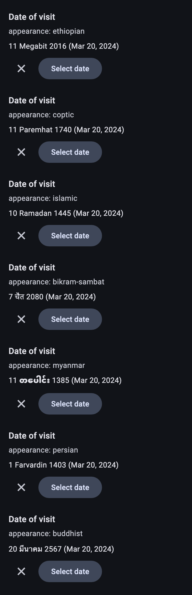

| type | name | label | appearance |
|---|---|---|---|
| date | ethiopian | Date of visit | ethiopian |
| date | coptic | Date of visit | coptic |
| date | islamic | Date of visit | islamic |
| date | bikram | Date of visit | bikram-sambat |
| date | myanmar | Date of visit | myanmar |
| date | persian | Date of visit | persian |
| date | buddhist | Date of visit | buddhist |

The answer is shown as Collect labels it (the calendar's date, then the
Gregorian date in brackets) and picked with that calendar's day, month
and year spinners (`CustomCalendarDatePickerDialog`, a port of Collect's
`CustomDatePickerDialog`). The **Gregorian** date is stored, so
calculations and submissions don't change. The calendars come from
[`dartrosa_calendars`](../../packages/dartrosa_calendars/README.md); see
also the [non-Gregorian calendars guide](../guides/non-gregorian-calendars.md).


| Ethiopian | Coptic | Islamic |
|---|---|---|
| 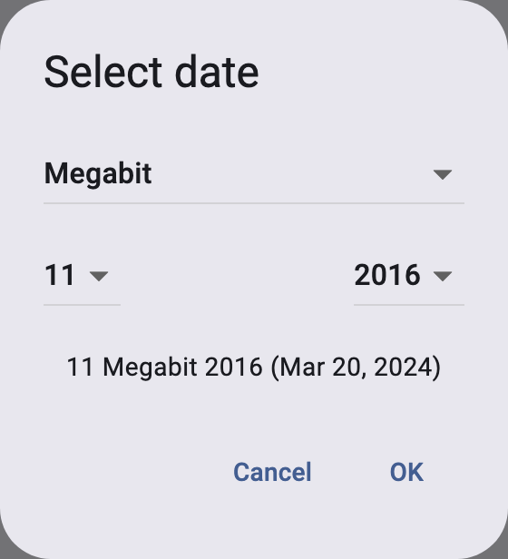 | 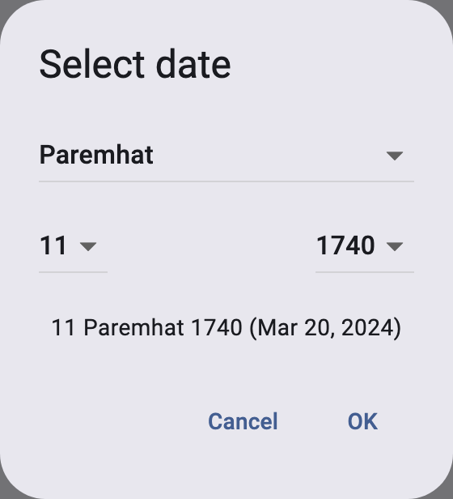 | 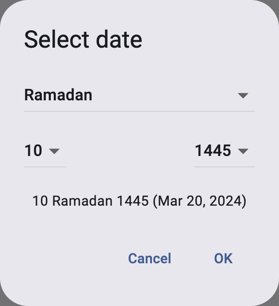 |
| **Bikram Sambat** | **Myanmar** | **Persian** |
| 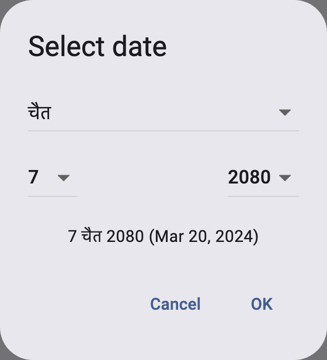 | 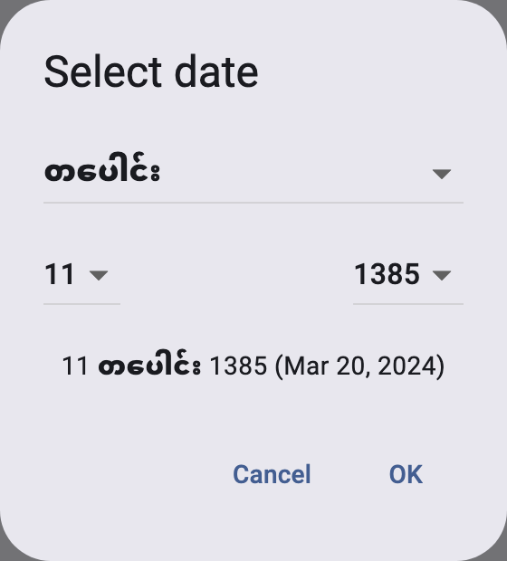 | 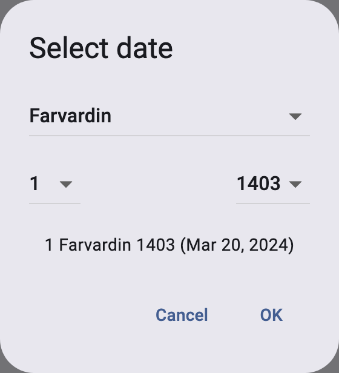 |
| **Buddhist** | **Ethiopian, dark** | |
| 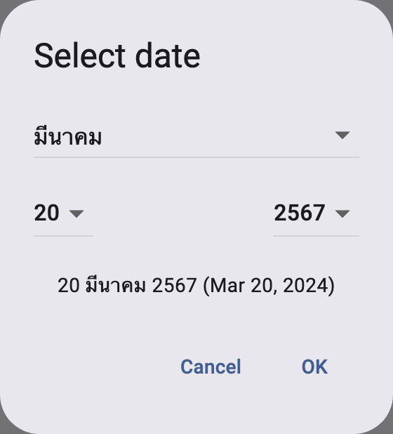 | 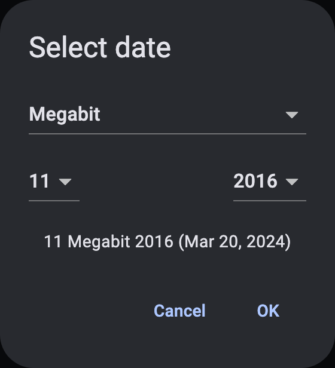 | |

Month names in Devanagari, Thai and Myanmar script need a font with those
letters; on Android and iOS the system fonts have them. Combine a
calendar with `month-year` or `year` to hide the day (or day and month)
spinners. Bikram Sambat covers 1913 to 2034; outside that range the
dialog starts at the nearest supported date.

## States

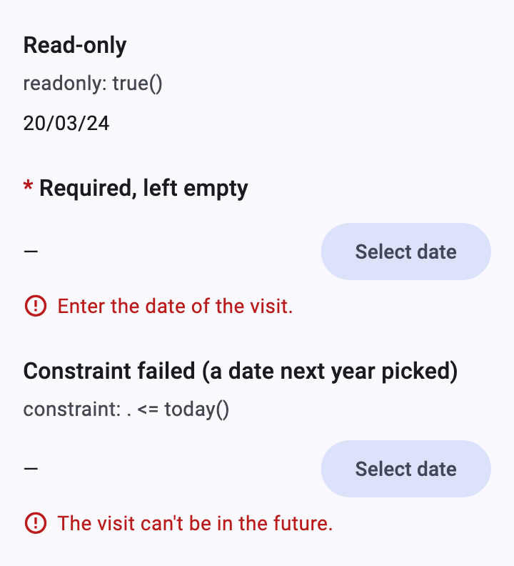

```xml
<bind nodeset="/data/s_invalid" type="date" constraint=". &lt;= today()"
      jr:constraintMsg="The visit can't be in the future."/>
```

Read-only dates show the value without buttons. A date the constraint
rejects isn't saved, so the answer stays `—` (or the last accepted date)
and the message shows under it.

## Keyboard, accessibility, theming

- The buttons and the pickers are reachable with Tab; Enter opens a
  picker, Esc closes it.
- The ✕ button has the tooltip "Clear" (`XFormLocalizations.clear`).
- Platform features: none.
- Theming: `DatePickerThemeData` and `TimePickerThemeData` in the app's
  theme style the Material pickers, `DialogTheme` the month / year and
  calendar dialogs, `FilledButtonTheme` the buttons. The pickers follow
  the app's `locale`.
