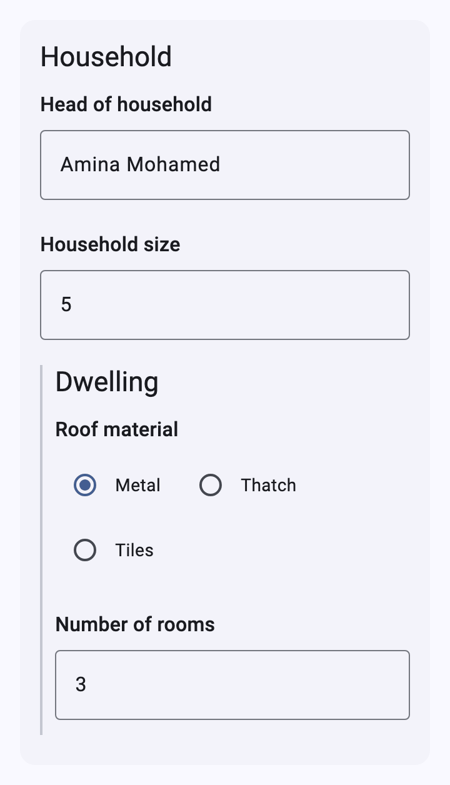
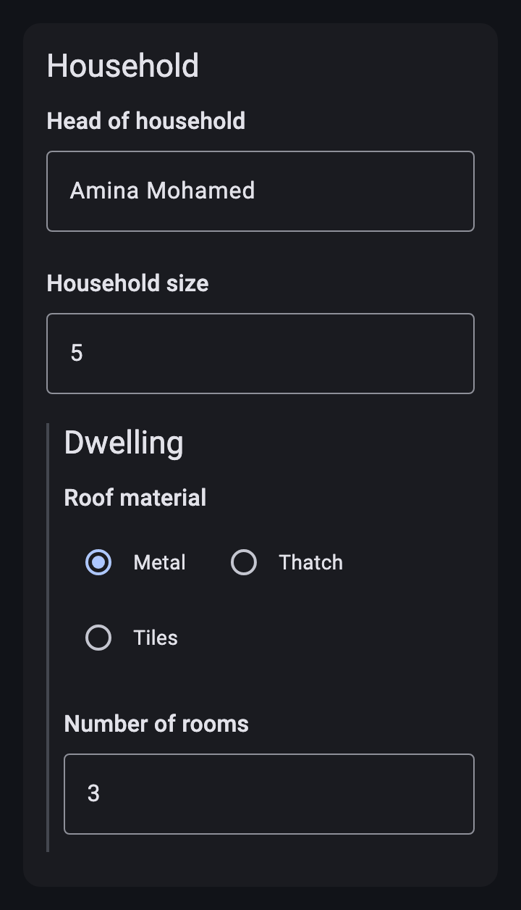
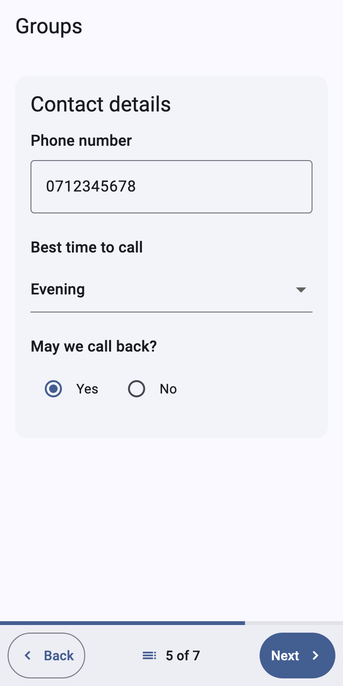
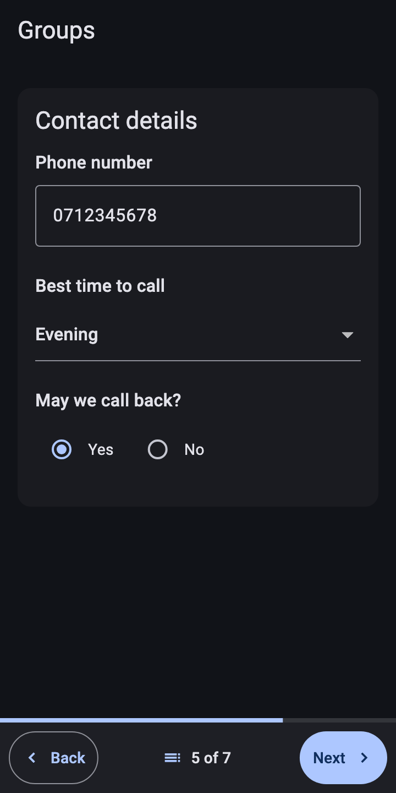
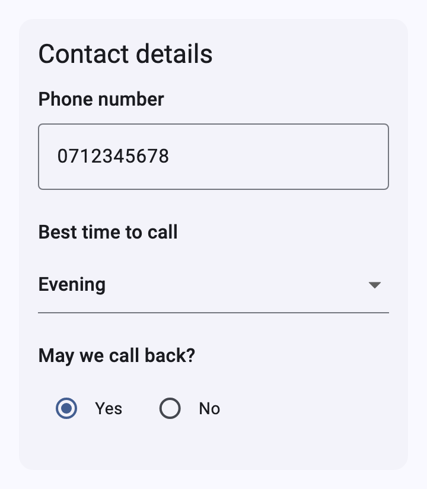
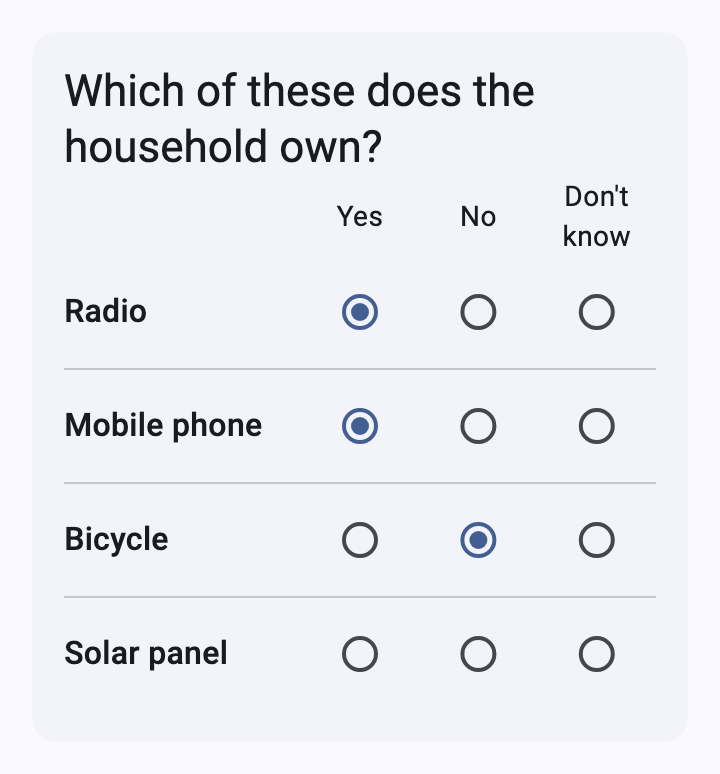
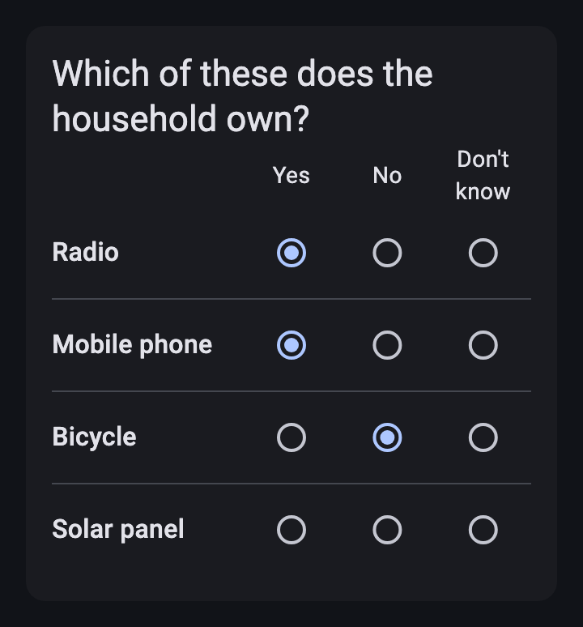
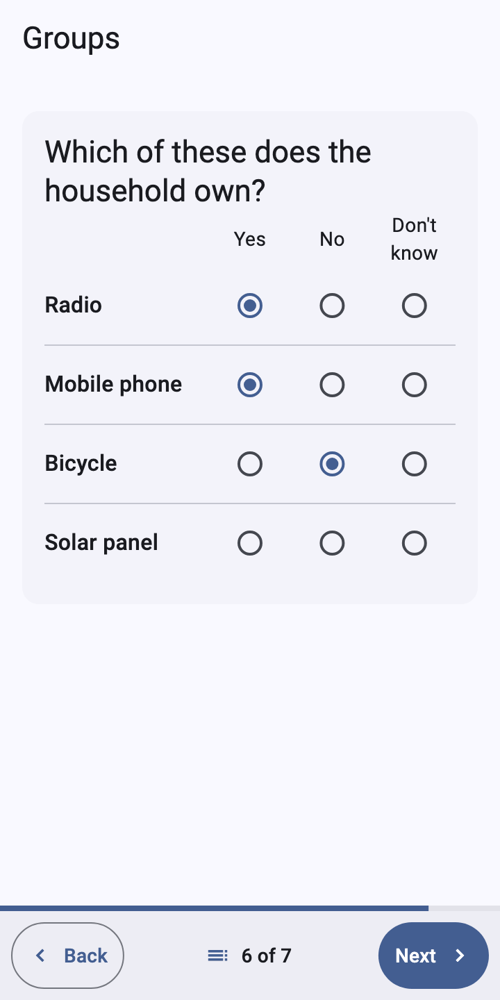
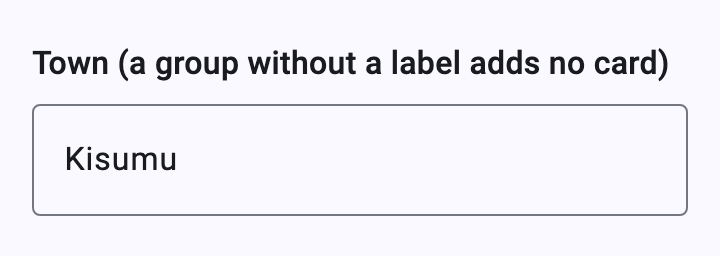

# Groups

[Catalog](README.md) › Groups

Form: [`forms/groups.xml`](../../packages/dartrosa_flutter/test/screenshots/forms/groups.xml)

- [Group cards and nested sections](#group-cards-and-nested-sections)
- [field-list](#field-list)
- [table-list](#table-list)
- [Groups without a label](#groups-without-a-label)
- [Theming](#theming)

## Group cards and nested sections

 

| type | name | label | appearance |
|---|---|---|---|
| begin_group | household | Household | |
| text | head | Head of household | |
| integer | size | Household size | |
| begin_group | dwelling | Dwelling | |
| select_one roof | roof | Roof material | columns-pack |
| integer | rooms | Number of rooms | |
| end_group | | | |
| end_group | | | |

```xml
<group ref="/data/household">
  <label>Household</label>
  <input ref="/data/household/head">...</input>
  <group ref="/data/household/dwelling">
    <label>Dwelling</label>
    ...
  </group>
</group>
```

A labelled group is a Material 3 filled card (`surfaceContainerLow`, no
shadow) with its label in `titleLarge` (`XFormCard`). A group inside a
card is a section marked by a line along its start edge, so nesting
doesn't eat the width of a phone screen. In pager mode a plain group's
questions still get a screen each; its label shows in the outline.

## field-list

 

| type | name | label | appearance |
|---|---|---|---|
| begin_group | contact | Contact details | field-list |
| text | phone | Phone number | numbers |
| select_one time | best_time | Best time to call | minimal |
| select_one yes_no | consent | May we call back? | columns-pack |
| end_group | | | |

In pager mode the whole group is one screen; Next checks all its
questions and [focuses the first error](validation.md#next-and-the-first-error).
In scroll mode it is a card like any group:



## table-list

 

| type | name | label | appearance |
|---|---|---|---|
| begin_group | assets | Which of these does the household own? | table-list |
| select_one ynd | radio | Radio | |
| select_one ynd | phone_owned | Mobile phone | |
| select_one ynd | bicycle | Bicycle | |
| select_one ynd | solar | Solar panel | |
| end_group | | | |

The first select's choice labels are the header; every select is a row
of buttons after its label, with lines between rows. `table-list`
implies `field-list`: one pager screen.



## Groups without a label



A group without a label only groups its questions (for relevance, or a
shared `ref`); it adds no card.

## Theming

`XFormTheme.cardColor`, `cardElevation`, `cardShape`, `cardMargin`,
`cardPadding`; the app's `CardTheme` when those are unset. The section
line uses `outlineVariant`.

```dart
ThemeData(
  extensions: const [
    XFormTheme(
      cardElevation: 1,
      cardPadding: EdgeInsets.all(12),
    ),
  ],
)
```
