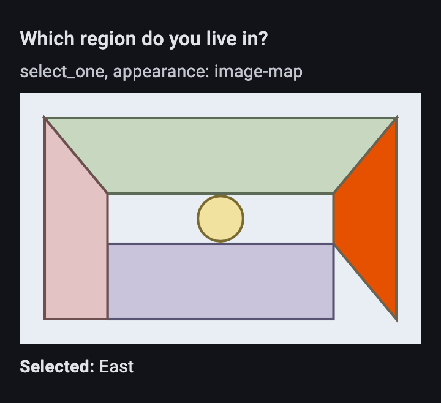
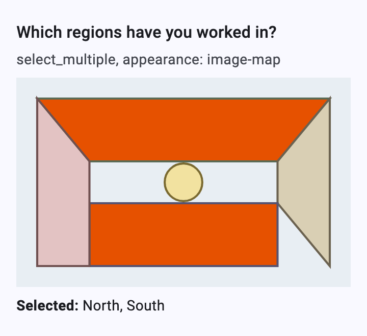
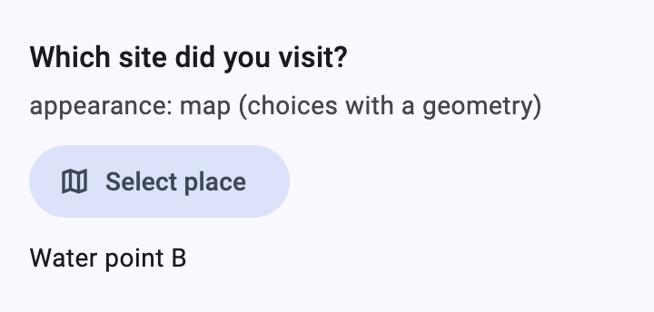
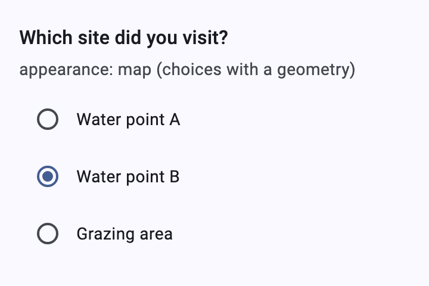
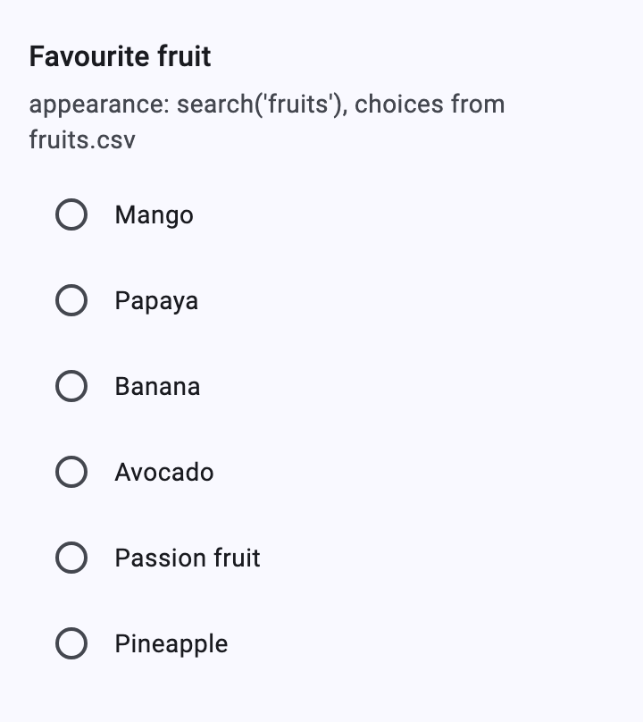
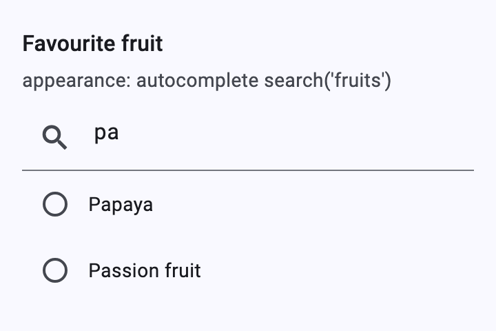
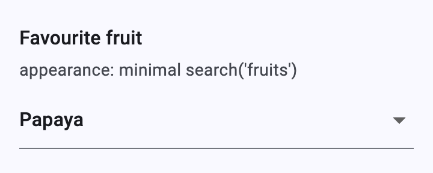
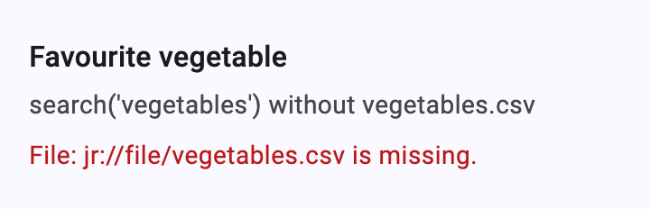

# Image maps, maps and CSV choices

[Catalog](README.md) › Image maps, maps and CSV choices

Selects whose choices are areas of a picture (`image-map`), places on the
app's map (`map`), or rows of a CSV file (`search()`).

Form: [`forms/select_advanced.xml`](../../packages/dartrosa_flutter/test/screenshots/forms/select_advanced.xml)

- [image-map](#image-map)
- [map](#map)
- [search()](#search)

## image-map

 



| type | name | label | media::image | appearance |
|---|---|---|---|---|
| select_one regions | region | Which region do you live in? | regions.svg | image-map |
| select_multiple regions | regions | Which regions have you worked in? | regions.svg | image-map |

```xml
<text id="region">
  <value>Which region do you live in?</value>
  <value form="image">jr://images/regions.svg</value>
</text>
...
<select1 ref="/data/region" appearance="image-map">
  <label ref="jr:itext('region')"/>
  <item><label>North</label><value>north</value></item>
  <item><label>East</label><value>east</value></item>
  ...
</select1>
```

```xml
<!-- regions.svg: element ids are choice values -->
<path id="north" d="M20 20 H300 L250 80 H70 Z"/>
<polygon id="east" points="250,80 300,20 300,180 250,120"/>
<rect id="south" x="70" y="120" width="180" height="60"/>
<circle id="centre" cx="160" cy="100" r="18"/>
```

The question's image is an SVG whose `g`, `path`, `rect`, `circle`,
`ellipse` and `polygon` elements have choice values as ids. Tapping an
area selects it (filled with Collect's highlight color); the selected
labels are listed under the picture.

- **App supplies** the SVG bytes: `XFormDelegates.mediaBytes(uri)`.
  Without them the question shows "SVG file does not exist!"
  (`XFormLocalizations.svgFileMissing`).
- **Keyboard and screen readers**: every area is focusable (Tab) and
  selected with Enter or Space; areas are semantics nodes named after the
  choice, placed where they are drawn (`SvgImageMap.areaBounds`).

```dart
@override
Future<Uint8List?> mediaBytes(String uri) async {
  final file = File('${mediaDir.path}/${Uri.parse(uri).pathSegments.last}');
  return file.existsSync() ? file.readAsBytes() : null;
}
```

## map

 

| type | name | label | appearance |
|---|---|---|---|
| select_one_from_file sites.csv | site | Which site did you visit? | map |

| name | label | geometry |
|---|---|---|
| a | Water point A | -1.2864 36.8172 0 0 |
| c | Grazing area | -1.28 36.81 0 0;-1.28 36.83 0 0;-1.30 36.83 0 0;-1.28 36.81 0 0 |

**Select place** asks the app to show the choices on its map. The
renderer passes them as `MapFeature`s: the choice, its points (parsed
from the `geometry` column: a point, a line, or a closed shape) and the
`marker-color`, `marker-symbol`, `stroke`, `stroke-width` and `fill`
columns. The app returns the picked choice. Without
`canShowMaps` (right) the question is a normal select.

```dart
@override
bool get canShowMaps => true;

@override
Future<SelectChoice?> selectFromMap(
  BuildContext context, {
  required QuestionNode node,
  required List<MapFeature> features,
  SelectChoice? selected,
}) => Navigator.push<SelectChoice>(
  context,
  MaterialPageRoute(builder: (_) => MyMapPage(features, selected)),
);
```

The map page itself (tiles, markers, the user's location) is the app's:
the renderer has no map dependency.

## search()

 

 

| type | name | label | appearance |
|---|---|---|---|
| select_one fruits | fruit | Favourite fruit | search('fruits') |
| select_one fruits | fruit_search | Favourite fruit | autocomplete search('fruits') |
| select_one fruits | fruit_minimal | Favourite fruit | minimal search('fruits') |

| list_name | name | label |
|---|---|---|
| fruits | name | label |

```xml
<select1 ref="/data/fruit" appearance="search('fruits')">
  <label>Favourite fruit</label>
  <item><label>label</label><value>name</value></item>
</select1>
```

```csv
name,label,color
mango,Mango,yellow
papaya,Papaya,orange
```

Collect's pre-itemset way of using CSV choices: the static item names the
CSV columns for the label and value. The choices are read from
`fruits.csv` in the form media by
[`dartrosa_external_data`](../../packages/dartrosa_external_data/README.md);
`search('fruits', 'contains', 'color', 'yellow')` filters them. Combine
with `autocomplete`, `minimal`, `columns*` and the other appearances.

- **App supplies** the plugin and the CSV when parsing the form:

```dart
final definition = await FormDefinition.parse(
  xml,
  config: DartRosaConfig(
    resolver: MapResourceResolver({'jr://file/fruits.csv': csvBytes}),
    plugins: [
      ExternalDataPlugin(listMedia: (_) => ['fruits.csv']),
    ],
  ),
);
```

- A missing file shows Collect's warning ("File: … is missing.") instead
  of choices; an invalid `search()` expression shows the parser error.
- Like JavaRosa, a default value in the instance is dropped for these
  selects (the choices aren't known when the form loads).
