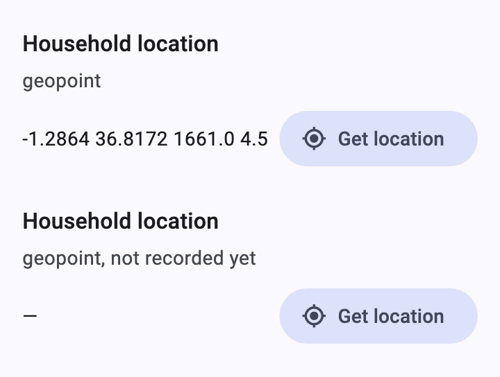
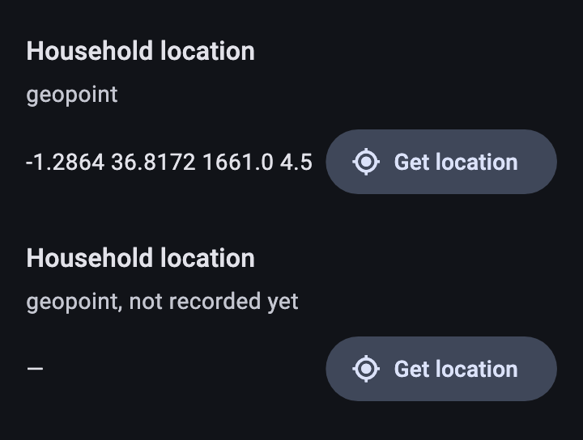
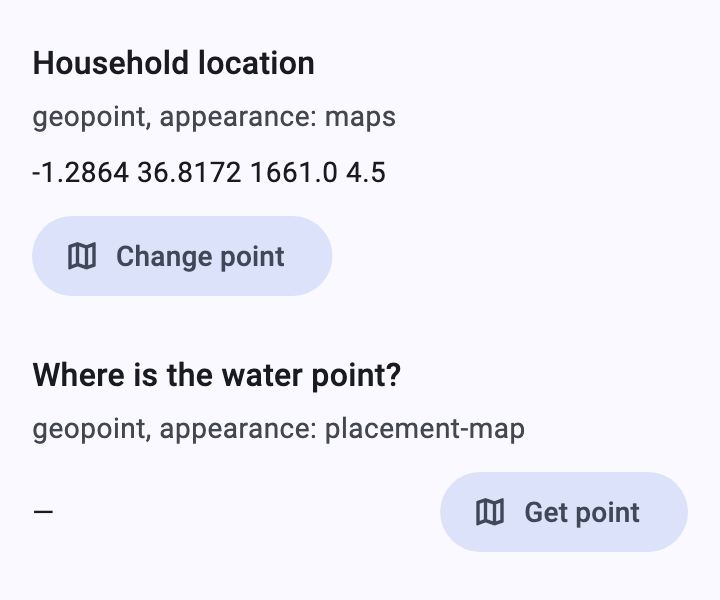
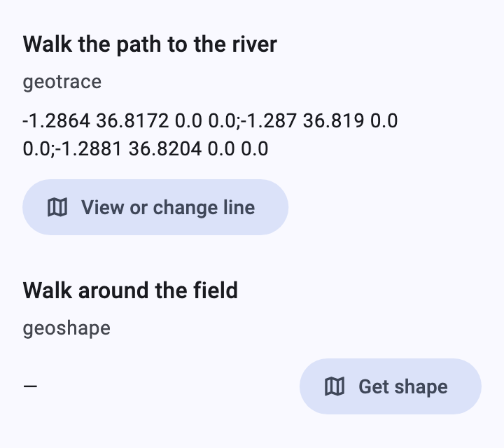
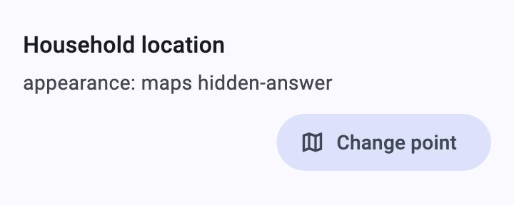
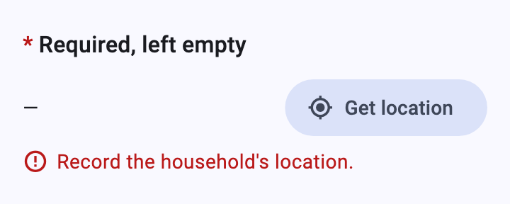
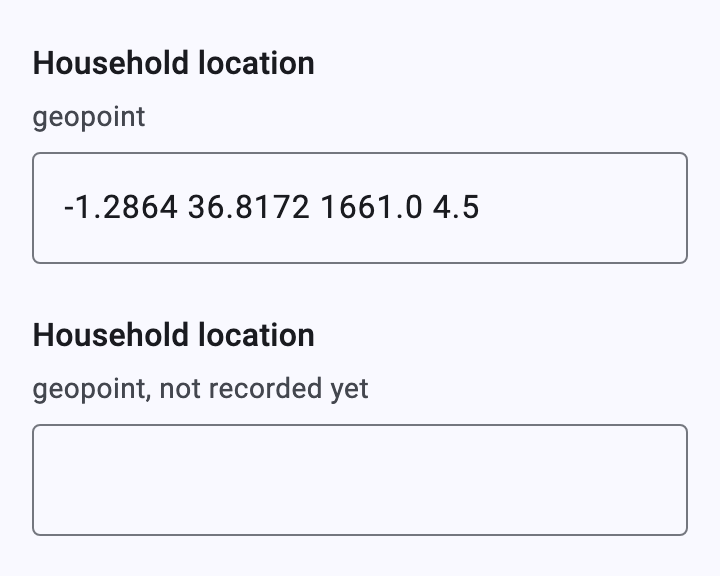

# Location

[Catalog](README.md) › Location

`geopoint`, `geotrace` and `geoshape` questions. The renderer has no GPS
or map code of its own: it asks the app through `XFormDelegates`, and
without the delegate the value is typed.

Form: [`forms/geo.xml`](../../packages/dartrosa_flutter/test/screenshots/forms/geo.xml)

- [geopoint](#geopoint)
- [maps and placement-map](#maps-and-placement-map)
- [geotrace and geoshape](#geotrace-and-geoshape)
- [hidden-answer](#hidden-answer)
- [States](#states)
- [Without delegates](#without-delegates)

## geopoint

 

| type | name | label |
|---|---|---|
| geopoint | home | Household location |

```xml
<bind nodeset="/data/home" type="geopoint"/>
...
<input ref="/data/home">
  <label>Household location</label>
</input>
```

**Get location** calls `XFormDelegates.currentLocation`, which returns
an ODK geopoint, `lat lon altitude accuracy`:

```dart
@override
bool get canLocate => true;

@override
Future<String?> currentLocation(BuildContext context) async {
  final p = await Geolocator.getCurrentPosition();
  return '${p.latitude} ${p.longitude} ${p.altitude} ${p.accuracy}';
}
```

## maps and placement-map



| type | name | label | appearance |
|---|---|---|---|
| geopoint | point_map | Household location | maps |
| geopoint | placement | Where is the water point? | placement-map |

With `canShowMaps`, these open the app's map through
`XFormDelegates.geoFromMap(context, node: node)`; the app reads
`node.appearance` to tell `maps` (the device's location on a map) from
`placement-map` (any point the person taps) and returns the geopoint,
`''` to clear it, or `null` if cancelled.

## geotrace and geoshape



| type | name | label |
|---|---|---|
| geotrace | path | Walk the path to the river |
| geoshape | field | Walk around the field |

Always captured on the app's map (`geoFromMap`) when `canShowMaps`; the
answer is the points separated by `;` (a geoshape's last point equals its
first). The button reads "Get line" / "View or change line" ("shape" for
geoshapes).

```dart
@override
bool get canShowMaps => true;

@override
Future<String?> geoFromMap(
  BuildContext context, {
  required QuestionNode node,
}) => Navigator.push<String>(
  context,
  MaterialPageRoute(
    builder: (_) => MyGeoPage(
      type: node.dataType, // geopoint, geotrace or geoshape
      initial: parseGeometry(node.value?.displayText ?? ''),
    ),
  ),
);
```

`parseGeometry` turns an ODK geo value into `MapPoint`s for the map.

## hidden-answer



| type | name | label | appearance |
|---|---|---|---|
| geopoint | hidden | Household location | maps hidden-answer |

The coordinates are recorded but not shown.

## States



Read-only geo questions show the value without a capture button.

## Without delegates



With `NoDelegates` (the default) the value is typed in ODK's format
(`-1.2864 36.8172 1661 4.5`); the engine rejects text that isn't a valid
geopoint.

Keyboard: the buttons are focusable and work with Enter. Theming:
`FilledButtonTheme` (the tonal capture buttons). Strings:
`XFormLocalizations.getLocation`, `geoMapButton`.
