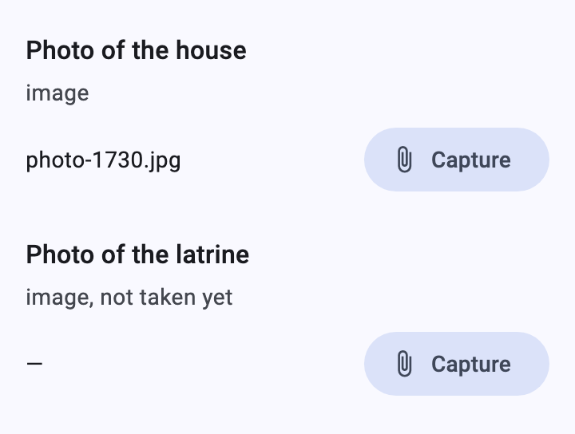
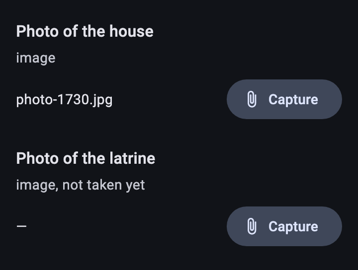
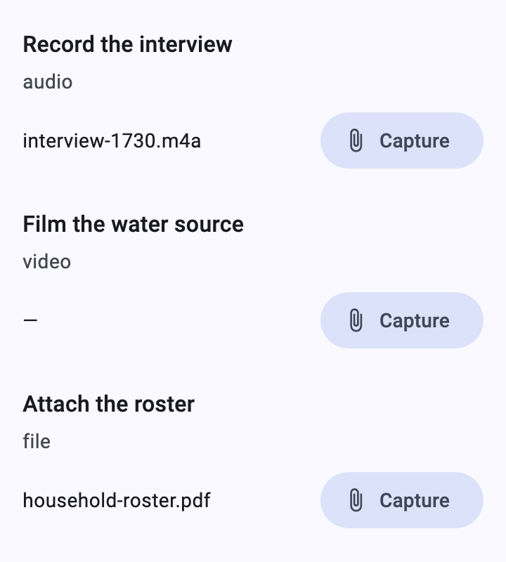
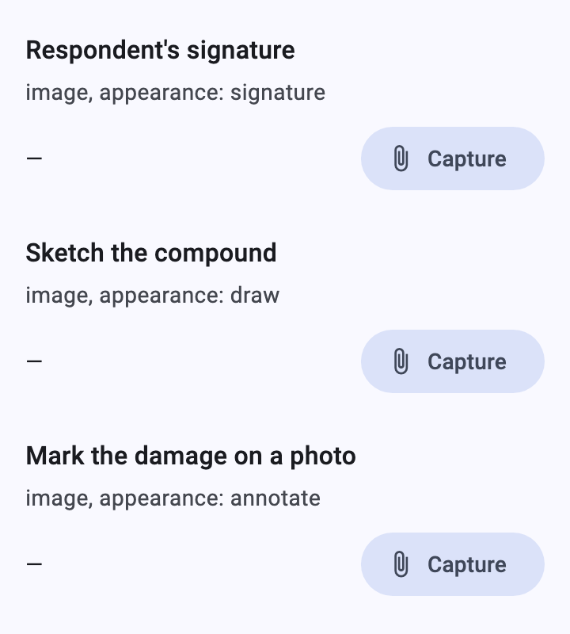
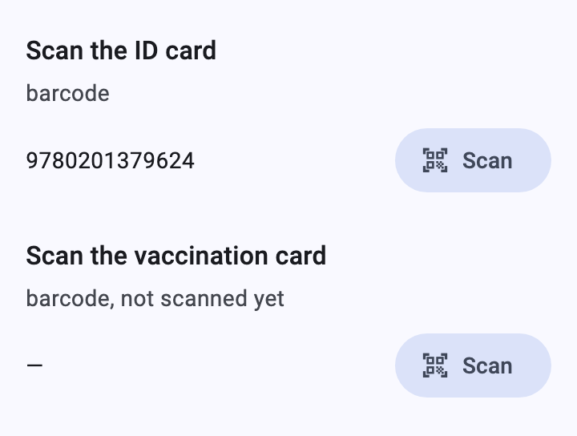
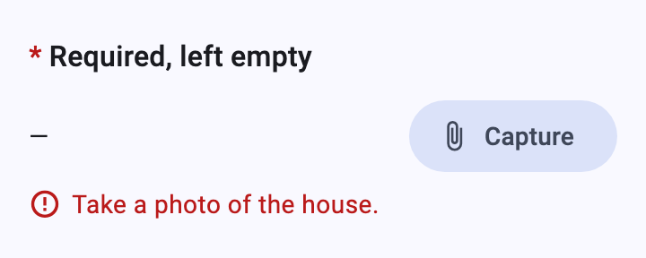
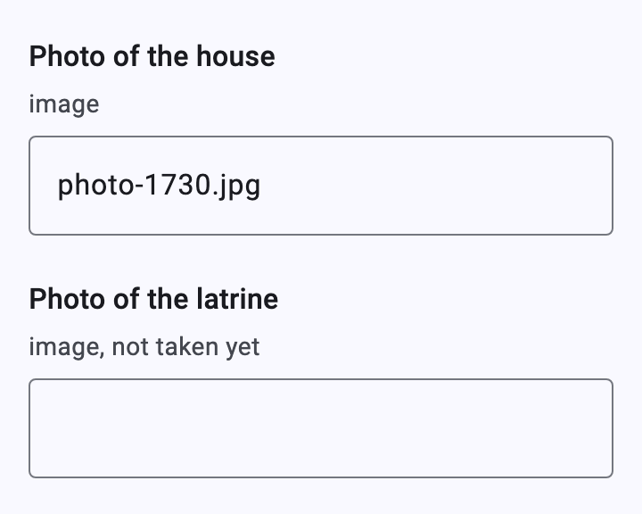

# Media and barcodes

[Catalog](README.md) › Media and barcodes

Photos, recordings, videos, files and barcodes are captured by the app:
the renderer shows the answer (a file name or the code) and a button that
calls `XFormDelegates`. Without the delegate the value is typed.

Form: [`forms/media.xml`](../../packages/dartrosa_flutter/test/screenshots/forms/media.xml)

- [image](#image)
- [audio, video and file](#audio-video-and-file)
- [signature, draw and annotate](#signature-draw-and-annotate)
- [barcode](#barcode)
- [States](#states)
- [Without delegates](#without-delegates)

## image

 

| type | name | label |
|---|---|---|
| image | photo | Photo of the house |

```xml
<bind nodeset="/data/photo" type="binary"/>
...
<upload ref="/data/photo" mediatype="image/*">
  <label>Photo of the house</label>
</upload>
```

**Capture** calls `captureMedia(context, mediaType: 'image/*',
appearance: ...)`; the app takes or picks the file, stores it with the
instance and returns its file name, which is the answer:

```dart
@override
bool get canCaptureMedia => true;

@override
Future<String?> captureMedia(
  BuildContext context, {
  required String mediaType,
  String? appearance,
}) async {
  final file = switch (mediaType) {
    'image/*' => await ImagePicker().pickImage(source: ImageSource.camera),
    'video/*' => await ImagePicker().pickVideo(source: ImageSource.camera),
    _ => null, // audio, files: a recorder or file picker
  };
  if (file == null) return null;
  final name = file.name;
  await file.saveTo('${instanceDir.path}/$name');
  return name;
}
```

The renderer shows the file name; a thumbnail or player is the app's
choice: replace the widget with `widgetOverrides` keyed by the control
type (`imageChoose`, `audioCapture`, `videoCapture`, `fileCapture`,
optionally with an appearance, e.g. `imageChoose:signature`).

## audio, video and file



| type | name | label |
|---|---|---|
| audio | recording | Record the interview |
| video | video | Film the water source |
| file | document | Attach the roster |

`mediaType` is `audio/*`, `video/*` or the `mediatype` of a file
question (`application/*`, ...). `osm/*` (OpenMapKit) goes the same way.

## signature, draw and annotate



| type | name | label | appearance |
|---|---|---|---|
| image | signature | Respondent's signature | signature |
| image | sketch | Sketch the compound | draw |
| image | marked | Mark the damage on a photo | annotate |

These look like image questions; the `appearance` argument of
`captureMedia` tells the app to open a signature pad, a drawing canvas,
or an annotation screen on a photo (`new` and `new-front` ask for the
camera only, as in Collect).

## barcode



| type | name | label |
|---|---|---|
| barcode | code | Scan the ID card |

**Scan** calls `scanBarcode`, which returns the decoded text:

```dart
@override
bool get canScanBarcode => true;

@override
Future<String?> scanBarcode(BuildContext context) =>
    Navigator.push<String>(
      context,
      MaterialPageRoute(builder: (_) => const MyScannerPage()),
    );
```

## States



An empty answer shows `—`. Read-only questions show the answer without
the button.

## Without delegates



With `NoDelegates` (the default) the file name or code is typed, so a
form can be tested before the capture features are built.

Keyboard: the capture buttons are focusable. Theming:
`FilledButtonTheme`. Strings: `XFormLocalizations.capture`, `scan`.
