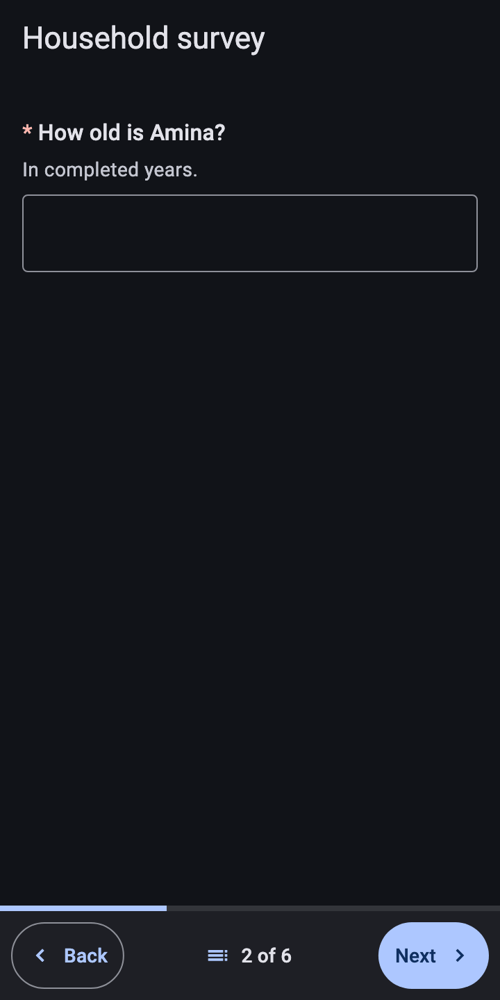
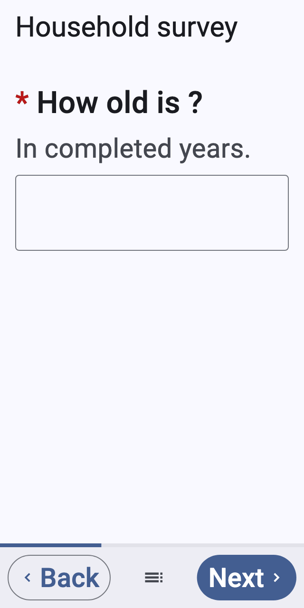
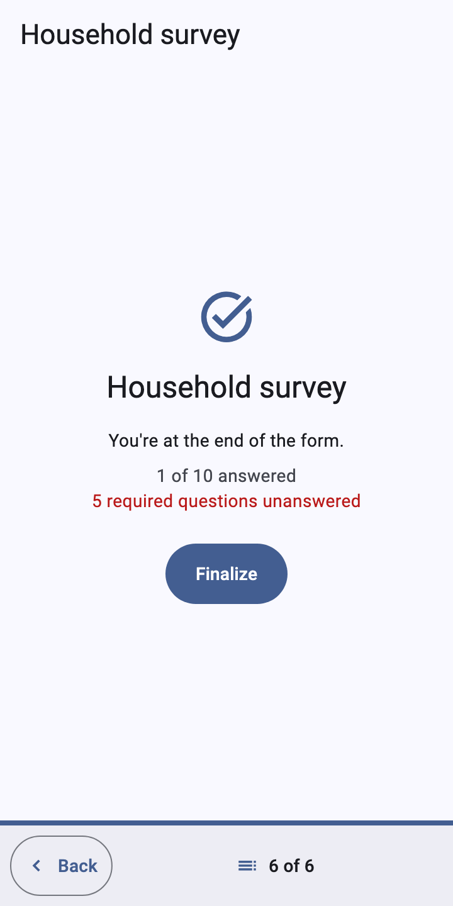
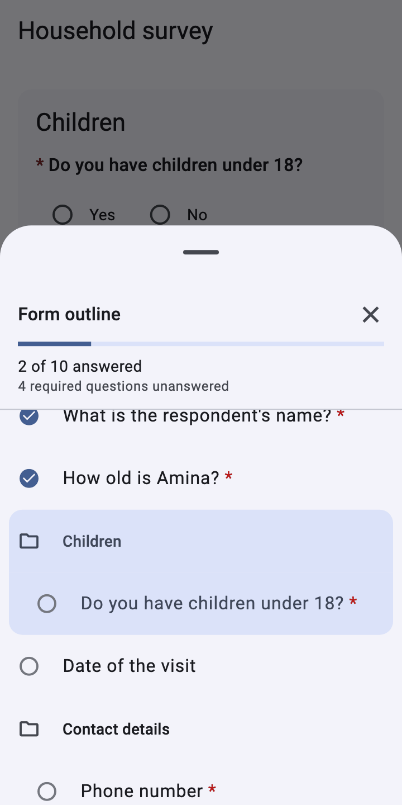
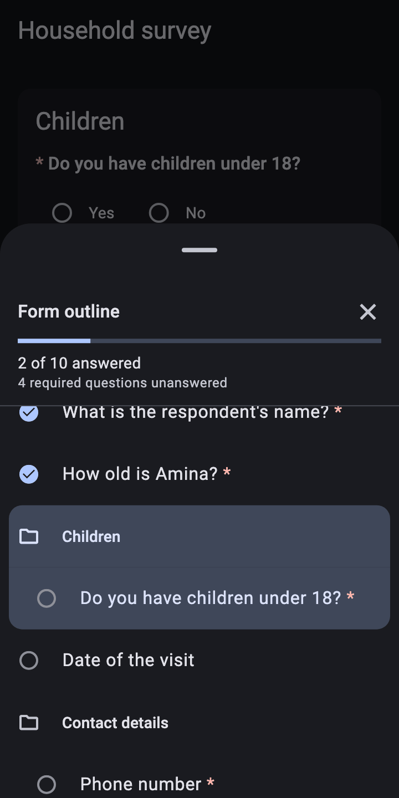
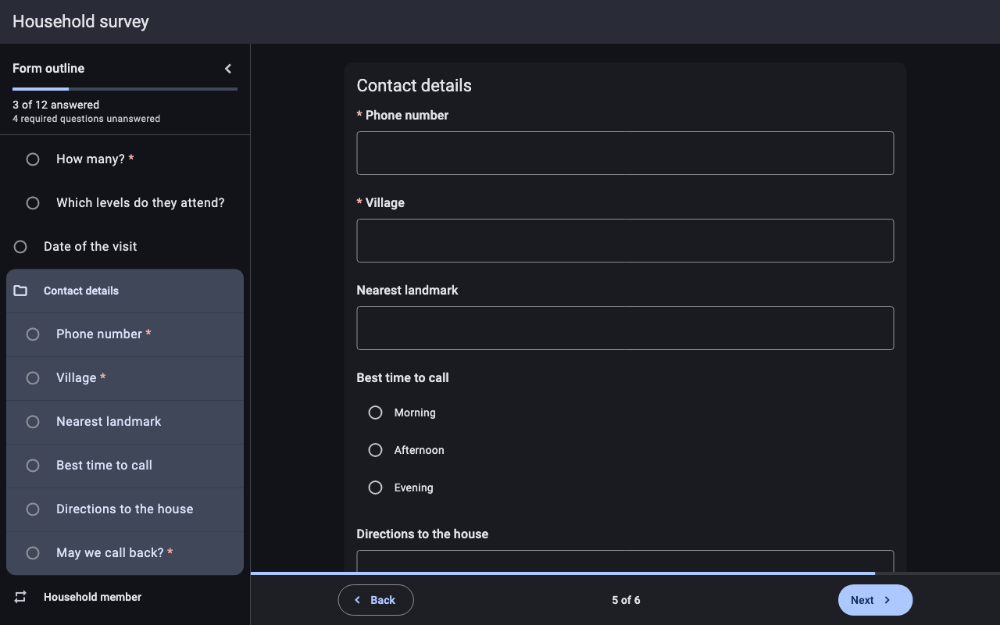
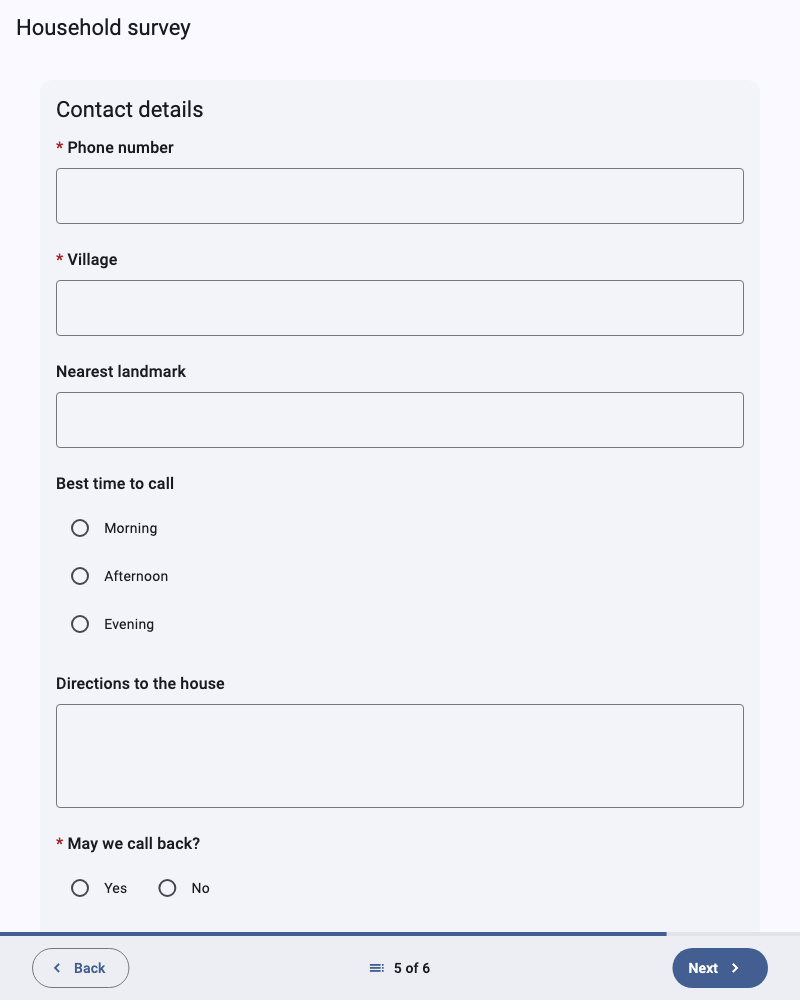

# Pager, outline and adaptive layout

[Catalog](README.md) › Pager, outline and adaptive layout

How `XFormView` lays out the form around the questions. Form:
[`forms/survey.xml`](../../packages/dartrosa_flutter/test/screenshots/forms/survey.xml)

- [The pager](#the-pager)
- [The end of the form](#the-end-of-the-form)
- [Scroll mode](#scroll-mode)
- [The form outline](#the-form-outline)
- [Adaptive layout](#adaptive-layout)
- [Keyboard and mouse](#keyboard-and-mouse)

## The pager

  

```dart
XFormView(session: session, mode: XFormMode.pager)
```

One question, or one `field-list` group, per screen, as in ODK Collect.
The bottom bar has:

- a progress bar (screens done out of the relevant screens: it changes
  as relevance changes),
- **Back** (disabled on the first screen),
- the position, "2 of 6", which opens the [outline](#the-form-outline),
- **Next**, which first checks the screen's answers (see
  [Validation](validation.md#next-and-the-first-error)).

On narrow screens with large text the buttons become icon buttons and the
position shrinks to its icon (320dp wide, text at 200%):



## The end of the form



After the last screen: the form title, how many questions are answered,
how many required ones are missing, and **Finalize**, which validates the
whole form; on success `XFormView.onFinalized` gets the `Submission`.

## Scroll mode

```dart
XFormView(session: session, mode: XFormMode.scroll)
```

Every relevant question on one page (built lazily, so long forms stay
fast), repeats with add / remove buttons, and **Finish** at the end. Most
images in this catalog are scroll-mode crops.

## The form outline

 

Groups and questions with their state (answered, required, needs
attention), the answered count and the current screen; tapping an entry
jumps to it, like Collect's hierarchy view. On phones it is a bottom
sheet opened from the position button; from 840dp wide it is a side
panel (the chevron hides it to a rail):





```dart
final formKey = GlobalKey<XFormViewState>();

XFormView(
  key: formKey,
  session: session,
  outline: XFormOutlineMode.adaptive, // or onRequest, none
);

// From an app bar button:
formKey.currentState!.showOutline();
```

`XFormOutlineMode.onRequest` never shows the panel (the sheet only, from
the position button or `showOutline()`); `none` turns the outline off.
`XFormTheme.outlinePanelWidth` (320dp) sets the panel's width.

## Adaptive layout


By the width `XFormView` is given (`XFormWindowSize`, the Material 3
window size classes):

| Width | Layout |
|---|---|
| under 600dp (compact) | full width, 48dp pager buttons |
| 600 to 839dp (medium) | a centered column at most 720dp wide (`XFormTheme.maxContentWidth`) |
| 840dp and wider (expanded) | the column plus the outline side panel |



Short text choices go in columns on wide forms
(`XFormTheme.adaptiveChoiceColumns`). Set `maxContentWidth:
double.infinity` to use the whole width.

## Keyboard and mouse

| Key | Action |
|---|---|
| Page Down, Alt+→ | next screen (Alt+← in right-to-left forms) |
| Page Up, Alt+← | previous screen |
| Enter in a one-line field | next field, or next screen when the question is alone |
| Tab, Shift+Tab | next / previous control, in form order |
| Enter, Space | select a focused choice, image-map area, button |
| Esc | close a sheet or dialog |

On desktops and the web, scroll bars stay visible, text can be selected
and the time picker opens for typing. Right-to-left form languages (ar,
fa, he, ur, ...) flip the layout.
