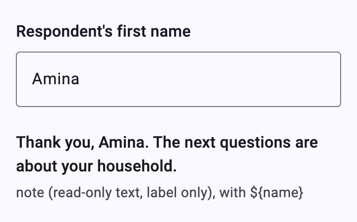
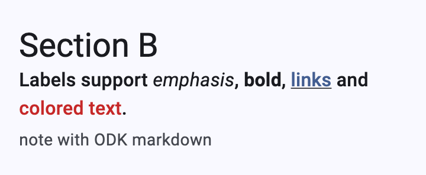
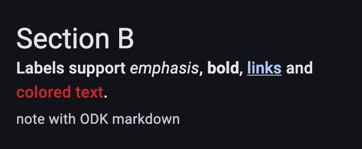
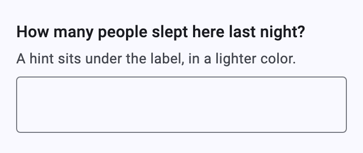
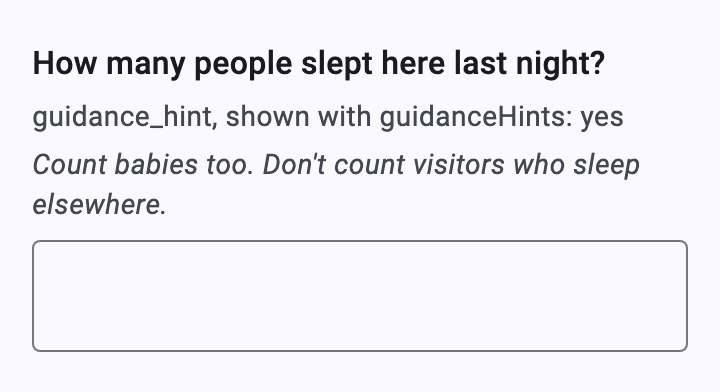
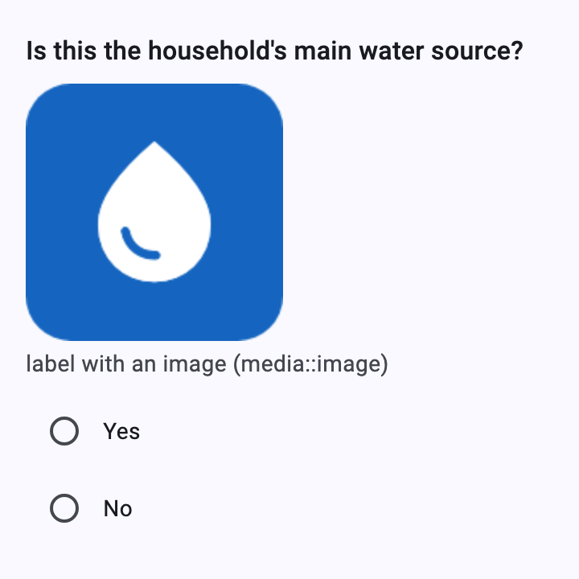
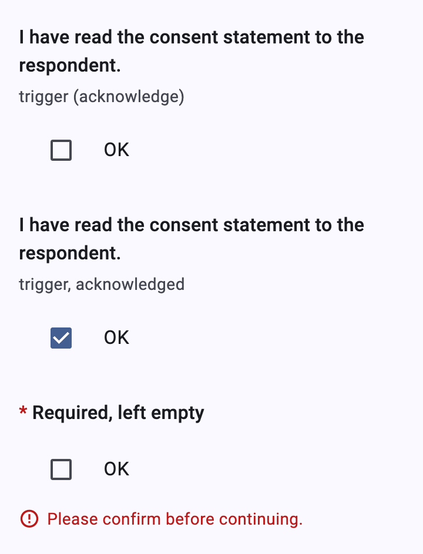

# Notes, labels and triggers

[Catalog](README.md) › Notes, labels and triggers

Form: [`forms/notes.xml`](../../packages/dartrosa_flutter/test/screenshots/forms/notes.xml)

- [Notes](#notes)
- [Markdown in labels](#markdown-in-labels)
- [Hints and guidance hints](#hints-and-guidance-hints)
- [Label images](#label-images)
- [Triggers (acknowledge)](#triggers-acknowledge)

## Notes



| type | name | label |
|---|---|---|
| text | name | Respondent's first name |
| note | welcome | Thank you, ${name}. The next questions are about your household. |

```xml
<bind nodeset="/data/welcome" type="string" readonly="true()"/>
...
<input ref="/data/welcome">
  <label>Thank you, <output value="/data/name"/>. The next questions are about your household.</label>
</input>
```

A note is a read-only text input: only its label and hints show.
`<output>` values update as the answers they read change.

## Markdown in labels

 

```text
# Section B
Labels support *emphasis*, **bold**, [links](https://getodk.org) and
<span style="color: #c62828">colored text</span>.
```

ODK's markdown subset in labels, hints and choice labels: `*em*`,
`**strong**`, `#` headers, `[links](url)` (opened through
`XFormDelegates.openLink`) and `<span style="color: …; font-family: …">`.
Screen readers get the plain text.

## Hints and guidance hints

 

| type | name | label | hint | guidance_hint |
|---|---|---|---|---|
| integer | hinted | How many people slept here last night? | A hint sits under the label, in a lighter color. | |
| integer | guided | How many people slept here last night? | | Count babies too. Don't count visitors who sleep elsewhere. |

```xml
<text id="guided">
  <value>How many people slept here last night?</value>
  <value form="guidance">Count babies too. Don't count visitors who sleep elsewhere.</value>
</text>
...
<input ref="/data/guided">
  <label ref="jr:itext('guided')"/>
</input>
```

Hints use `bodyMedium` in `onSurfaceVariant`. Guidance hints follow
`XFormView.guidanceHints`: `GuidanceHintMode.yes` (shown, in italics),
`collapsed` (behind a "Guidance" expander), `no` (hidden).

## Label images



| type | name | label | media::image |
|---|---|---|---|
| select_one yes_no | water | Is this the household's main water source? | water.png |

Images come from `XFormDelegates.image(uri)`, as for
[choice images](select-one.md#choice-images-and-no-buttons).

## Triggers (acknowledge)



| type | name | label | required |
|---|---|---|---|
| acknowledge | consent | I have read the consent statement to the respondent. | |
| acknowledge | t_required | Required, left empty | yes |

```xml
<trigger ref="/data/consent">
  <label>I have read the consent statement to the respondent.</label>
</trigger>
```

A check box labelled "OK" (`XFormLocalizations.acknowledge`); ticking it
answers `OK`, unticking clears the answer.
