# Range and rank

[Catalog](README.md) › Range and rank

Form: [`forms/range_rank.xml`](../../packages/dartrosa_flutter/test/screenshots/forms/range_rank.xml)

- [Range](#range)
- [vertical](#vertical)
- [picker](#picker)
- [rating](#rating)
- [no-ticks](#no-ticks)
- [Range states](#range-states)
- [Rank](#rank)

## Range

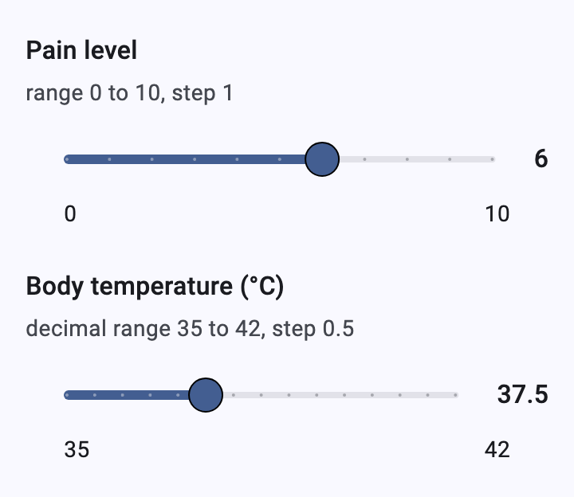 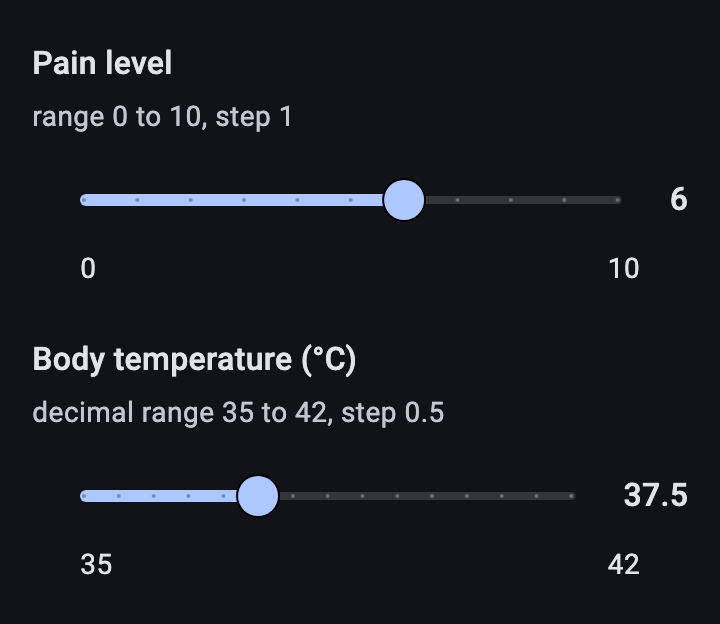

| type | name | label | parameters |
|---|---|---|---|
| range | pain | Pain level | start=0 end=10 step=1 |
| range | temperature | Body temperature (°C) | start=35 end=42 step=0.5 |

```xml
<bind nodeset="/data/pain" type="int"/>
...
<range ref="/data/pain" start="0" end="10" step="1">
  <label>Pain level</label>
</range>
```

A Material `Slider` with a tick per step, the value beside it and the
ends under it (`RangeInput`). Integer ranges answer `IntegerValue`,
decimal ranges `DecimalValue`; `start` may be greater than `end`.

## vertical

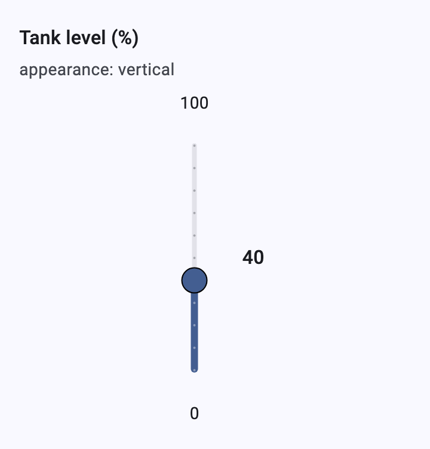

| type | name | label | appearance | parameters |
|---|---|---|---|---|
| range | water | Tank level (%) | vertical | start=0 end=100 step=10 |

## picker

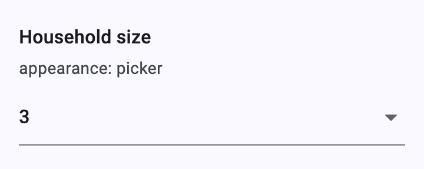

| type | name | label | appearance | parameters |
|---|---|---|---|---|
| range | picker | Household size | picker | start=1 end=10 step=1 |

A drop-down of every value from `start` to `end`.

## rating

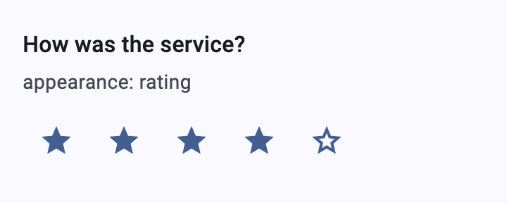

| type | name | label | appearance | parameters |
|---|---|---|---|---|
| range | rating | How was the service? | rating | start=1 end=5 step=1 |

One star per value (zero excluded); tapping a star picks it.

## no-ticks

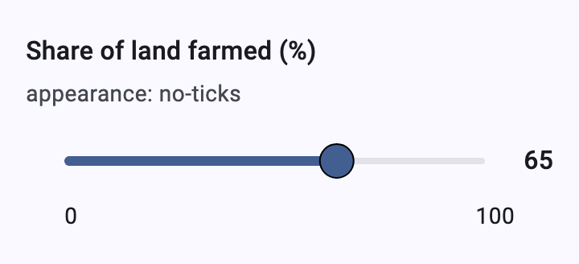

| type | name | label | appearance | parameters |
|---|---|---|---|---|
| range | noticks | Share of land farmed (%) | no-ticks | start=0 end=100 step=1 |

## Range states

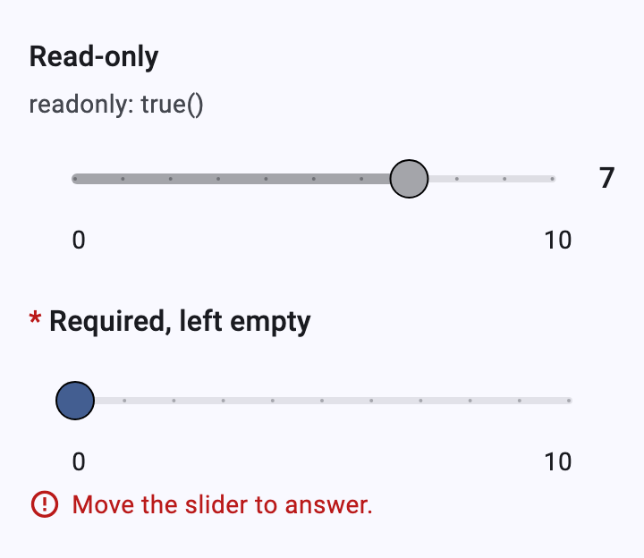

An unanswered slider sits at its lowest value without a value label;
moving it answers. Read-only sliders are disabled.

Keyboard: the slider takes focus with Tab; the arrow keys move it a step.
Theming: `SliderTheme` (track, thumb, ticks, value indicator).

## Rank

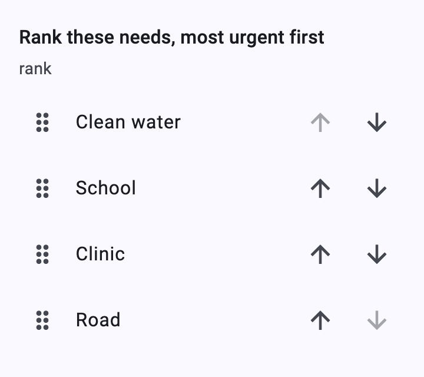 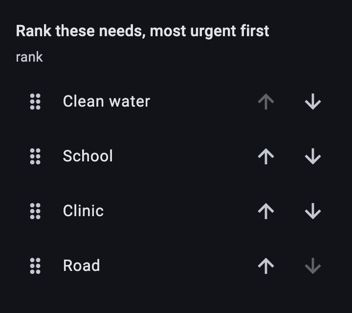

| type | name | label |
|---|---|---|
| rank needs | priorities | Rank these needs, most urgent first |

```xml
<bind nodeset="/data/priorities" type="odk:rank"/>
...
<odk:rank ref="/data/priorities">
  <label>Rank these needs, most urgent first</label>
  <item><label>Clean water</label><value>water</value></item>
  ...
</odk:rank>
```

A reorderable list: drag a row by its handle (or long-press it), or use
the **Move up** / **Move down** buttons, which also work with the
keyboard and screen readers. Every move answers with the whole order
(`water school clinic road`).

| Not answered yet | Read-only |
|---|---|
| 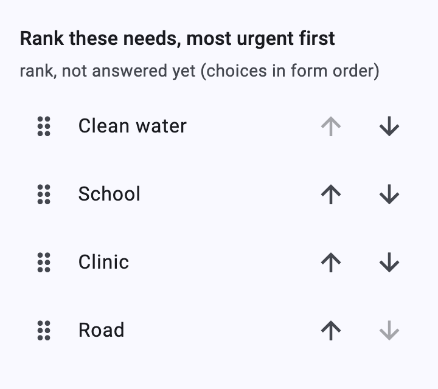 | 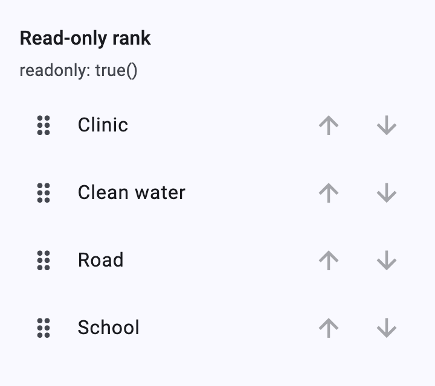 |

An unanswered rank lists the choices in form order; the answer is saved
on the first move. Theming: `ListTileTheme`, `IconButtonTheme`. Strings:
`XFormLocalizations.moveUp`, `moveDown`.
