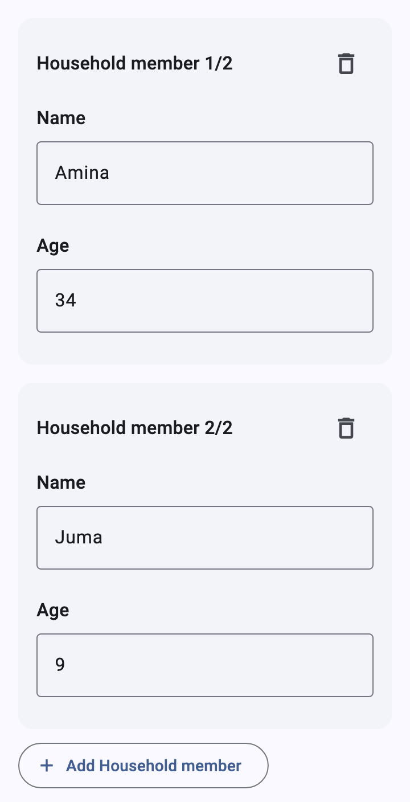
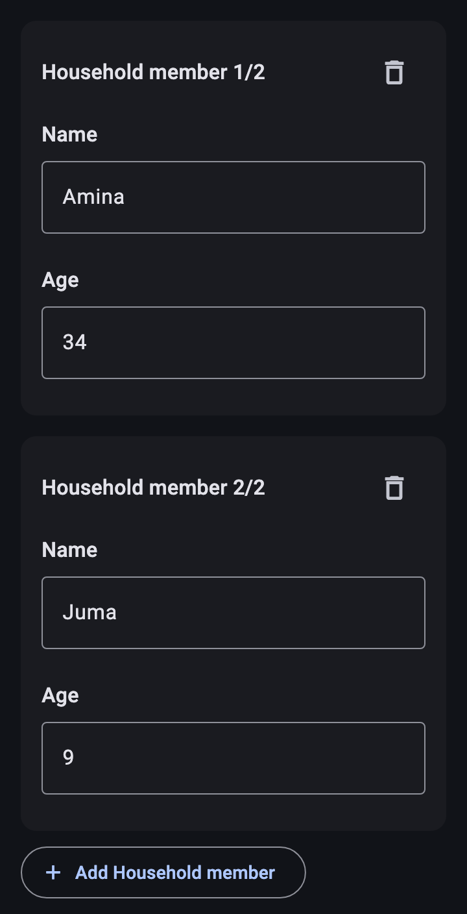
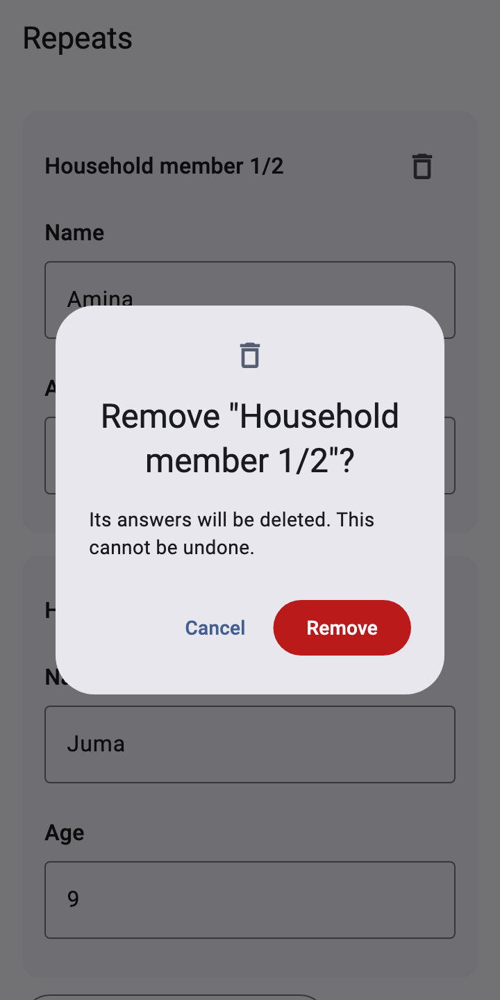
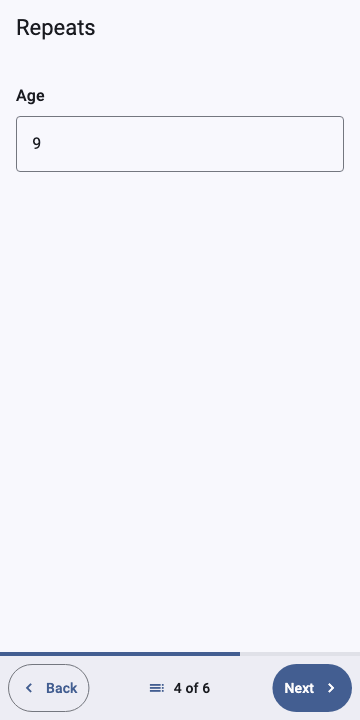
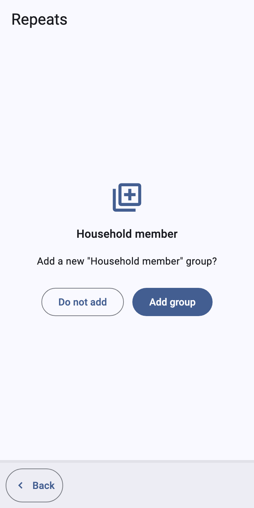
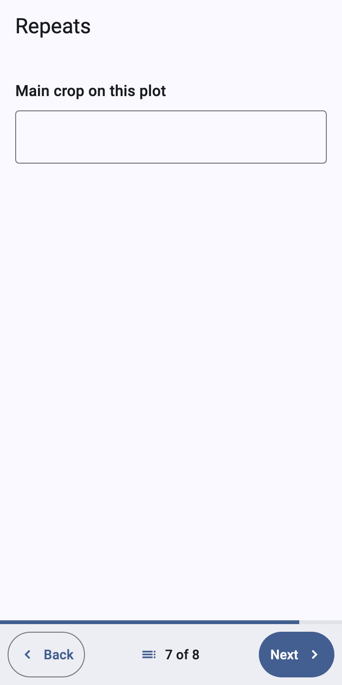
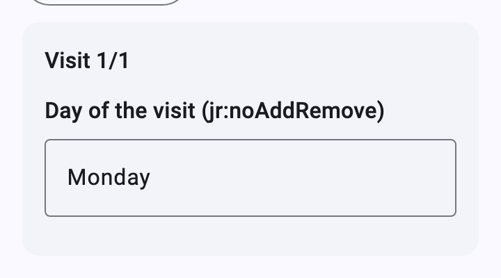

# Repeats

[Catalog](README.md) › Repeats

Form: [`forms/repeats.xml`](../../packages/dartrosa_flutter/test/screenshots/forms/repeats.xml)

- [In scroll mode](#in-scroll-mode)
- [In the pager](#in-the-pager)
- [jr:count](#jrcount)
- [jr:noAddRemove](#jrnoaddremove)

## In scroll mode

 

| type | name | label |
|---|---|---|
| begin_repeat | member | Household member |
| text | name | Name |
| integer | age | Age |
| end_repeat | | |

```xml
<group ref="/data/member">
  <label>Household member</label>
  <repeat nodeset="/data/member">
    <input ref="/data/member/name"><label>Name</label></input>
    <input ref="/data/member/age"><label>Age</label></input>
  </repeat>
</group>
```

Each instance is a card headed with its name and position ("Household
member 1/2"). **Add Household member** adds an instance; the delete
button asks first, because the instance's answers go with it:



## In the pager

 

Like Collect, after the last instance the pager asks "Add a new
"Household member" group?": **Add group** adds one and shows its first
question, **Do not add** moves past the repeat.

## jr:count



| type | name | label | repeat_count |
|---|---|---|---|
| integer | plots | How many plots do you farm? | |
| begin_repeat | plot | Plot | ${plots} |
| text | crop | Main crop on this plot | |
| end_repeat | | | |

```xml
<repeat nodeset="/data/plot" jr:count="/data/plots">
```

The pager creates as many instances as the count and never asks to add
more. Known gap: scroll mode doesn't create the counted instances; it
shows the instances already in the instance and an add button, so use
the pager for forms with `jr:count` repeats.

## jr:noAddRemove



```xml
<repeat nodeset="/data/visit" jr:noAddRemove="true()">
```

The instances in the form are shown without add or delete buttons.

Theming: instance cards are `XFormCard`s ([Groups](groups.md#theming));
the delete button is an `IconButton`, the confirmation an `AlertDialog`
whose Remove button uses `XFormTheme.errorColor`. Strings:
`XFormLocalizations.addRepeat`, `addRepeatPrompt`, `addGroup`,
`doNotAdd`, `remove`, `removeRepeatTitle`, `removeRepeatMessage`.
