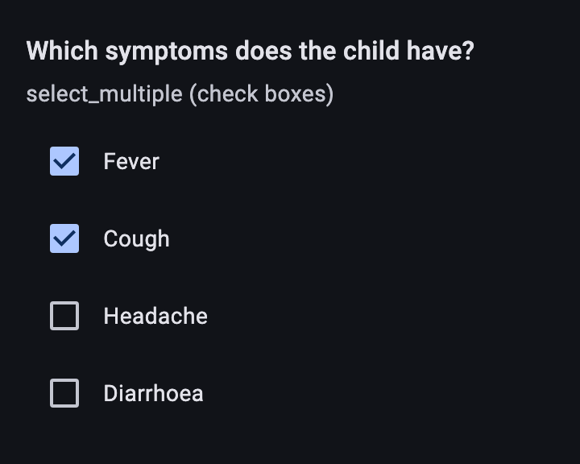
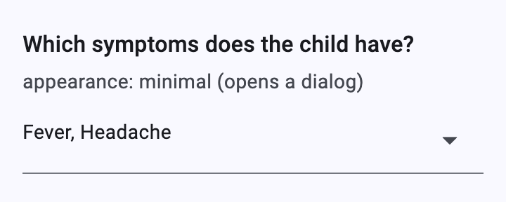
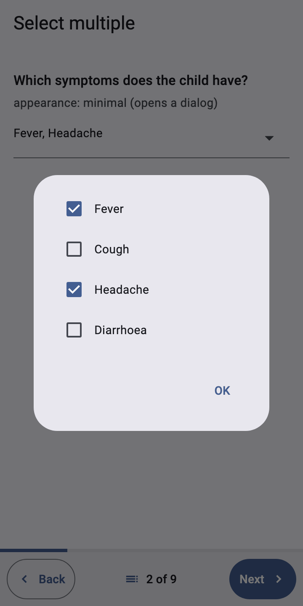
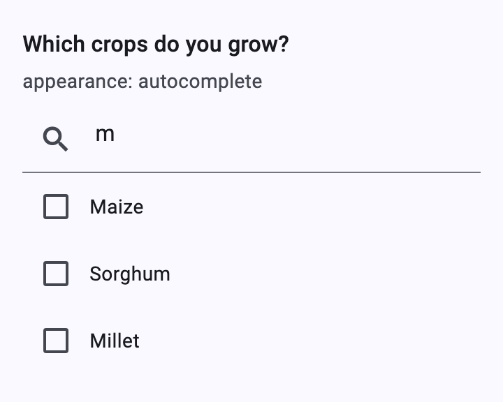
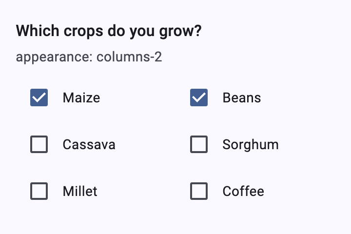
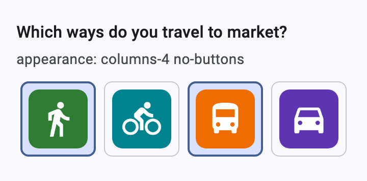
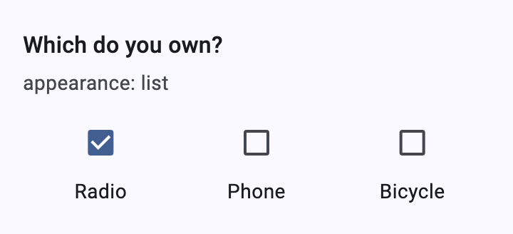
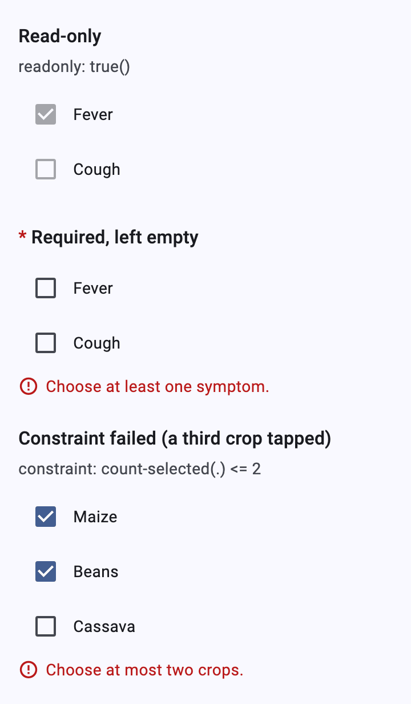

# Select multiple

[Catalog](README.md) › Select multiple

`select_multiple` (`<select>`) questions: check boxes by default, or the
widget for their appearance (`SelectMultiInput`). The answer lists the
selected values in choice order (`fever cough`). The layout appearances
(`columns*`, `no-buttons`, choice images) work as for
[select one](select-one.md#columns-columns-pack-columns-n).

Form: [`forms/select_multiple.xml`](../../packages/dartrosa_flutter/test/screenshots/forms/select_multiple.xml)

- [Check boxes](#check-boxes)
- [minimal](#minimal)
- [autocomplete](#autocomplete)
- [columns-N](#columns-n)
- [no-buttons](#no-buttons)
- [list](#list)
- [States and constraints](#states-and-constraints)
- [Keyboard, accessibility, theming](#keyboard-accessibility-theming)

## Check boxes

 

| type | name | label |
|---|---|---|
| select_multiple symptoms | symptoms | Which symptoms does the child have? |

```xml
<select ref="/data/symptoms">
  <label>Which symptoms does the child have?</label>
  <item><label>Fever</label><value>fever</value></item>
  <item><label>Cough</label><value>cough</value></item>
  <item><label>Headache</label><value>headache</value></item>
  <item><label>Diarrhoea</label><value>diarrhoea</value></item>
</select>
```

## minimal

 

| type | name | label | appearance |
|---|---|---|---|
| select_multiple symptoms | minimal | Which symptoms does the child have? | minimal |

A field listing the selected labels; tapping it opens a dialog of check
boxes that answers as you tick.

## autocomplete



| type | name | label | appearance |
|---|---|---|---|
| select_multiple crops | crops | Which crops do you grow? | autocomplete |

Filtering only hides choices; selections that are filtered out stay
selected.

## columns-N



| type | name | appearance |
|---|---|---|
| select_multiple crops | columns | columns-2 |

## no-buttons



| type | name | appearance |
|---|---|---|
| select_multiple transport | nobuttons | columns-4 no-buttons |

Tiles are toggled; screen readers hear them as checked or not.

## list



| type | name | appearance |
|---|---|---|
| select_multiple assets | list | list |

`label` and `list-nolabel` work too, as for
[select one](select-one.md#label-and-list-nolabel).

## States and constraints



```xml
<bind nodeset="/data/s_invalid" type="string"
      constraint="count-selected(.) &lt;= 2"
      jr:constraintMsg="Choose at most two crops."/>
```

Tapping a third crop is rejected: the check box stays clear and the
form's message shows until a valid answer is given.

## Keyboard, accessibility, theming

- Check boxes take focus with Tab; Space toggles.
- Platform features: `XFormDelegates.image` for choice images.
- Theming: `CheckboxTheme`, `DialogTheme` (minimal), the color scheme for
  tiles. Override with `widgetOverrides: {'selectMulti': ...}` or
  `'selectMulti:minimal'`.
