# Select one

[Catalog](README.md) › Select one

`select_one` (`<select1>`) questions: radio buttons by default, or the
widget for their appearance (`SelectOneInput`). Tapping the selected
choice again clears it. Choices come from `<item>`s, an `<itemset>`
(secondary instance, choice filters) or, with `search()`, a CSV file
([Image maps, maps, CSV choices](image-maps-maps-and-csv.md)).

Form: [`forms/select_one.xml`](../../packages/dartrosa_flutter/test/screenshots/forms/select_one.xml)

- [Radio buttons](#radio-buttons)
- [minimal](#minimal)
- [quick](#quick)
- [autocomplete](#autocomplete)
- [columns, columns-pack, columns-N](#columns-columns-pack-columns-n)
- [Choice images and no-buttons](#choice-images-and-no-buttons)
- [likert](#likert)
- [list](#list)
- [label and list-nolabel](#label-and-list-nolabel)
- [States](#states)
- [Relevance: a choice that shows questions](#relevance-a-choice-that-shows-questions)
- [Keyboard, accessibility, theming](#keyboard-accessibility-theming)

## Radio buttons

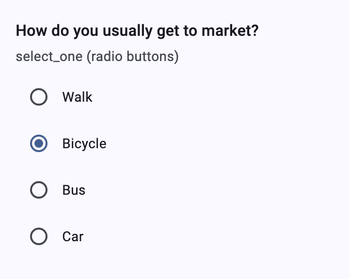 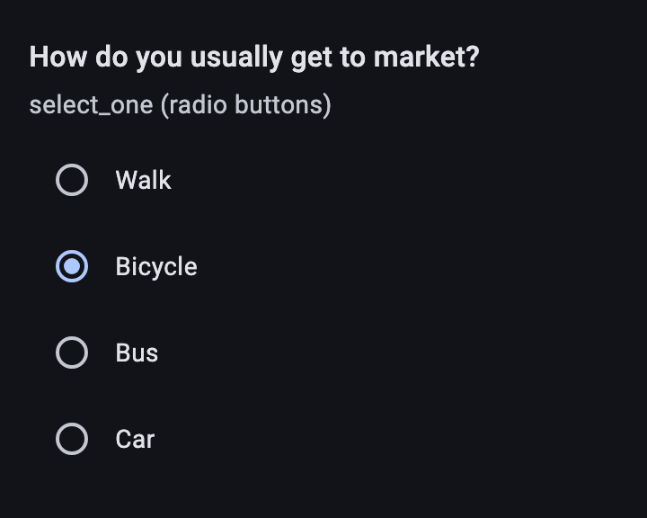

| type | name | label |
|---|---|---|
| select_one transport | transport | How do you usually get to market? |

| list_name | name | label |
|---|---|---|
| transport | walk | Walk |
| transport | bike | Bicycle |
| transport | bus | Bus |
| transport | car | Car |

```xml
<select1 ref="/data/transport">
  <label>How do you usually get to market?</label>
  <item><label>Walk</label><value>walk</value></item>
  <item><label>Bicycle</label><value>bike</value></item>
  <item><label>Bus</label><value>bus</value></item>
  <item><label>Car</label><value>car</value></item>
</select1>
```

Each row is at least 48dp high and the whole row is the tap target. On
forms wider than 560dp, four or more short text choices go in columns
(`XFormTheme.adaptiveChoiceColumns`); phones keep one per line.

## minimal

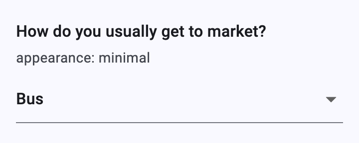 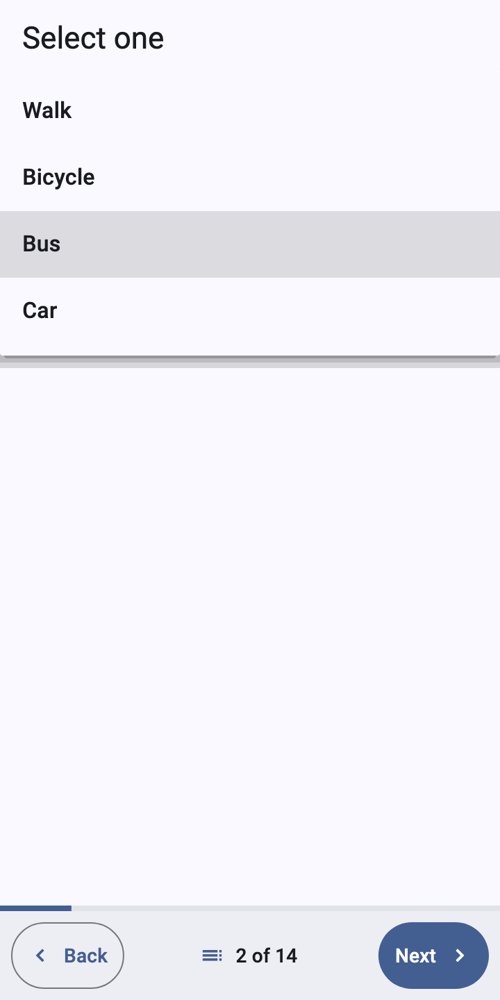

| type | name | label | appearance |
|---|---|---|---|
| select_one transport | minimal | How do you usually get to market? | minimal |

A `DropdownButtonFormField`; menu items show choice images too. Screen
readers name it after the question while nothing is selected.

## quick

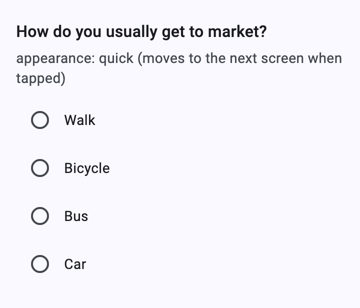 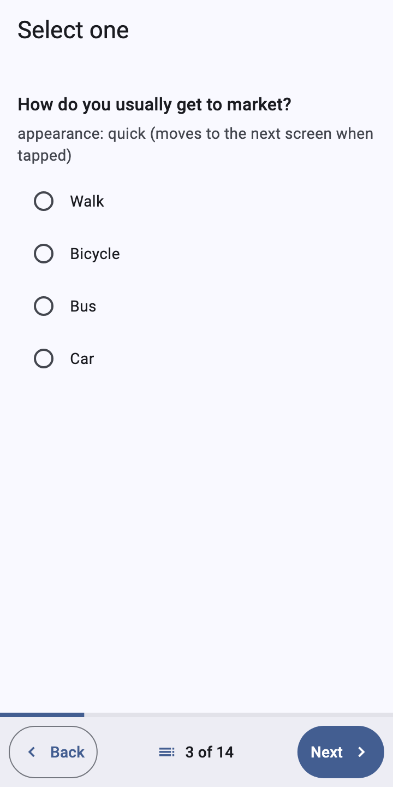

| type | name | label | appearance |
|---|---|---|---|
| select_one transport | quick | How do you usually get to market? | quick |

Looks like the default; in pager mode, when the question is alone on its
screen, choosing moves to the next screen (if the answer is accepted).
Collect's `quickcompact` and `quickcompact-N` are `quick` plus
`no-buttons` (and `columns-N`).

## autocomplete

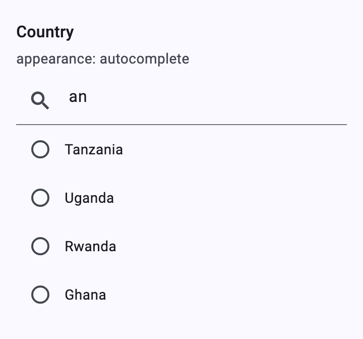

| type | name | label | appearance |
|---|---|---|---|
| select_one countries | country | Country | autocomplete |

A search field above the choices; typing keeps the choices whose label
contains the text (ignoring case). Collect's old name `search` (without
brackets) means the same.

## columns, columns-pack, columns-N

| `columns` | `columns-pack` | `columns-3` |
|---|---|---|
| 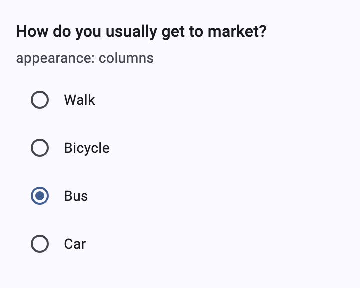 | 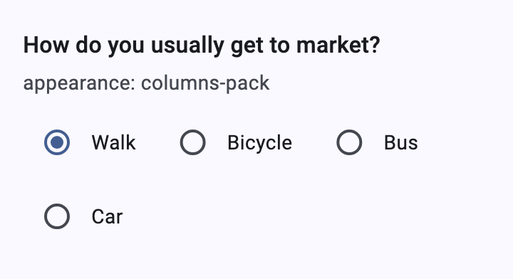 | 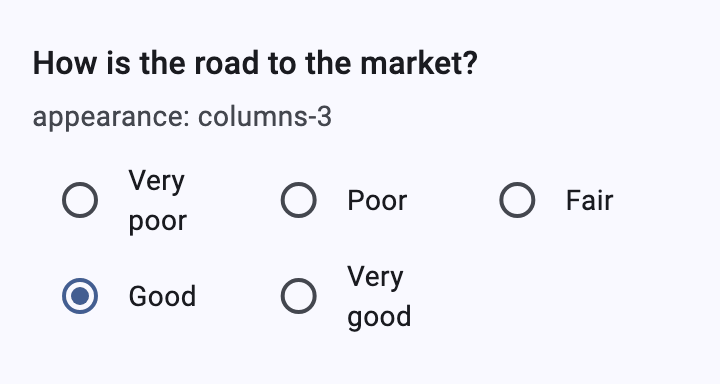 |

| type | name | appearance |
|---|---|---|
| select_one transport | columns | columns |
| select_one transport | pack | columns-pack |
| select_one scale | columns_n | columns-3 |

- `columns`: as many columns of about 180dp as fit (one on a 360dp phone,
  four on a tablet).
- `columns-pack`: choices side by side at their natural width, wrapping.
- `columns-N`: exactly N equal columns (1 to 20).
- Collect's `compact`, `compact-N`, `horizontal` and `horizontal-compact`
  map to `no-buttons`, `no-buttons columns-N`, `columns` and
  `columns-pack`.

## Choice images and no-buttons

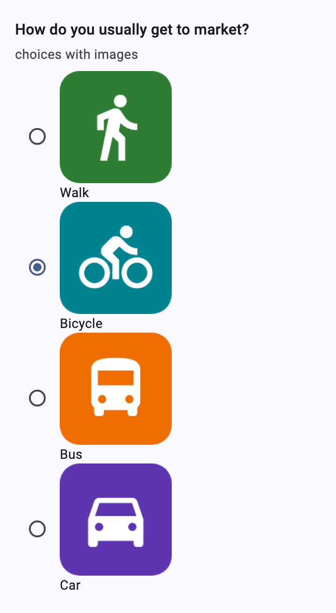

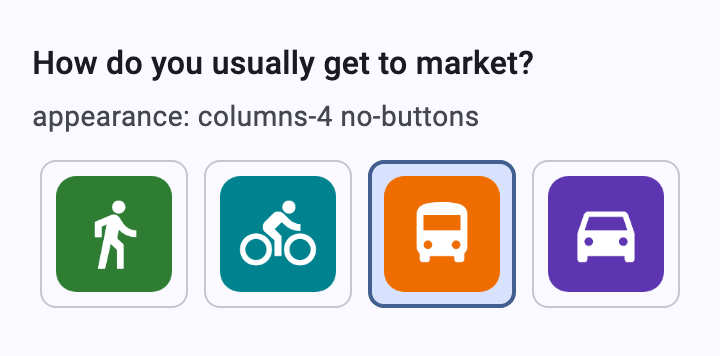 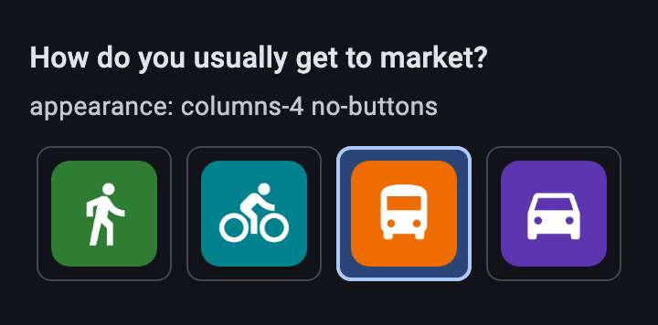

| list_name | name | label | media::image |
|---|---|---|---|
| transport | walk | Walk | walk.png |
| transport | bike | Bicycle | bike.png |

| type | name | appearance |
|---|---|---|
| select_one transport | images | |
| select_one transport | nobuttons | columns-4 no-buttons |

```xml
<text id="walk">
  <value>Walk</value>
  <value form="image">jr://images/walk.png</value>
</text>
...
<item><label ref="jr:itext('walk')"/><value>walk</value></item>
```

Images (at most 120dp high) come from `XFormDelegates.image(uri)`: the
app returns an `ImageProvider` for `jr://images/walk.png`, typically
from the form's media folder. With `no-buttons` each choice is a tile:
its image, or its label when it has none; the selected tile gets the
`primaryContainer` color and a `primary` border. The label stays the
image's semantic label.

```dart
class AppDelegates extends XFormDelegates {
  AppDelegates(this.mediaDir);

  final Directory mediaDir;

  @override
  ImageProvider? image(String uri) =>
      FileImage(File('${mediaDir.path}/${Uri.parse(uri).pathSegments.last}'));
}
```

## likert

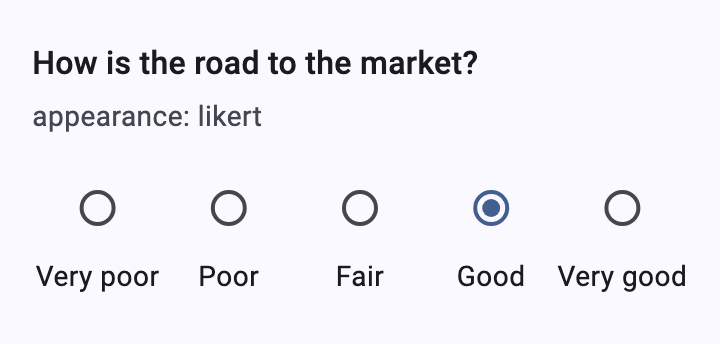 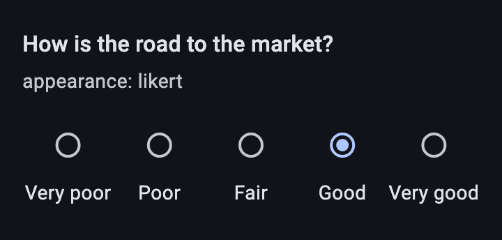

| type | name | label | appearance |
|---|---|---|---|
| select_one scale | likert | How is the road to the market? | likert |

Choices side by side in equal cells, the button above its label.

## list

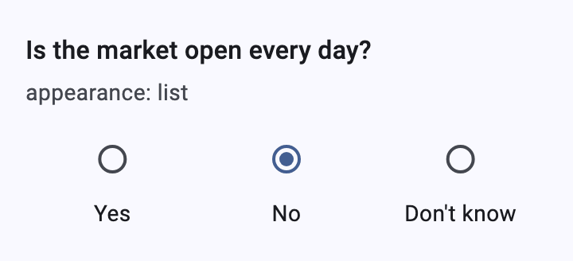

| type | name | label | appearance |
|---|---|---|---|
| select_one yes_no_dk | list | Is the market open every day? | list |

One row of equal cells, button above label.

## label and list-nolabel

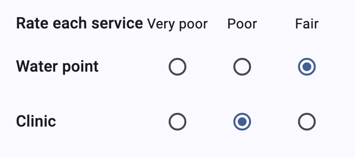

| type | name | label | appearance |
|---|---|---|---|
| begin_group | ratings | | field-list |
| select_one scale | header | Rate each service | label |
| select_one scale | water | Water point | list-nolabel |
| select_one scale | clinic | Clinic | list-nolabel |
| end_group | | | |

The XLSForm way to build a grid: a `label` question shows only the choice
labels, `list-nolabel` questions only their buttons, each after its
question label. A [`table-list` group](groups.md#table-list) builds the
same grid from plain selects.

## States

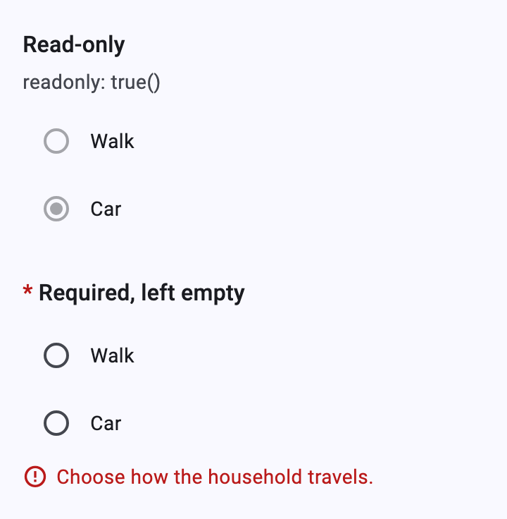

Read-only selects keep their buttons, disabled. A required select left
empty shows `jr:requiredMsg` after Next or Finalize.

## Relevance: a choice that shows questions

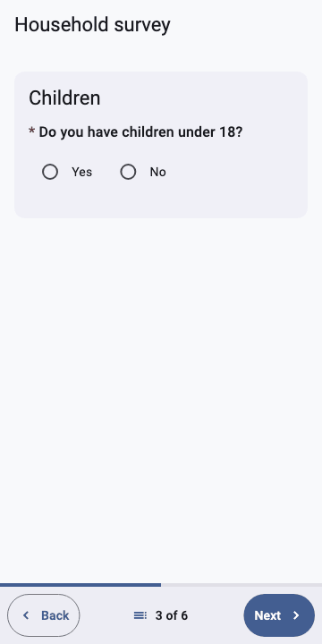

```xml
<bind nodeset="/data/children/count" type="int"
      relevant="/data/children/has_children = 'yes'"/>
```

Answering re-evaluates `relevant`; the questions that change appear or
disappear without rebuilding the rest of the screen. Form:
[`forms/survey.xml`](../../packages/dartrosa_flutter/test/screenshots/forms/survey.xml).

## Keyboard, accessibility, theming

- Radio buttons take keyboard focus (Tab); Space or Enter selects. Rows
  merge their semantics, so a screen reader reads "Bicycle, radio button,
  checked, in group".
- `no-buttons` tiles are buttons with a selected state.
- Platform features: `XFormDelegates.image` for choice images; nothing
  else.
- Theming: `RadioTheme`, the color scheme (`primary`,
  `primaryContainer`, `outlineVariant` for tiles), `DropdownMenuTheme`,
  `XFormTheme.adaptiveChoiceColumns`. Replace one appearance with
  `widgetOverrides: {'selectOne:likert': ...}`.
