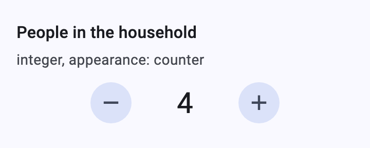
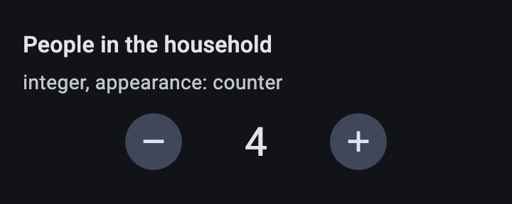
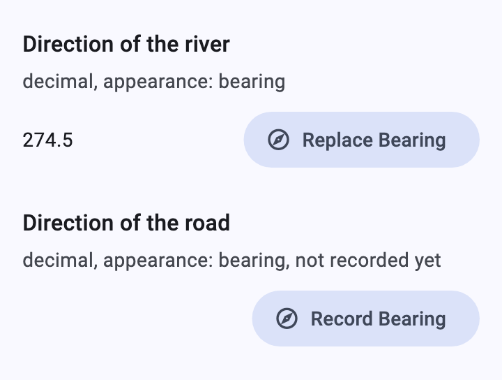
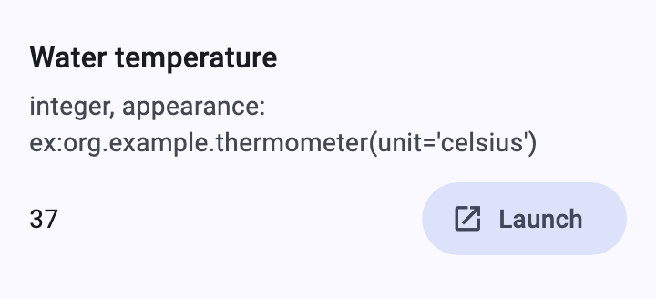
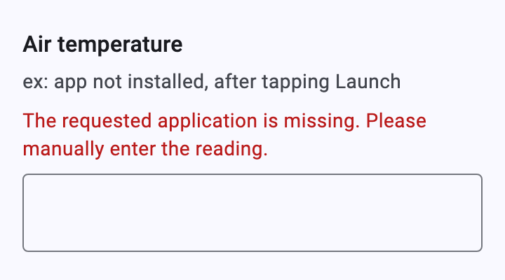
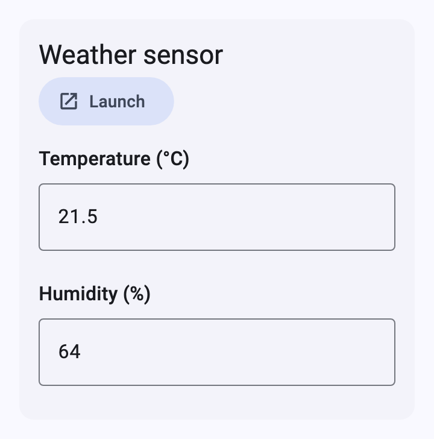
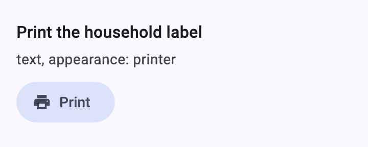
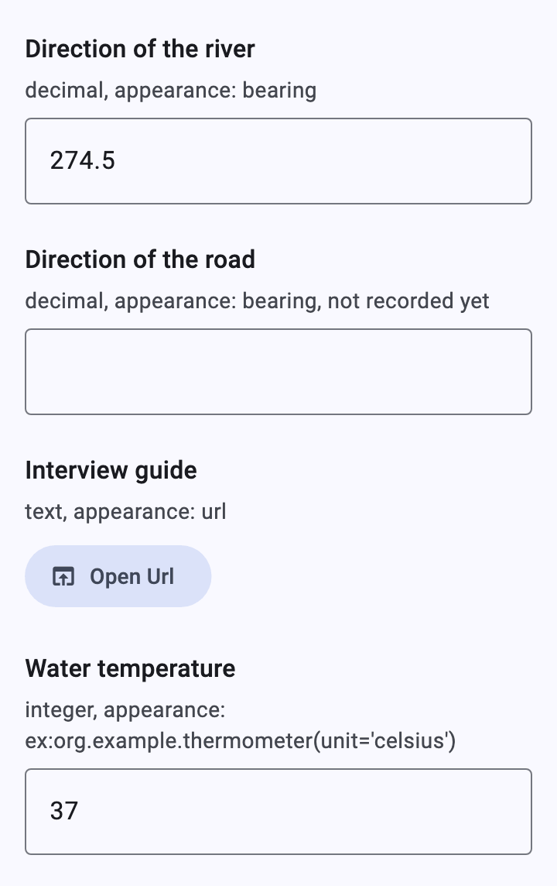

# Counters, links, external apps and printing

[Catalog](README.md) › Counters, links, external apps and printing

Appearances that turn a text or number question into a different widget.
Each one that needs the device falls back to the default text field when
the app doesn't provide the feature.

Form: [`forms/special.xml`](../../packages/dartrosa_flutter/test/screenshots/forms/special.xml)

- [counter](#counter)
- [bearing](#bearing)
- [url](#url)
- [External apps (ex:)](#external-apps-ex)
- [Intent groups](#intent-groups)
- [printer](#printer)
- [Without delegates](#without-delegates)

## counter

 

| type | name | label | appearance |
|---|---|---|---|
| integer | people | People in the household | counter |

```xml
<input ref="/data/people" appearance="counter">
```

Minus and plus buttons (tooltips "Decrease" / "Increase") around the
count, from 0 to 999,999,999, like Collect's `CounterWidget`. No platform
feature needed.

## bearing



| type | name | label | appearance |
|---|---|---|---|
| decimal | heading | Direction of the river | bearing |

**Record Bearing** calls `compassBearing`, which returns degrees (0 to
360):

```dart
@override
bool get canReadBearing => true;

@override
Future<double?> compassBearing(BuildContext context) =>
    Navigator.push<double>(
      context,
      MaterialPageRoute(builder: (_) => const MyCompassPage()),
    );
```

## url


| type | name | label | appearance | default |
|---|---|---|---|---|
| text | guide | Interview guide | url | https://getodk.org |

A read-only text with a link: **Open Url** calls
`XFormDelegates.openLink(context, uri)` (for example with url_launcher).
Without a value it says "No URL set". Links in labels and hints
(`[text](url)`) use the same delegate.

```dart
@override
Future<void> openLink(BuildContext context, Uri uri) async {
  await launchUrl(uri);
}
```

## External apps (ex:)

 

| type | name | label | appearance |
|---|---|---|---|
| integer | reading | Water temperature | ex:org.example.thermometer(unit='celsius') |

**Launch** calls `launchExternalApp` with the intent (`org.example.thermometer`)
and the parameters evaluated as Collect does (`'constants'`, XPath
expressions, `instanceProviderID()`, `uri_data`), plus `value`, the
current answer. The app's `value` result becomes the answer. When no app
handles the intent, throw `ExternalAppNotFoundException`: the form's
`noAppErrorString` (or Collect's default message, right) shows and the
answer can be typed.

```dart
@override
bool get canLaunchExternalApps => true;

@override
Future<Map<String, Object?>?> launchExternalApp(
  BuildContext context, {
  required String intent,
  required Map<String, Object?> params,
  String? data,
}) async {
  // On Android, start the activity for a result (e.g. a platform
  // channel); throw ExternalAppNotFoundException when none is installed.
  return myIntentChannel.startForResult(intent, params, data);
}
```

`buttonText` and `noAppErrorString` (`jr:` attributes, or itext forms)
change the button and the error.

## Intent groups



| type | name | label | intent |
|---|---|---|---|
| begin_group | sensor | Weather sensor | org.example.sensor(device='kit-7') |
| decimal | temperature | Temperature (°C) | |
| integer | humidity | Humidity (%) | |
| end_group | | | |

```xml
<group ref="/data/sensor" intent="org.example.sensor(device='kit-7')">
```

One **Launch** button for the group: the app gets the parameters and, by
question name, the current text, number and binary answers, and returns
new answers by name.

## printer



| type | name | label | appearance | read_only | calculation |
|---|---|---|---|---|---|
| text | label_text | Print the household label | printer:org.example.printer | yes | concat('Household ', ${hh_id}) |

**Print** sends the answer to `XFormDelegates.print`. Collect parses it
as HTML with `<qrcode>` and `<barcode>` elements; the app decides how to
render and print it. Without `canPrint` the question is a note.

## Without delegates



Keyboard: every button is focusable. Theming: `FilledButtonTheme`,
`IconButtonTheme` (counter). Strings: `XFormLocalizations.getBearing`,
`replaceBearing`, `openUrl`, `noUrl`, `launchApp`, `noApp`, `print`,
`increment`, `decrement`.
