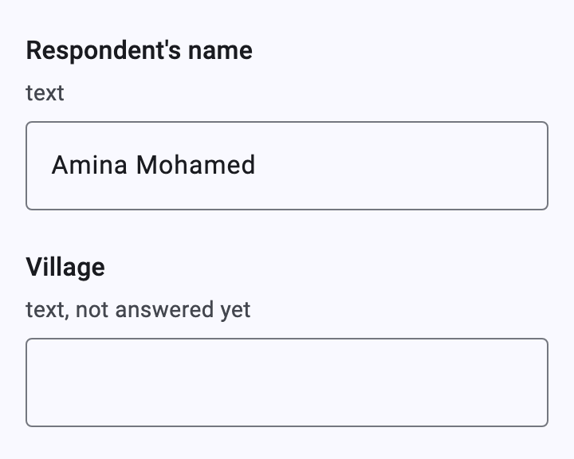
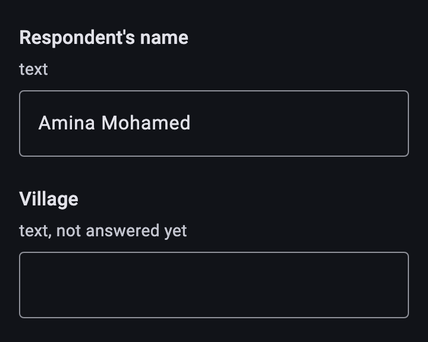
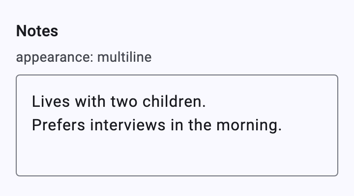
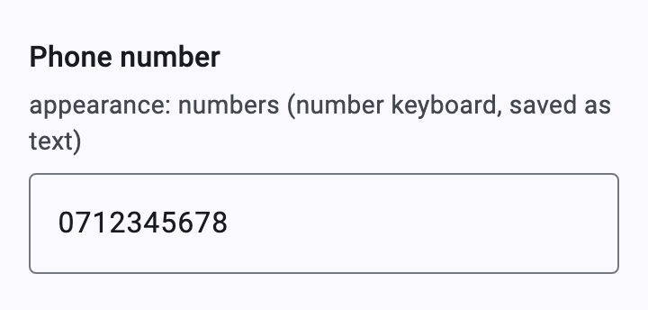
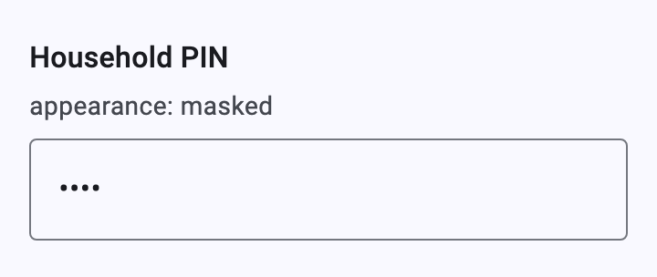
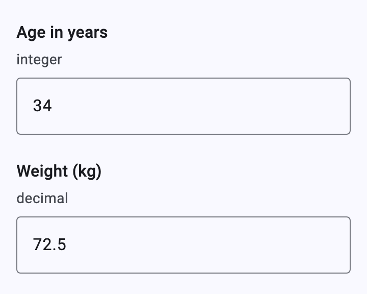
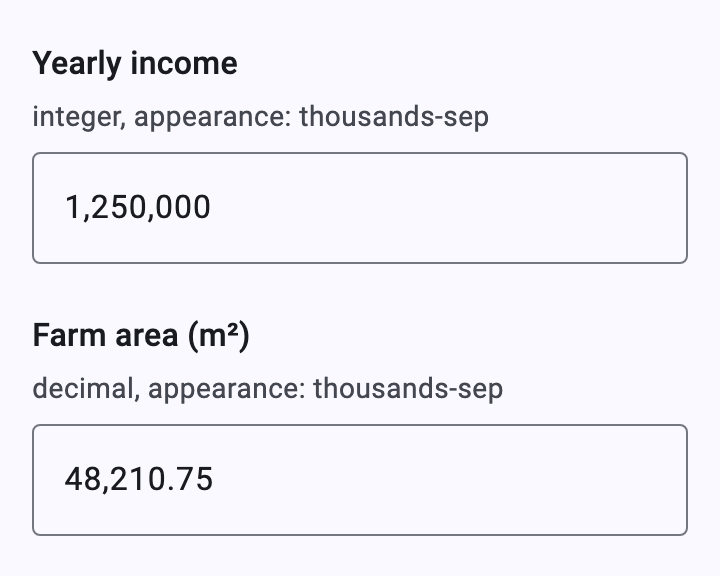
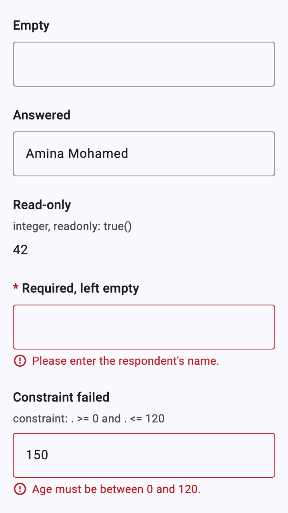
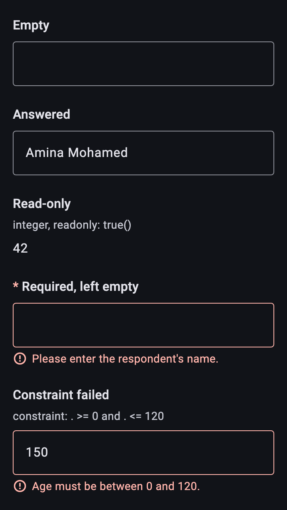

# Text and numbers

[Catalog](README.md) › Text and numbers

`input` questions of type `string`, `int`, `decimal` and `long` are a
Material `TextField` (`TextQuestionInput`). Every keystroke is an answer:
the engine checks it at once, so a constraint error shows while typing
and goes away when the value is fixed.

Form: [`forms/text.xml`](../../packages/dartrosa_flutter/test/screenshots/forms/text.xml)

- [Text](#text)
- [multiline](#multiline)
- [numbers](#numbers)
- [masked](#masked)
- [Integer and decimal](#integer-and-decimal)
- [thousands-sep](#thousands-sep)
- [States](#states)
- [Keyboard, accessibility, theming](#keyboard-accessibility-theming)

## Text

 

| type | name | label |
|---|---|---|
| text | name | Respondent's name |

```xml
<bind nodeset="/data/name" type="string"/>
...
<input ref="/data/name">
  <label>Respondent's name</label>
</input>
```

One line; Enter moves to the next field (or, alone on a pager screen, to
the next screen).

## multiline



| type | name | label | appearance |
|---|---|---|---|
| text | notes | Notes | multiline |

```xml
<input ref="/data/notes" appearance="multiline">
```

At least three lines, growing with the text; Enter adds a line, so Page
Down and Alt+→ don't leave the field.

## numbers



| type | name | label | appearance |
|---|---|---|---|
| text | phone | Phone number | numbers |

Shows the number keyboard but saves text, so leading zeros stay (phone
numbers, IDs).

## masked



| type | name | label | appearance |
|---|---|---|---|
| text | pin | Household PIN | masked |

The text is hidden, without suggestions or autocorrect. ODK's `secret`
control is shown the same way.

## Integer and decimal



| type | name | label |
|---|---|---|
| integer | age | Age in years |
| decimal | weight | Weight (kg) |

```xml
<bind nodeset="/data/age" type="int"/>
<bind nodeset="/data/weight" type="decimal"/>
```

The number keyboard (with a decimal key for decimals, and a sign key).
Integer fields only accept digits and a leading `-`; text that isn't a
decimal is sent to the engine as typed and rejected (see
[Validation](validation.md#rejected-answers)).

## thousands-sep



| type | name | label | appearance |
|---|---|---|---|
| integer | income | Yearly income | thousands-sep |
| decimal | area | Farm area (m²) | thousands-sep |

Digits are grouped as you type with the locale's grouping separator (a
space where it would be `.`, as Collect does). Only the display changes:
the answer is `1250000`.

## States

 

```xml
<bind nodeset="/data/s_readonly" type="int" readonly="true()"/>
<bind nodeset="/data/s_required" type="string" required="true()"
      jr:requiredMsg="Please enter the respondent's name."/>
<bind nodeset="/data/s_invalid" type="int"
      constraint=". &gt;= 0 and . &lt;= 120"
      jr:constraintMsg="Age must be between 0 and 120."/>
```

- **Read-only** text and numbers show the answer as text in place of
  the field (`ReadOnlyAnswer`), as Collect does: a read-only number
  without an answer shows `—`, a read-only text without one is a
  [note](notes-labels-and-triggers.md#notes) (label only).
- **Required** questions show a red `*`; the error appears when Next or
  Finalize is tapped while it is empty.
- **Constraint**: the typed `150` stays in the field, outlined in red,
  with the form's `jr:constraintMsg` under it. The rejected value isn't
  saved; the last accepted value (or none) stays in the instance.

## Keyboard, accessibility, theming

- Tab and Shift+Tab move between fields in form order; Enter moves on
  from one-line fields (`TextInputAction.next`).
- Screen readers read the question's label, "required", and the error
  (a live region) as one node.
- Platform features: none.
- Theming: `InputDecorationTheme` styles the outlined field;
  `XFormTheme.errorColor` the error outline and text; `questionSpacing`
  the space between questions. To replace the widget:
  `widgetOverrides: {'input': ...}` (or `'input:multiline'`).
