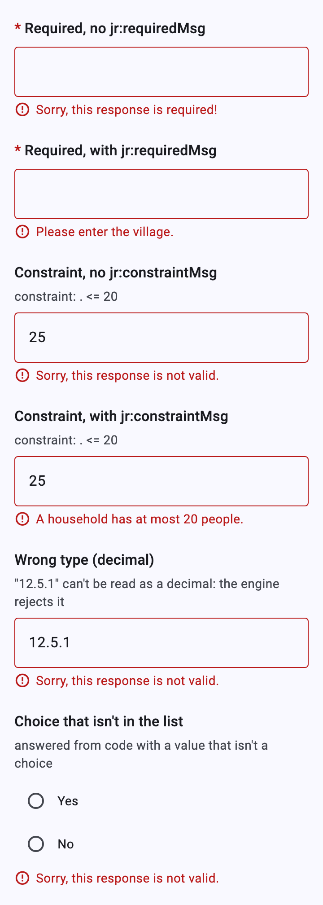
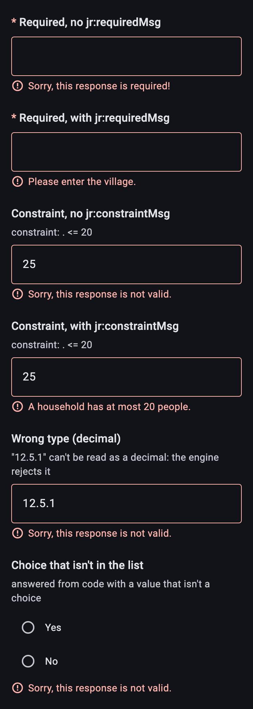
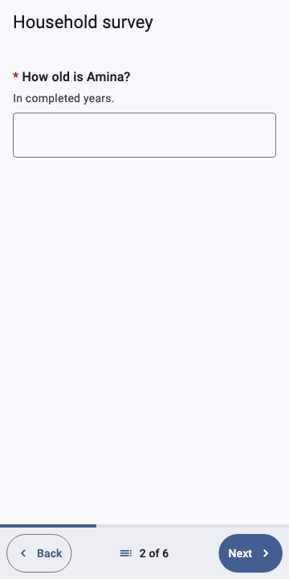
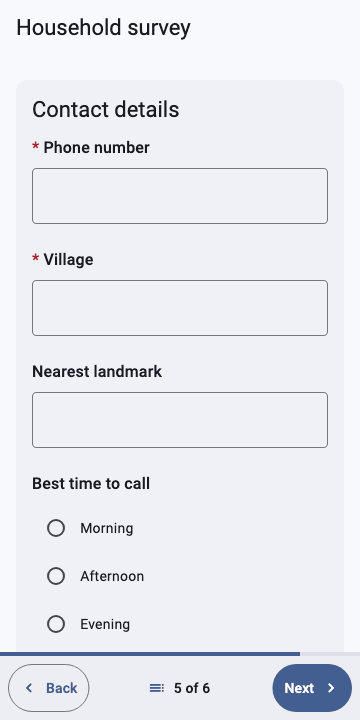
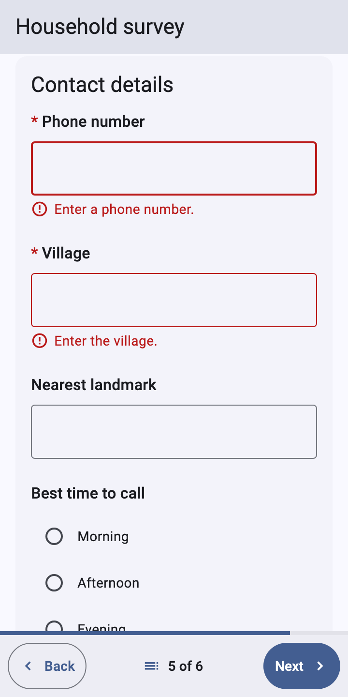
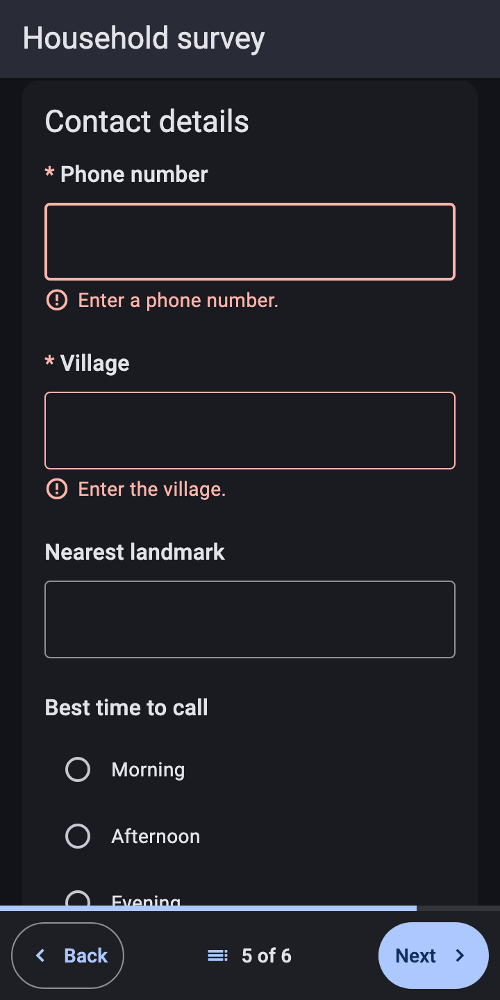
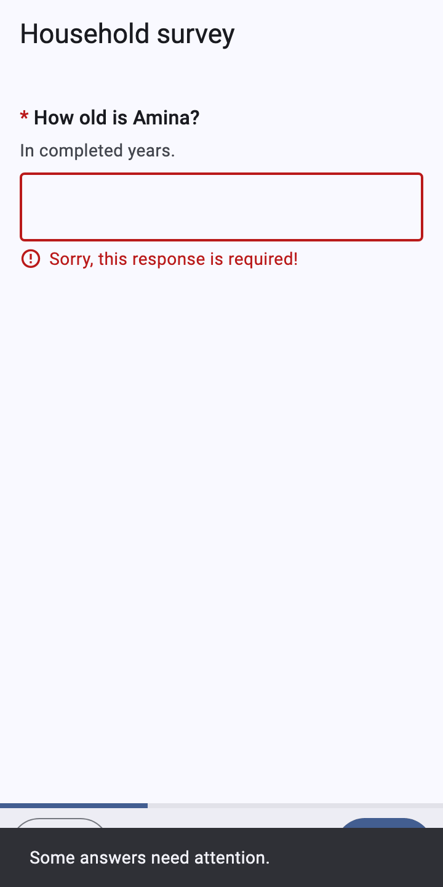

# Validation

[Catalog](README.md) › Validation

The engine checks every answer as it is given; `XFormView` shows what it
says. Forms:
[`forms/validation.xml`](../../packages/dartrosa_flutter/test/screenshots/forms/validation.xml),
[`forms/survey.xml`](../../packages/dartrosa_flutter/test/screenshots/forms/survey.xml)

- [Messages](#messages)
- [Required](#required)
- [Constraints](#constraints)
- [Rejected answers](#rejected-answers)
- [Next and the first error](#next-and-the-first-error)
- [Finalize](#finalize)
- [Customizing](#customizing)

## Messages

 

| Result (`AnswerResult`) | When | Message |
|---|---|---|
| `AnswerRequired` | a required question is empty at Next or Finalize | `jr:requiredMsg`, else "Sorry, this response is required!" |
| `AnswerConstraintViolated` | the `constraint` is false | `jr:constraintMsg`, else "Sorry, this response is not valid." |
| `AnswerRejected` | the value can't be the question's type, or isn't one of its choices | "Sorry, this response is not valid." |

Rejected answers aren't saved: the instance keeps the last accepted
value. A text field keeps what was typed (with a red outline) so it can
be corrected.

## Required

| type | name | label | required | required_message |
|---|---|---|---|---|
| text | village | Village | yes | Please enter the village. |

```xml
<bind nodeset="/data/village" type="string" required="true()"
      jr:requiredMsg="Please enter the village."/>
```

Required questions have a red `*` before the label. Being empty is only
an error when moving on: Next (pager), Finish or Finalize.

## Constraints



| type | name | label | constraint | constraint_message |
|---|---|---|---|---|
| integer | age | How old is ${name}? | . >= 0 and . <= 120 | Age must be between 0 and 120. |

```xml
<bind nodeset="/data/age" type="int" constraint=". &gt;= 0 and . &lt;= 120"
      jr:constraintMsg="Age must be between 0 and 120."/>
```

Text and number fields answer on every keystroke, so the message shows as
soon as the value breaks the constraint and goes when it is fixed.
Selects show it when the choice is tapped (see
[select multiple](select-multiple.md#states-and-constraints)).

## Rejected answers

The "Wrong type" and "Choice that isn't in the list" rows of the picture
above: `12.5.1` typed in a decimal field, and a select answered from code
with `SelectOneValue(Selection('maybe'))`. Both give `AnswerRejected`.
Integer fields filter out anything but digits, so they don't get there.

## Next and the first error

  

Next re-checks every relevant, editable question of the screen. If any
fails, the pager stays, every failing question shows its error, and the
**first** one is scrolled into view and focused (a text field gets the
cursor). Screen readers announce its message.

## Finalize



**Finalize** (and **Finish** in scroll mode) validates the whole form
(`XFormController.finalize`). On failure the view jumps to the first
failing question (its whole `field-list` screen in the pager), shows the
error, announces it, and shows a snack bar, "Some answers need
attention." (`XFormLocalizations.answersNeedAttention`), when there is a
`ScaffoldMessenger`. On success `onFinalized` gets the submission.

The outline marks failing questions too ("needs attention"), and the end
page counts the required questions still unanswered.

## Customizing

- `XFormTheme(errorColor: ...)` colors error text, icons and outlines.
- Subclass `XFormLocalizations` for the default messages
  (`requiredDefault`, `constraintDefault`) and the snack bar text.
- `XFormController.errorFor(index)` and `failureFor(index)` give the
  error of any question, for custom widgets (`widgetOverrides`).
