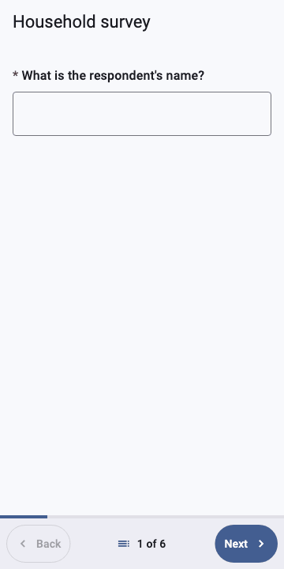
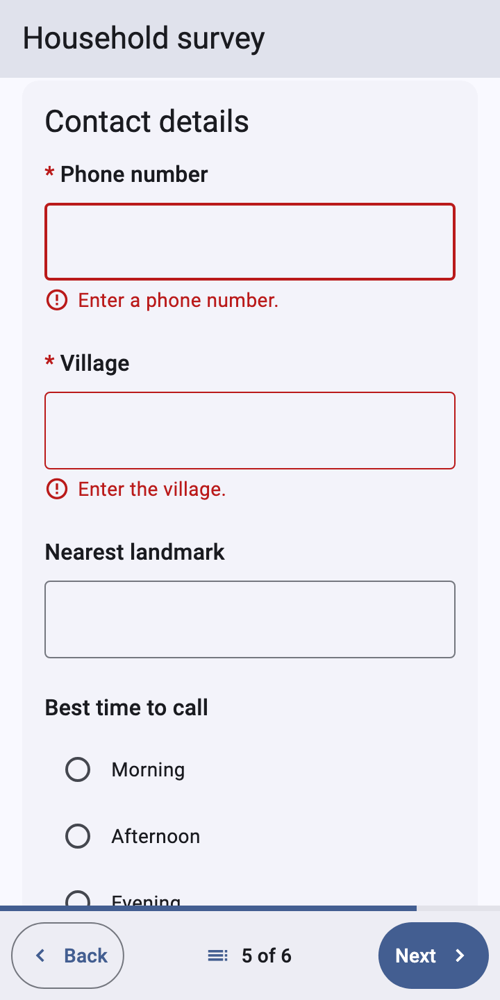

# dartrosa_flutter

Flutter renderer for [DartRosa](https://github.com/sudhi001/dartrosa/tree/main/packages/dartrosa), the pure-Dart ODK XForms
engine.

<p>



</p>


## Visual tour

Every control type and appearance, with its XLSForm, XForm, states,
platform needs and theming, is in the
[widget catalog](https://github.com/sudhi001/dartrosa/blob/main/docs/widgets/README.md).

<table>
<tr>
<td align="center"><a href="https://github.com/sudhi001/dartrosa/blob/main/docs/widgets/text-and-numbers.md"><br>Text and numbers</a></td>
<td align="center"><a href="https://github.com/sudhi001/dartrosa/blob/main/docs/widgets/date-and-time.md"><br>Dates and times</a></td>
<td align="center"><a href="https://github.com/sudhi001/dartrosa/blob/main/docs/widgets/select-one.md"><br>Select one</a></td>
</tr>
<tr>
<td align="center"><a href="https://github.com/sudhi001/dartrosa/blob/main/docs/widgets/select-multiple.md"><br>Select multiple</a></td>
<td align="center"><a href="https://github.com/sudhi001/dartrosa/blob/main/docs/widgets/image-maps-maps-and-csv.md"><br>Image maps, maps, CSV</a></td>
<td align="center"><a href="https://github.com/sudhi001/dartrosa/blob/main/docs/widgets/range-and-rank.md"><br>Range and rank</a></td>
</tr>
<tr>
<td align="center"><a href="https://github.com/sudhi001/dartrosa/blob/main/docs/widgets/location.md"><br>Location</a></td>
<td align="center"><a href="https://github.com/sudhi001/dartrosa/blob/main/docs/widgets/media-and-barcodes.md"><br>Media and barcodes</a></td>
<td align="center"><a href="https://github.com/sudhi001/dartrosa/blob/main/docs/widgets/special-inputs.md"><br>Counter, bearing, url, ex:, printer</a></td>
</tr>
<tr>
<td align="center"><a href="https://github.com/sudhi001/dartrosa/blob/main/docs/widgets/notes-labels-and-triggers.md"><br>Notes, labels, triggers</a></td>
<td align="center"><a href="https://github.com/sudhi001/dartrosa/blob/main/docs/widgets/groups.md"><br>Groups</a></td>
<td align="center"><a href="https://github.com/sudhi001/dartrosa/blob/main/docs/widgets/repeats.md"><br>Repeats</a></td>
</tr>
<tr>
<td align="center"><a href="https://github.com/sudhi001/dartrosa/blob/main/docs/widgets/navigation-and-layout.md"><br>Pager, outline, layout</a></td>
<td align="center"><a href="https://github.com/sudhi001/dartrosa/blob/main/docs/widgets/validation.md"><br>Validation</a></td>
<td align="center"><a href="https://github.com/sudhi001/dartrosa/blob/main/docs/widgets/navigation-and-layout.md#adaptive-layout"><br>Adaptive layout</a></td>
</tr>
</table>

## Install

```sh
flutter pub add dartrosa_flutter
```

`dartrosa_flutter` re-exports `package:dartrosa/dartrosa.dart`, so most
apps need only this package.

## Usage

```dart
final definition = await FormDefinition.parse(xformXml);
final session = definition.createSession();

XFormView(
  session: session,
  mode: XFormMode.pager, // or XFormMode.scroll
  delegates: MyDelegates(), // camera, location, barcode, media in labels
  onFinalized: (submission) => upload(submission.xml),
);
```

- **Pager** mode shows one question (or `field-list` group) per screen,
  validates the screen before moving on, asks before adding repeat
  instances and ends with a finalize screen, like ODK Collect.
- **Scroll** mode shows every relevant question on one page with
  add/remove buttons for repeats (removing asks first).
- **Adaptive layout**, by the width `XFormView` is given (Material 3
  window size classes, `XFormWindowSize`): phones (under 600dp) use the
  full width; from 600dp the form is a centered column at most 720dp
  wide (`XFormTheme.maxContentWidth`); from 840dp the **form outline**
  (groups and questions, answered / required / error state, the current
  screen) is a side panel that jumps to any question, like Collect's
  hierarchy view. On narrower windows the outline is a bottom sheet,
  opened from the pager's position ("3 of 12") or by
  `XFormViewState.showOutline()` (use a `GlobalKey<XFormViewState>`);
  `XFormView.outline` turns the panel off (`onRequest`) or the outline
  off (`none`).
- **Keyboard and mouse**: Page Down / Page Up and Alt+→ / Alt+← (mirrored
  in right-to-left forms) move between pager screens, Enter in a
  one-line field moves to the next field or screen, Tab follows form
  order (image-map areas and rank moves included), Esc closes sheets and
  dialogs. On desktops and in browsers scroll bars stay visible, text can
  be selected and the time picker opens for typing.
- **Errors**: when Next or Finalize is blocked, the first question in
  error is scrolled into view and focused; its field turns red and the
  message, with an icon, sits under it.
- Widgets rebuild per question: each question listens only to its own
  node's changes (answers, recalculations, relevance).
- Platform features go through `XFormDelegates`; without one, capture
  questions fall back to typing the value. Any question widget can be
  replaced with `widgetOverrides` (keyed by control type and optionally
  appearance, e.g. `selectOne:likert`).

## Supported

| Control | Appearances |
|---|---|
| text | `multiline`, `numbers`, `masked` (also `secret`), `ex:` (external app), `printer` (also `printer:...`), `url` (opened with `XFormDelegates.openLink`) |
| integer / decimal / long | `thousands-sep` (the locale's grouping separator, a space where it is `.`; display only, the answer has no separators), `ex:`, `counter` (integer), `bearing` (decimal, from `XFormDelegates.compassBearing`; typed otherwise) |
| date | `no-calendar` (typed date), `month-year`, `year` (saved as the 1st); calendars `ethiopian`, `coptic`, `islamic`, `bikram-sambat`, `myanmar`, `persian`, `buddhist` (shown as Collect labels them and picked with that calendar's spinners, via [dartrosa_calendars](https://github.com/sudhi001/dartrosa/tree/main/packages/dartrosa_calendars); the Gregorian date is stored) |
| time / dateTime | pickers |
| select one | radio list, `minimal` (drop-down), `quick` (auto-advance in pager mode), `autocomplete`, `columns`, `columns-N`, `columns-pack`, `no-buttons`, `likert`, `label`, `list-nolabel`, `list`; Collect's old names `compact`, `quickcompact`, `compact-N`, `horizontal`, `horizontal-compact`; `image-map`; `map` (through `XFormDelegates.selectFromMap`) |
| select multiple | check boxes, `minimal` (dialog), `autocomplete`, `columns*`, `no-buttons`, `label`, `list-nolabel`, `list`, `image-map` |
| rank, trigger, note | reorderable list (drag, or the move up / down buttons), acknowledge, read-only text |
| range | slider, `vertical`, `picker`, `rating`, `no-ticks` |
| geopoint, barcode, image / audio / video / file | through `XFormDelegates` (typed value otherwise) |
| geopoint `maps` / `placement-map`, geotrace, geoshape | on the app's map through `XFormDelegates.geoFromMap` when `canShowMaps` (default widget otherwise); `hidden-answer` |
| group | card, `field-list` (one pager screen), `table-list` (one grid: choice labels as header, a row of buttons per select, lines between rows), `intent` attribute (external app filling the group's questions) |
| repeat | add / remove, "add another?" prompt in pager mode, `noAddRemove` |

Choice images use `delegates.image(uri)`. Selects with a `search(...)`
appearance get their choices from CSV form media through
[dartrosa_external_data](https://github.com/sudhi001/dartrosa/tree/main/packages/dartrosa_external_data) (parse the form with
its `ExternalDataPlugin`); combine it with `autocomplete`, `minimal`, ...
as in Collect (bare `search` is the old name of `autocomplete`). A
missing CSV shows Collect's warning instead of choices. `image-map` selects show the
SVG of the question's image (read with `delegates.mediaBytes(uri)`): the
`g`, `path`, `rect`, `circle`, `ellipse` and `polygon` elements whose ids
are choice values are tapped to select them and filled when selected. Unsupported appearances fall
back to the default widget (with one `debugPrint` per appearance).

- **External apps** (`ex:` appearances, group `intent` attributes) go
  through `XFormDelegates.launchExternalApp` with the parameters
  evaluated as ODK Collect does (`ExternalAppsUtils`: `'constants'`,
  XPath expressions, `instanceProviderID()`, `uri_data`); `ex:`
  questions send their answer as `value` and read the result's `value`,
  intent groups exchange their text/number/binary answers by question
  name. When no app is found (`ExternalAppNotFoundException`) the form's
  `noAppErrorString` is shown and the answer can be typed. `printer`
  questions print their answer with `XFormDelegates.print`.
- **Labels, hints and choices** render ODK's markdown subset: `*em*`,
  `**strong**`, `#` headers, `[links](url)` (opened through
  `XFormDelegates.openLink`), `<span style="color: ...; font-family:
  ...">`. Guidance hints are shown per `XFormView.guidanceHints` (`yes`,
  `collapsed`, `no`).
- **Theme**: add an `XFormTheme` to `ThemeData.extensions` (page padding,
  question spacing, error color, card style (a Material 3 filled card by
  default; groups inside groups are sections), `maxContentWidth` (720dp
  by default, `double.infinity` to fill the width), `outlinePanelWidth`,
  and `adaptiveChoiceColumns`: four or more short text choices go in
  columns on wide forms).
- **Performance**: answering a question rebuilds that question and the
  questions whose state depends on it, not the form; scroll mode builds
  questions lazily (`test/rebuild_test.dart` prints the rebuild counts of
  a 1,000-question form). The tests run with Flutter's leak tracker.
- **Strings**: buttons, prompts and default messages come from
  `XFormLocalizations` (English); subclass it and register a
  `LocalizationsDelegate` for other languages.
- **Accessibility**: each question is a semantics node labelled with its
  label, "required" and its validation state; errors are live regions,
  and blocked Next / Finalize announce the error; focus follows form
  order; choice and button targets are at least 48dp.
- **RTL**: forms in ar, fa, he, ur, ps, sd, ug, yi or dv (by code or
  name, e.g. `Arabic (ar)`) are laid out right to left.

Golden tests (`test/golden_test.dart`, light/dark, LTR/RTL) use the
default test font; refresh them with `flutter test --update-goldens`.
`test/adaptive_test.dart` checks every size class (320 to 1920dp, text
at 100% and 200%) for overflow and layout.
The screenshots and GIFs of the widget catalog are rendered by
`test/screenshots/` from the forms in `test/screenshots/forms/` (opt-in
with `DARTROSA_SCREENSHOTS=1`, macOS only).

Run the example: `cd example && flutter create . && flutter run`.

## Documentation

- [Widget catalog](https://github.com/sudhi001/dartrosa/blob/main/docs/widgets/README.md): every control, appearance and state, with screenshots
- [Documentation index](https://github.com/sudhi001/dartrosa/blob/main/docs/README.md)
- [Show a form in a Flutter app](https://github.com/sudhi001/dartrosa/blob/main/docs/guides/render-a-form-in-flutter.md)
- [Use non-Gregorian calendars](https://github.com/sudhi001/dartrosa/blob/main/docs/guides/non-gregorian-calendars.md)
- [Getting started](https://github.com/sudhi001/dartrosa/blob/main/docs/GETTING_STARTED.md)
- [Compatibility matrix](https://github.com/sudhi001/dartrosa/blob/main/docs/COMPATIBILITY.md)
- [Plugins and extension points](https://github.com/sudhi001/dartrosa/blob/main/docs/PLUGINS.md)
- [Migrating from JavaRosa](https://github.com/sudhi001/dartrosa/blob/main/docs/MIGRATING_FROM_JAVAROSA.md)

## License

Apache License 2.0 (see [LICENSE](LICENSE)). The widgets follow ODK
Collect's behaviour; the engine is a port of JavaRosa. See
[the licensing notes](https://github.com/sudhi001/dartrosa/blob/main/docs/legal/README.md).
